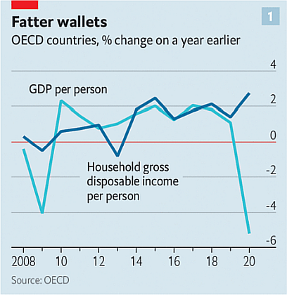
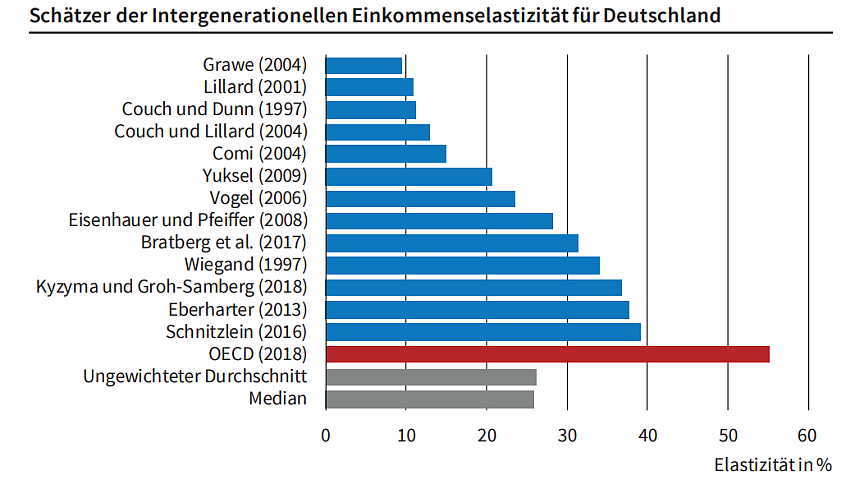

class: title-slide

```{r xaringan-themer, include=FALSE}
library(xaringanthemer)
style_xaringan(text_color = "#232461",inverse_text_color = "#FFFFFF",inverse_background_color = "#232461", title_slide_background_color = "#232461",header_background_color = "#232461",header_color = "#FFFFFF",header_h1_font_size = "32px",
  header_h2_font_size = "26px",link_color="#d84116",
  header_h3_font_size = "20px",text_slide_number_color = "#232461",text_slide_number_font_size = "0.5em")
```

```{r xaringanExtra, echo=FALSE}
xaringanExtra::use_progress_bar(color = "#d84116", location = "bottom")
xaringanExtra::use_xaringan_extra(c("tile_view","scribble","panelset","tachyons"))
xaringanExtra::style_panelset_tabs(font_family = "inherit")
#xaringanExtra::use_search(show_icon = TRUE)
#weitere: "share_again","animate_css", "webcam","freezeframe","clipboard","fit_screen","extra-styles" 
xaringanExtra::use_editable(expires = 1)
xaringanExtra::use_freezeframe(trigger = "hover")
```

```{r setup, include=FALSE}
options(htmltools.dir.version = FALSE)
library(latex2exp)
library(fontawesome)
```

# Volkswirtschaftslehre

## CORE - The Economy

### Unit 1: Einführung: Wohlstand und Wachstum

 

<br>
<br>
<br>
<br>
<br>
<br>
<br>
### Sommersemester 2024 
<br>
### Prof. Dr. Jörg Schoder
.mycontacts[
`r fa('github')` @ISBA-University
`r fa('linkedin')` @jfschoder
]


---
layout: true

<div class="my-footer"></div>       

<div style="position: absolute;left:400px;bottom:10px;color:ISBAblue;font-size:9px">`r r2symbols::sym('copyright')``r rmarkdown::metadata$author`</div>


---
name: Motivation
class: left

# Deutschland wird ärmer (?)

<iframe width="1000" height="550" src="https://www.youtube.com/embed/oOtA82FfaMU" title="YouTube video player" frameborder="0" allow="accelerometer; autoplay; clipboard-write; encrypted-media; gyroscope; picture-in-picture" allowfullscreen></iframe>


???

* Erste 1:23min anschauen

* Im Intro des Videos werden vier aktuelle Schlüsselfragen genannt:

    * Woher bekommen wir die Energie?
    * Wieviel ist unser Geld noch wert?
    * Wo sind die Fachkräfte?
    * Wie rüsten wir Deutschland für die Zukunft?

* Ukraine-Krieg und Sanktionen gegen Russland
  * Rohstoffe
  * Moralische Dimension
     * Konsequenzialismus: Sanktionen bringen nix, also lieber weiter heizen
     * Deontologische Dimension: es zählt die Absicht

---
name: motivation
class: left

# Motivation: Wohlstand und Innovation

```{r, echo=FALSE,out.width = "100%"}
knitr::include_url("https://www.thepioneer.de/originals/others/articles/wir-brauchen-einen-ruck-in-deutschland-und-in-europa?utm_medium=newsletter&utm_source=steingarts-morning-briefing",height = "550px")
```

.quelle[Quelle: [Steingarts Morning Briefing](https://www.gaborsteingart.com/steingarts-morning-briefing/).]


???

* Sein Diktum richtet sich auch an die politische Klasse:

> "Wir befinden uns in einem Standort-Wettbewerb – vor allem mit 330 Millionen Menschen in den Vereinigten Staaten, mit 1,4 Milliarden Chinesen und bald auch mit ebenso vielen Indern."
    
* Zu wenige – auch in Berlin – würden diese unbequemen Fakten bisher als Weckruf für sich interpretieren. Was bedeute es für die langfristige Wettbewerbsfähigkeit, fragte er in die Runde, wenn die letzte wirklich große Reform in Deutschland – die Agenda 2010 – fast 20 Jahre her sei.

* Sein Fazit:

	
>	"Es ist Zeit für einen Ruck in Deutschland und Europa, um einmal die Formulierung unseres früheren Bundespräsidenten zu bemühen. Und zwar jetzt. 2021 und 2022 sind Jahre der Richtungsentscheidungen. Für Deutschland – aber letztlich auch für Europa. Denn es geht in diesem Superwahljahr nicht nur ums Kanzleramt. Es geht darum, welche Wirtschaftspolitik, ja: welche Wirtschaftsordnung das kommende Jahrzehnt prägen soll."

* Er ermunterte alle kritischen Geister – in der Wirtschaft, im Kulturleben, in der Zivilgesellschaft – sich an der großen Reformdebatte zu beteiligen:

	
> "Innovation entsteht nicht dadurch, dass alle dasselbe denken, dass alle denselben Hintergrund haben. Innovation entsteht aus dem Wettstreit von Ideen. Aus intellektueller Diversität. Aus der Freiheit heraus, diese Diversität verwirklichen zu dürfen. Und wenn es eine Region in der Welt gibt, die divers ist und trotzdem auf gleichen Werten basiert – dann ist es unser Europa."


* Die gesamte Rede, in der Sewing konkrete Vorschläge für die Themen Bildung und den europäischen Kapitalmarkt unterbreitet und seinen europäischen Lösungsansatz begründet, lesen Sie auf ThePioneer.de. Pflichtlektüre für alle, die Kanzler oder Kanzlerin werden wollen.


---
name: Gliederung
class: inverse, left, middle
# Was lernen wir?

Das CORE-Projekt versucht, einen höheren Lerneffekt zu erreichen, indem jede Einheit inhaltlichen Fragen gewidmet ist. Anhand dieser Leitfragen werden ökonomische Methoden und Theorien bzw. Modelle eingeführt, um ökonomisches Denken einzuüben.


## Inhaltliche Leitfragen in Unit 1

.blockquote[
1. Wie hat sich der Wohlstand in verschiedenen Ländern historisch entwickelt?
2. Gibt es einen Zusammenhang zwischen Informationsfluss, Innovation und wirtschaftlicher Entwicklung?
3. Welche Rolle spielt die Wirtschaftsordnung für die Entstehung von Wohlstand und dessen Verteilung?
]

## Ökonomische Methoden und Konzepte in Unit 1 

.blockquote[
1. Wirtschaftskreislauf und VGR
2. Begriffsbildung und Klassifikatorische Theorien
3. Empirische Daten und Entwicklung von Forschungsfragen

]


???

The specific narrative of Unit 1 is the transition from relative stagnation, in which living conditions tended to change only if there was an epidemic or a war, to permanent and sustained growth in living standards in some countries, as depicted in the hockey stick graphs

Section 1.8 indicates how technological progress, innovation and specialization (for example, according to comparative advantage) can create the necessary improvements in production

Unit 1 also introduces the economic system, plus the institutions that constitute it (and which may constrain its operation). The natural environment is clearly a very important constraint on economic processes, and there are hockey stick graphs which serve to illustrate these constraints in a visual way. 

There is a strong suggestion in these graphs that they are related to the hockey stick graphs of GDP seen earlier (students could be asked to consider whether this relationship is merely correlation or whether there might be a causal link). Section 1.9 introduces these ideas more formally, discusses the differences between causality and correlation, and how natural experiments can be used to arrive at causal explanations in economics.

In section 1.10, the capitalist institutions of markets, private property and firms are discussed. This combination of institutions is introduced as particular to capitalism and it is important to emphasise to students that other systems can have different institutions. So the word 'particular' is key within the definition of capitalism given in section 1.6: “capitalism is an economic system characterized by a particular combination of institutions”. One institution common in capitalism is the democratic political system, which is discussed in section 1.10, although it is important to note that capitalism is not dependent on democracy.

CORE consistently stresses that economic choices and decisions are always made in context. The obvious examples of context from Unit 1 are:

*	The environment: Which limits and frames so much of what economic processes can achieve.
*	Rules and policies: Within which economic decisions are taken. 


---
name: Teil4
class: inverse, center, middle

# Teil 1

## Wohlstandsmessung


### "If you can’t measure it, you can’t improve it." (P. Drucker)

.blockquote[Was messen wir?]

.blockquote[Was wollen (sollten) wir messen?]

.blockquote[Was könn(t)en wir messen?]


???

* Wir messen Wohlstand primär am BIP und damit am Gütermarkt

* Peter Ferdinand Drucker 
    * veröffentlichte zwischen 1940 und seinem Tod 2005 zahlreiche **einflussreiche Werke über Theorie und Praxis des Managements**. 
    * Er gilt als ein **Pionier der modernen Managementlehre** und als origineller und unabhängiger Denker.
    * Drucker bemühte sich in seinen Werken um Klarheit und Übersicht. Auf einen wissenschaftlichen Apparat und Mitarbeiterstab verzichtete er weitgehend. Seine 35 Bücher wurden über 5 Millionen Mal verkauft.


---
name: VGR
class: left

# Volkswirtschaftliche Gesamtrechnungen (VGR)

.panelset[
.panel[.panel-name[Übersicht]
```{tikz, echo=FALSE}
\usetikzlibrary{angles,quotes,babel,calc,matrix,patterns,math,fit,arrows,arrows.meta,shapes.arrows,shapes,shapes.geometric,positioning,intersections,chains,trees,mindmap,shadows,shadows.blur,shadings,backgrounds,colorbrewer,decorations.markings,decorations.pathreplacing,decorations.text}
		\tikzset{font=\normalsize\sffamily,
			edge from parent fork down,
			%level distance=12mm,
			level 1/.style={sibling distance=70mm,level distance=22mm,},
			level 2/.style={sibling distance=35mm,level distance=20mm,},
			level 3/.style={grow=down,anchor=west,xshift=-4em,align=left,
				edge from parent path={(\tikzparentnode.south)+(-5em,0) |- (\tikzchildnode.west)}},
			first/.style={level distance=12mm},
			second/.style={level distance=18mm},
			third/.style={level distance=24mm},
			fourth/.style={level distance=30mm},
			fifth/.style={level distance=36mm},
			sixth/.style={level distance=42mm},
			%	every node/.style=
			treenode/.style = {align=center, inner sep=4pt, text centered,
				font=\normalsize\bfseries\sffamily},
			kasten/.style = {treenode,
				top color=white,
				bottom color=blue!25,
				rectangle,rounded corners,
				minimum width= 50mm,
				minimum height=12mm,
				draw=blue!75,
				very thick,
				drop shadow,
				align=center,
				text depth = 2pt
			},
			kasten2/.style = {treenode,
				top color=white,
				bottom color=blue!25,
				rectangle,rounded corners,
				minimum height=6mm,
				minimum width=44mm,
				draw=blue!75,
				very thick,
				drop shadow,
				align=center,
				text depth = 2pt
			},
			plainode/.style = {treenode,fill=none},% arbre rouge noir, noeud rouge
			edge from parent/.style={draw=blue!50,thick}
		}
		\begin{tikzpicture}[scale=.9]
			\node [kasten] {Volkswirtschaftliche Gesamtrechnungen}
			child[level 1] {node [kasten]{Inlandsprodukts- und\\ Nationaleinkommensberechnung}
				child[level 3,level distance=14mm] {node [kasten2]{Entstehungsrechnung}}
				child[level 3,level distance=26mm] {node [kasten2]{Verwendungsrechnung}}
				child[level 3,level distance=38mm] {node [kasten2]{Verteilungsrechnung}}
			}
			child[level 1] {node [kasten]{Nebenrechnungen}
				child[level 3,first] {node []{Input-Output-Rechnung}} 
				child[level 3,second] {node []{Vermögensrechnung}}
				child[level 3,third] {node []{Erwerbstätigenrechnung \footnote{ILO-Konzept}}}
				child[level 3,fourth] {node []{Arbeitsvolumensrechnung}}
				child[level 3,fifth] {node []{Finanzierungsrechnung}}
				%					child[level 3,sixth] {node []{Außenwirtschaftsrechnung}}
				%					child[level 3,sixth] {node []{Einkommensrechnung\footnote[frame]{für private Haushalte nach sozioökonomischer Gliederung}}}
			};
		\end{tikzpicture}
```


.quellePan[Eigene Darstellung.]
]
.panel[.panel-name[Inlandsproduktrechnungen]
```{r, echo=FALSE,fig.align='center',out.width='100%'}
knitr::include_url('https://www.core-econ.org/the-economy/book/images/web/figure-13-06.svg',height='480px')
```
]
]


---
name: BIP
class: left

# Bruttoinlandsprodukt

.blockquote[
Das Bruttoinlandsprodukt stellt den Wert der Güter (Waren und Dienstleistungen) dar, die in einer Volkswirtschaft in einer Periode (meist: Kalenderjahr oder Quartale) erzeugt wurden.
]

* Berechnung des nominalen BIP $(Y^n)$:
$$Y^n=\sum_i q_i\cdot p_i$$

* (Nominales) BIP pro Kopf: $\frac{Y^n}{N}$ mit N: Zahl der Einwohner

* Verfügbare Einkommen:
  * Haushaltsebene
  * Einkommen (Arbeit und Kapital) abzüglich Nettosteuern (Steuern-Transfers)


???

* For example, **disposable income** leaves out:
  * The quality of our social and physical environment such as friendships and clean air.
  * The amount of free time we have to relax or spend time with friends and family.
  * Goods and services that we do not buy, such as healthcare and education, if they are provided by a government.
  * Goods and services that are produced within the household, such as meals or childcare (predominantly provided by women).


---
name: BIPaktuell
class: left

# Bruttoinlandsprodukt 2021

```{r, echo=FALSE,fig.align='center',out.width='100%'}
knitr::include_url('../images/unit01/BIP_2022.PNG',height='550px')
```
.quelle[Quelle: [Destatis (2023)](https://www.destatis.de/DE/Themen/Wirtschaft/Volkswirtschaftliche-Gesamtrechnungen-Inlandsprodukt/Publikationen/Downloads-Inlandsprodukt/zusammenhaenge-pdf-0310100.pdf).]


---
name: Entstehung
class: left

# Entstehungsrechnung

.panelset[
.panel[.panel-name[Aktuell]
```{r, echo=FALSE,fig.align='center',out.width='100%'}
knitr::include_graphics('../images/unit01/Entstehung_2022_(Destatis_S11).png')
```
.quellePan[Quelle: [Destatis (2022)](https://www.destatis.de/DE/Themen/Wirtschaft/Volkswirtschaftliche-Gesamtrechnungen-Inlandsprodukt/Publikationen/Downloads-Inlandsprodukt/zusammenhaenge-pdf-0310100.pdf).]
]
.panel[.panel-name[Historisch]
```{r, echo=FALSE,fig.align='center',out.width='100%'}
knitr::include_graphics('../images/unit01/bpb_langeReihe_Entstehung_(Rahlf_2015).png')
```
.quellePan[Quelle: [Bundeszentrale für Politische Bildung (2015)](https://www.bpb.de/system/files/dokument_pdf/4938_zb_dtindaten_gesamt.pdf)]

]
]

???

Hinweis: Strukturwandel


---
name: Verwendung
class: left

# Verwendungsrechnung

.panelset[
.panel[.panel-name[Aktuell]
```{r, include=FALSE}
source(xfun::from_root("R/VGR_Verwendung.R"))
```
```{r, echo=FALSE,fig.align='center',out.width='90%'}
p
```

.quellePanURL[Quelle: Eigene Darstellung. Datenbasis: [Destatis (2023)](https://www.destatis.de/DE/Themen/Wirtschaft/Volkswirtschaftliche-Gesamtrechnungen-Inlandsprodukt/Publikationen/Downloads-Inlandsprodukt/inlandsprodukt-erste-ergebnisse-pdf-2180110.pdf?__blob=publicationFile).]

]
.panel[.panel-name[Historisch]
```{r, echo=FALSE,fig.align='center',out.width='100%'}
knitr::include_graphics('../images/unit01/bpb_langeReihe_Nachfragekomponenten_(Rahlf_2015).png')
```

.quellePanURL[Quelle: [Bundeszentrale für Politische Bildung (2015)](https://www.bpb.de/system/files/dokument_pdf/4938_zb_dtindaten_gesamt.pdf)]

]
]


---
name: Verteilung
class: left

# Verteilungsrechnung (Primäreinkommensentwicklung)
```{r, echo=FALSE,fig.align='center',out.width='100%'}
knitr::include_graphics('../images/unit01/Primaereinkommen_seit1991_(Destatis_2023).png')
```
.quelle[Quelle: [Destatis (2022)](https://www.dashboard-deutschland.de/#/themen/konjunktur_wirtschaft/preise).]

---
name: GDPvsDispInc
class: left

# BIP pro Kopf vs. Verfügbares Einkommen

```{r, echo=FALSE,fig.align='center'}

```

.quelle[Quelle: [Economist (18.07.2021).](https://www.economist.com/finance-and-economics/2021/07/18/will-the-economic-recovery-survive-the-end-of-emergency-stimulus)]


---
name: VGR-Monitor
class: left

# Destatis VGR-Monitor

```{r, echo=FALSE,fig.align='center'}
knitr::include_url('https://service.destatis.de/DE/vgr-monitor-deutschland/investitionen.html',height='550px')
```


---
name: BIPstats
class: left
# Intertemporale und Internationale Vergleichbarkeit

* Vergleichbarkeit **über die Zeit**
  * Nominales vs. Reales BIP
  * Reales BIP und Erfassung von Mengeneffekten

* Vergleichbarkeit **zwischen Regionen**
  * Theorie: Kaufkraftparität (KKP) vs. Gesetz des einheitlichen Preises 
  * Tradable Goods vs. Non Tradable Goods und der Balassa-Effekt
  * Empirie: Big-Mac-Index vs. Iphone-Index
  
* Grafische Darstellung von **Wachstumsprozessen**
  * lineare Skala vs. logarithmische Skala (log-Skala)
  * log-log-Diagramm vs. semi-log-Diagramm
  


???
* Kaufkraftunterschiede zwischen Ländern 

* Kaufkraftparität (Purchasing Power Parity) zieht Warenkorb heran (Makroökonomie)
während Law of one Price (William S. Jevons) sich auf ein Gut
* Problem: Heute werden die Wechselkurse maßgeblich durch Finanztransaktionen bestimmt. Nur 3% der Devisengeschäfte an den Finanzmärkten dienen Warengeschäften - entsprechend sind die Annahmen der PPP-Theorie nicht erfüllt
* Empirie: Für internationale Einkommensvergleiche ermitteln internationale Organisationen (z. B. Weltbank) solche Kaufkraftparitäten empirisch, um Verzerrungen durch Wechselkursschwankungen zu eliminieren. 
* Da viele Entwicklungsländer (nach der Kaufkraftparitätentheorie) unterbewertete Währungen aufweisen (Balassa-Effekt), stellt sich ihr Pro-Kopf-Einkommen in (USD-)Kaufkraftparitäten zumeist höher dar als mit offiziellen Wechselkursen umgerechnet.
   * Ausgangspunkt von Balassas Überlegungen war die These, dass Entwicklungsländer bei handelbaren Gütern (Tradables) eine niedrigere Arbeitsproduktivität aufweisen als Industrieländer. Aufgrund des weltweiten Wettbewerbs und der Gültigkeit der Kaufkraftparität unterscheiden sich jedoch die Preise für beide Güter nicht.
   * Weiterhin geht Balassa davon aus, dass bei nicht handelbaren Gütern und Dienstleistungen (**Non-Tradables**) zwischen beiden Ländern keine Produktivitätsunterschiede bestehen (insbesondere bei sehr arbeitsintensiven Dienstleistungen sind kaum Produktivitätsunterschiede realisierbar; z. B. **Friseur, Restaurant**). Im Verhältnis zu Industrieländern sind Entwicklungsländer nach Ansicht Balassas also bei diesen nicht handelbaren Gütern **gleichermaßen produktiv**. (Bei niedrigeren Löhnen wird folglich billiger produziert.)
   * Aber: der **Sektor der handelbaren Güter** hat nach Balassa die **größere ökonomischen Bedeutung** und ist deshalb **maßgeblicher für die Höhe der Löhne**
   * Wenn die Arbeiter zwischen den Sektoren (Tradable/Nontradable) mobil sind, wird die Lohnhöhe primär von der Produktivität der Arbeitskräfte im Sektor handelbarer Güter bestimmt - in beiden Sektoren.
   * Somit können Entwicklungsländer handelbare Güter also zu gleichen Preisen wie Industrieländer produzieren (aufgrund niedrigerer Löhne bei niedrigerer Produktivität). Allerdings sind nach Balassas Theorie die Preise für nicht-handelbare Güter in Entwicklungsländern niedriger (niedrigere Löhne bei gleicher Produktivität) – das heißt, das durchschnittliche Preisniveau der Entwicklungsländer liegt unterhalb dessen der Industrieländer.
   * Weil die der Kaufkraftparitätentheorie zugrundeliegenden Güterströme nur bei handelbaren Gütern zustande kommen, bleibt das niedrigere Preisniveau der Entwicklungsländer bestehen – ihre Währungen bleiben also unterbewertet.
* Samuelson-Effekt: Entwicklungsländer, die sich im Aufholprozess befinden, weisen höhere Inflationsraten auf als Industrieländer.
* Ein populäres Beispiel für Kaufkraftparitäten auf einer alternativen Basis ist der von der Zeitschrift The Economist regelmäßig veröffentlichte Big-Mac-Index. Dabei wird ermittelt, wie viel ein Big Mac in einem McDonald’s-Restaurant in den verschiedenen Ländern der Welt kostet. Diese Preise werden zur Grundlage einer Währungsumrechnung gemacht. 
  * Neuerdings auch: Iphone-Index
  * Unterschied: Big Mac sind nontradable goods während iphone tradeable goods sind
  * Nur bei tradeable goods kann es zu ausgleichenden Arbitrage-Geschäften gemäß des Law of one Price kommen


---
name: Real-nominal
class: left

# Reales vs. nominales BIP

.blockquote[
**Nominales BIP**

Wert der innerhalb eines festgelegten Zeitraums im Inland hergestellten Güter (Waren und Dienstleistungen) zu laufenden Preisen abzüglich des Werts importierter Vorleistungen.
]

Anstieg des nominalen BIP durch:
* Anstieg der Preise (des Preisniveaus)
* Anstieg der Menge (reale Produktion)

.blockquote[
**Reales BIP**

Wert der innerhalb eines festgelegten Zeitraums im Inland hergestellten Güter und Dienstleistungen zu Vorjahrespreisen abzüglich des Werts importierter Vorleistungen.
]

`r fa("circle-right")` Ziel: Abbildung des (reinen) Mengeneffekts 

`r fa("circle-right")` Methodik: Vorjahrespreisbasis (seit VGR Revision 2005), vgl. [BIP-Deflator](#InfMess) 


???

* bis zur VGR Revision 2005: Festpreisbasis
* Reales BIP-Wachstum: Prozentbetrag, um den das reale BIP über dem nominalen Vorjahres-BIP liegt.


---
name: Wohlstand
class: left


# Einkommensentwicklung als "Hockey-Stick"

```{r, echo=FALSE,out.width = "100%"}
knitr::include_url("https://ourworldindata.org/grapher/historys-hockey-stick-gross-domestic-product-per-capita-using-the-ratio-scale-1990",height = "550px")
```

???

Hinweise zur Statistik:

* Hat wirtschaftliche Aktivität vor 1700 nicht geschwankt? Schwankungen als Eigenschaft kapitalistischer Systeme?

* Statistisches Artefakt! Vor 1700 nur wenige Datenpunkte, die hier einfach verbunden wurden.

*Vergleichbarkeit der Daten? 
  * Real vs. Nominal
  * PPP


---
name: Umwelt
class: left

# Noch ein Hockeystick: Umweltbelastung

```{r, echo=FALSE,out.width = "100%"}
knitr::include_url("https://www.core-econ.org/the-economy/book/images/web/figure-01-06-a.svg",height = "550px")
```


---
class: left

# Kritik der Wohlstandsmessung

* Messen wir richtig? 
    * Bewertung?
    * Was wird (nicht) erfasst? 
        + Ehrenamt
        + Schattenwirtschaft
        + VGR vs. [UGR](https://www.destatis.de/DE/Themen/Gesellschaft-Umwelt/Umwelt/Publikationen/Umweltnutzung-Wirtschaft/umweltnutzung-und-wirtschaft-bericht-5850001147004.pdf?__blob=publicationFile)
    

* Bruttoinlandsprodukt (BIP) erfasst (bestenfalls) den materiellen Wohlstand

* Immaterielle Aspekte und Lebenszufriedenheit?
    * Lebensstandard, 
    * Lebensqualität
    * Lebenszufriedenheit

* Messen wir das richtige? [Rede Robert F. Kennedy](https://www.core-econ.org/the-economy/book/text/01.html#exercise-13-what-should-we-measure)
   

???
Messung

Ausführungen zu diesen Aspekten in den Abschnitten 1.2, 1.3, 1.5


---
name: Capab
class: left

# Steigerung der Produktivität und Einkommen...

##... oder Steigerung der persönlichen Freiheit?

Der Fähigkeiten-Ansatz von A. Sen

.center[
<iframe width="650" height="360" src="https://www.youtube.com/embed/BunGwSCuksE" title="YouTube video player" frameborder="0" allow="accelerometer; autoplay; clipboard-write; encrypted-media; gyroscope; picture-in-picture" allowfullscreen></iframe>
]

* Gleichheit, Gerechtigkeit
* Ergebnisorientierung vs. Prozessorientierung

???

* Fähigkeiten. Es kommt nicht darauf an, was ich habe, sondern was ich damit machen kann:
  * Bsp. wenn eine Person mit Handicap ein Fahrrad bekommt, kann sie damit nichts anfangen, auch
  wenn ihr materieller Wohlstand vermeintlich gestiegen ist.
* Konzept ist schwer messbar!

* Alternatives Video [Capabilities Approach](https://www.youtube.com/watch?v=rKKs1rqdlmo)


---
name: QualiLife
class: left

# Wohlstand, Lebensqualität und Lebenszufriedenheit


## [Stiglitz/Sen/Fitoussi-Kommission (2009):](https://ec.europa.eu/eurostat/documents/8131721/8131772/Stiglitz-Sen-Fitoussi-Commission-report.pdf) Lebenszufriedenheit ist mehrdimensional. 

The 8+1 dimensions of quality of life:

--
  * Material living standards (income, consumption and wealth)

--

  * Health
 
--

  * Education

--

  * Personal activities including work

--

  * Political voice and governance

--

  * Social connections and relationships

--

  * Environment (present and future conditions)

--

  * Insecurity, of an economic as well as a physical nature


???

* Soziale Verbindungen, Beziehungen
  * Zusammenhang mit der Wahrnehmung einer Gesellschaft als Fair/Gerecht:
  * Wettbewerb und Ellenbogengesellschaft
  * Winner-Takes-All-Probleme

* Statische Ungleichheit vs. Soziale Mobilitität


---
name: OECD-BLI
class: left

# OECD Better-Life-Index


<iframe src="http://www.oecdbetterlifeindex.org/de/" loading="lazy" style="width: 100%; height: 550px; border: 0px none;"></iframe>

.quelle[Quelle: [oecdbetterlifeindex.org](http://www.oecdbetterlifeindex.org/de/)]


---
name: NAWI-D
class: left

# Nationaler Wohlstandsindex

```{r, echo=FALSE,out.width = "100%"}
knitr::include_graphics('../images/unit01/NAWI-D_(Ipsos_2020).png')
```

.quelle[[www.ipsos.com/](https://www.ipsos.com/de-de/nationaler-wohlstandsindex-fur-deutschland-corona-sorgt-fur-leichten-wohlstandsdampfer)]

???

* Im Frühjahr 2012 konzipierten das Meinungsforschungsinstitut Ipsos und der Zukunftsforscher Prof. Dr. Horst W. Opaschowski ein neues Wohlstandsbarometer als Basis für einen umfassenden Nationalen WohlstandsIndex für Deutschland (NAWI-D), das seitdem kontinuierlich quartalsweise erhoben wird.

* In der Studie werden folgende Fragen an die Teilnehmer gerichtet:
  * Was verbinden sie mit dem Wort Wohlstand ?
	* Welche Bedingungen müssen erfüllt sein, um wohlhabend zu sein ?
	* Wie schätzen sie ihren persönlichen Wohlstand ein ?
	* Welche Zukunftsängste haben sie?
	
* Antworten werden in drei Kategorien unterteilt (siehe Abbildung)

* Basierend auf den Ergebnissen der Studie wurde ein Modell zur Definition von Wohlstand entwickelt, dass auf vier Arten des Wohlstandes beruht, die den Begriff Wohlstand als Ganzes definieren:
	* Gesellschaftlicher Wohlstand; Leben in einer freien und friedlichen Gesellschaft
	* Individueller Wohlstand; Gesund und ohne Zukunftsängste leben
	* Ökonomischer Wohlstand; ohne Geldsorgen leben
	* Ökologischer Wohlstand; naturnah und nachhaltig leben


---
name: GDP-QLife
class: left

# Einkommen und subjektive Lebenszufriedenheit

.panelset[
.panel[.panel-name[Daten]
<iframe src="https://ourworldindata.org/grapher/gdp-vs-happiness" loading="lazy" style="width: 100%; height: 480px; border: 0px none;"></iframe>
]

.panel[.panel-name[Erklärungsmodell]
```{r, echo=FALSE,out.width = "100%"}
knitr::include_url('https://www.core-econ.org/the-economy/book/images/web/figure-13-flowchart-01.svg',height='480px')
```
]
]


---
name: PersDev1
class: left

# Exkurs: Persönliche Entwicklung


```{r, echo=FALSE,fig.align='center'}
knitr::include_graphics('../images/unit01/big-five-personality-traits-infographic.png')
```

* Persönlichkeit bzw. Charaktereigenschaften ändern sich allenfalls langsam.
*	Voraussetzungen für selbstgesteuerte Veränderungen der Persönlichkeit? [Hennecke et al. (2014)](https://www.researchgate.net/publication/262063688_A_three-part_framework_for_self-regulated_personality_development_across_adulthood_European_Journal_of_Personality)

.quelle[Bildquelle: [blog.adioma.com](https://blog.adioma.com/5-personality-traits-infographic/)]
???

* Voraussetzungen für selbstgesteuerte Veränderungen der Persönlichkeit nach Hennecke et al. (2014)
  1. Wunsch nach Veränderung des eigenen charakterlich bedingten Verhaltens als Selbstzweck oder um bestimmte Ziele zu erreichen
	2. Die Verhaltensänderungen müssen als realistisch und umsetzbar erscheinen
  3. Verhaltensänderungen müssen zu Gewohnheiten (habits) werden, um eine stabile Charaktereigenschaft herauszubilden 
	
* After elaborating on these three conditions, we review **evidence attesting to the importance of motivation and self-regulation for trait development**. We conclude with a discussion of the mutual interdependence of traits and goals as well as the limits of self-regulated personality change. 
* From our framework we derive why **personality changes across adulthood tend to be small to medium only**, namely because they may require that all three preconditions for self-regulated personality change are fulfilled. We provide reasons for why people might not view change as desirable, feasible, or fail to maintain it over time.


---
name: PersDev2
class: left

# Persönliche Entwicklung und Lebenszufriedenheit

* Umfeld/Umwelt können Persönlichkeitsentwicklung anstossen (Austauschstudierende, [Hutteman et al. 2014)](https://www.researchgate.net/publication/263672998_Wherever_I_May_Roam_Processes_of_Self-Esteem_Development_From_Adolescence_to_Emerging_Adulthood_in_the_Context_of_International_Student_Exchange)


```{r, echo=FALSE,fig.align='center'}
knitr::include_graphics('../images/unit01/Komfortzone_(Hinson)_small.png')
```
.quelle[Bildquelle: [vocal.media](https://vocal.media/motivation/you-re-now-leaving-the-comfort-zone)]

* Persönlichkeitsentwicklung `r fa("circle-right")` Selbstachtung/Selbstwert `r fa("circle-right")`  Beruflicher Erfolg `r fa("circle-right")`  Lebenszufriedenheit

* **Identity Economics:** Verständnis der Motivation entscheidend für die Erklärung menschlichen Verhaltens und die Entwicklung ökonomischer Modelle!


---
name: Erklärungen
class: inverse, center, middle

# Teil 2

## Erste Erklärungsansätze für das Wachstum in Form eines "Hockey-Sticks"

.blockquote[Technologische Revolution]

.blockquote[Kapitalistische Revolution]


???
Historisches Zusammentreffen zweier Revolutionen


---
name: TechnologRev
class: left

# Technologische Revolution

.blockquote[
Technologie beschreibt im ökonomischen Kontext den Zusammenhang zwischen Inputs und Output.
]

Beispiele

.panelset[
.panel[.panel-name[Produktivität]
```{r, echo=FALSE,out.width = "100%"}
knitr::include_url("https://www.core-econ.org/the-economy/book/images/web/figure-01-03.svg",height = "350px")
```
]
.panel[.panel-name[Diffusion]
```{r, echo=FALSE,out.width = "100%"}
knitr::include_url("https://www.core-econ.org/the-economy/book/images/web/figure-01-04.svg",height = "350px")
```
]
]


???

* Mithin kann Technologie ökonomisch durch eine Produktionsfunktion abgebildet werden.


---
name: KapitalistRev
class: left

# Kapitalistische Revolution

* Religion und Aufklärung (Max Weber)
  
* Alternative Wirtschaftsordnungen und geschichtliche Erfahrungen
  + Freiheit und Marktwirtschaft (F.A. Hayek)
  + Ressourcen vs. Institutionen 

.blockquote[
"‘Capitalism’ refers not to a specific economic system, but to a class of systems sharing these characteristics. How the institutions of capitalism—private property, markets, and firms—combine with each other and with families, governments, and other institutions differs greatly across countries."
]

???

Just as ice and steam are both ‘water’ (defined chemically as a compound of two hydrogen atoms bonded with one oxygen atom), China and the US are both capitalist economies. But they differ in the extent to which the government influences economic affairs, and in many other ways.


Entstehung

Ausführungen zu diesen Aspekten in den Abschnitten 1.4, 1.6.-1.10


In section 1.10, the capitalist institutions of markets, private property and firms are discussed. This combination of institutions is introduced as particular to capitalism and it is important to emphasise to students that other systems can have different institutions. So the word 'particular' is key within the definition of capitalism given in section 1.6: “capitalism is an economic system characterized by a particular combination of institutions”. One institution common in capitalism is the democratic political system, which is discussed in section 1.10, although it is important to note that capitalism is not dependent on democracy.

*	Varieties of capitalism: As noted in section 1.10, capitalism is not a homogeneous system, and its institutions (and therefore outcomes) differ widely among capitalist countries. Indeed, many of the following units will discuss how economic outcomes vary considerably between capitalist nations depending on the nature and effectiveness of their institutions and policies (see 16.7 for an example of how long run transition is variously dealt with in different countries; see also section 21.1, and the table in Figure 21.5 in particular, for an example of how the German and Silicon Valley, US innovation systems differ).

* Market performance can also differ widely: The conditions under which markets operate determine this. Moreover, in many contexts markets may not work very well. The box on Adam Smith points out that Smith was well aware of the potential limitations of markets. 


---
name: Kreislauf
class: left

# Mensch und Umwelt

* Kreislaufmodell der Volkswirtschaft

```{r, echo=FALSE,out.width = "100%"}
knitr::include_url("https://www.core-econ.org/the-economy/book/images/web/figure-01-12.svg",height = "420px")
```

* Ausblick: Modellbildung


---
name: Ordnungen
class: left

# Grundlegende Ordnungsprinzipien


```{r, echo=FALSE,out.width = "100%", fig.align='center'}
knitr::include_graphics('../images/unit01/Wirtschaftsordnungen.png')
```

.quelle[Eigene Darstellung.]

* Weiterführende Informationen bspw. auf der [Webseite der Universität
Wien](https://homepage.univie.ac.at/christian.sitte/PAkrems/zerbs/volkswirtschaft_I/haupttexte/wio.html)

* Historische Experimente und Überlegenheit dezentraler Planung (F.A. Hayek)


---
name: Institutionen
class: left

# Institutionen kapitalistischer Wirtschaftsordnungen

.blockquote[
Institutionen sind die formellen (kodifizierten) und informellen Regeln unter denen soziale Interaktionen (sowie Interaktionen mit der Bioshäre) stattfinden.
]

.panelset[
.panel[.panel-name[Kapitalismus]
```{r, echo=FALSE,out.width = "100%"}
knitr::include_url("https://www.core-econ.org/the-economy/book/images/web/figure-01-08.svg",height = "350px")
```
]
.panel[.panel-name[Institutionen]
+ [Eigentumsrechte](https://www.core-econ.org/the-economy/book/text/01.html#private-property) (Anreize) 

+ [Unternehmen](https://www.core-econ.org/the-economy/book/text/01.html#firm) (Arbeitsteilung/Spezialisierung)

+ [Märkte](https://www.core-econ.org/the-economy/book/text/01.html#markets) (Tauchgewinne)
]
]


???

* Institutionen als Spielregeln

* Private Propery means that you can:
  * enjoy your possessions in a way that you choose
  * exclude others from their use if you wish
  * dispose of them by gift or sale to someone else...who becomes their owner

* Markets are:

  * a way of connecting people who may mutually benefit
  * by exchanging goods and services
  * through a process of buying and selling

* A firm is a way of organizing production with the following characteristics:
  * One or more individuals own a set of capital goods that are used in production.
  * They pay wages and salaries to employees.
  * They direct the employees (through the managers they also employ) in the production of goods and services.
  * The goods and services are the property of the owners.
  * The owners sell the goods and services on markets with the intention of making a profit.

* **How could capitalism lead to growth in living standards?**

  * Two major changes accompanied the emergence of capitalism, both of which enhanced the productivity of individual workers:
    * **Technology:** As we have seen, the permanent technological revolution *coincided with the transition to firms as the predominant means of organizing production*. This does **not mean that firms necessarily caused** technological change. But firms competing with each other in markets had strong incentives to adopt and develop new and more productive technologies, and to invest in capital goods that would have been beyond the reach of small-scale family enterprises.
    * **Specialization**: The *growth of firms employing large numbers* of workers—and the expansion of markets linking the entire world in a process of exchange—allowed historically unprecedented specialization in the tasks and products on which people worked. In the next section, we will see how this specialization can raise labour productivity and living standards.


---
name: VoC
class: left

# Varieties of Capitalism


.panelset[
.panel[.panel-name[VoC]
```{r, echo=FALSE,out.width = "100%"}
knitr::include_url("https://www.researchgate.net/profile/Charles-Edquist-2/publication/271074148/figure/tbl1/AS:668513236709376@1536397384073/Major-features-of-LME-and-CME_W640.jpg",height = "480px")
```
.quellePan[Quelle: [Edquist (2012).](https://www.researchgate.net/publication/271074148_Knowledge-intensive_Entrepreneurship_National_Systems_of_Innovation_and_European_Varieties_of_Capitalism_A_Conceptual_Framework)]
]
.panel[.panel-name[D als Ordnungslabor]
* Freie kapitalistische Marktwirtschaft bzw. Nachtwächterstaat (19. Jahrhundert)

* Organisierte kapitalistische Verbandswirtschaft (Weimarer Republik)

*	Kapitalistische Zentralverwaltungswirtschaft (Endphase 3. Reich)

* Sozialistische Zentralverwaltungswirtschaft (DDR)

* Gebundene kapitalistische Marktwirtschaft bzw. Soziale Marktwirtschaft (BRD)
]
]


???

hypothesis by Hall and Soskice (2001) that liberal market economies (LMEs) have an institutional comparative advantage in industries featuring radical innovation, whereas coordinated market economies (CMEs) have an institutional comparative advantage in industries with incremental innovation. [@witt_varieties_2016](https://link.springer.com/article/10.1057/s41267-016-0001-8#:~:text=Several%20competing%20typologies%20exist.,social%2Ddemocratic%2C%20and%20Mediterranean.)

---
name: Kausalität
class: left

# Kausalität vs. Korrelation

```{r, echo=FALSE,out.width = "100%"}
knitr::include_url("https://www.core-econ.org/the-economy/book/images/web/figure-01-11.svg
",height = "550px")
```


---
name: DezentraleOrdnung
class: left

# Dezentrale und freiheitliche Ordnungen

* Macht und Machtbegrenzung

--

* persönliche vs. wirtschaftliche Freiheit

--

* Nutzung dezentralen Wissens (F.A. Hayek)

--

* Kreativität, Innovation und schöpferische Zerstörung (Schumpeter)

--

* Produktivität, Standards und Pfadabhängigkeiten

--

* Haftungsfragen (W. Eucken)


---
name: Ordnung-Innovation
class: left

# Wirtschafts-/Gesellschaftsordnung und Innovation

<iframe width="1100" height="500" src="https://www.youtube.com/embed/z2hj_zfrG6g" title="YouTube video player" frameborder="0" allow="accelerometer; autoplay; clipboard-write; encrypted-media; gyroscope; picture-in-picture; web-share" allowfullscreen></iframe>

---
name: Ricardo
class: inverse, middle, center

# Teil 3

## Ökonomisches Prinzip und Arbeitsteilung

.blockquote[Allokation vs. Distribution]

.blockquote[Spezialisierung und Wirtschaftsordnung]


---
name: EcoPrinciple
class: left

# Grundidee: Ökonomisches Prinzip und Arbeitsteilung

* Arbeitsteilung ermöglicht Spezialisierung

```{r, echo=FALSE,fig.align='center',out.width='90%'}
knitr::include_graphics('../images/unit01/arbeitsteilung_(Goodwin_S21).png')
```
.quelle[Bildquelle: Goodwin (2012, S. 21).]


* Spezialisierung ermöglicht Produktivitätssteigerungen


---
name: NachteileSpez
class: left

# Gesellschaftliche "Nebenwirkungen" der Arbeitsteilung

* Spezialisten haben Erpressungspotenzial/Macht (Bsp. Pilotenstreiks).

* Konzentrationstendenzen/Monopolisierung (Bsp.
Internetökonomie/Plattformökonomie).

* Komplexität der Ordnung und Ohnmachtsgefühl (Marx:
Entfremdung).

* Spezialisierung und Monotonie (Smith (!): Entfremdung).


---
name: AllokationDistribution
clas: left

# Allokation vs. Distribution

.pull-left[

```{r, echo=FALSE,fig.align='center',out.width='100%'}

```

`r fa("circle-right")` Effiziente Ressourcenverwendung
("Koordination der Spezialisten")

]
.pull-right[
<br>
<br>
```{r, echo=FALSE,fig.align='center',out.width='100%'}

```
<br>
<br>
`r fa("circle-right")` "gerechte" Verteilung des Sozialprodukts

]


.center[**Alternative Lösungsstrategien: Die Frage der Wirtschaftsordnung!**]

.quelle[Bildquelle: pixabay.com.]


???

* Allokations-/Lenkungsproblem ("Koordination der Spezialisten"):
    * **Was** (welche Güter sollen produziert werden)?
    * **Wieviel** (in welcher Menge sollen die Güter hergestellt werden)?
    * **Wie** (auf welche Weise, mit welcher Technologie)?
    * **Wann?** (Konsumgüter vs. Investitionsgüter)
    * **Wo?** (Standort der Produktion vs. Ort des Konsums)
* Distributions-/Verteilungsproblem (Verteilung des
Sozialprodukts)


**Können Allokation und Distribution isoliert betrachtet werden (vgl. Keen)?**


---
name: OrgSpontOrd
clas: left

# Allokation: Organisation vs. Spontane Ordnung

.panelset[
.panel[.panel-name[Organisation vs. Spontane Ordnung]
```{r, echo=FALSE,fig.align='center',out.width='65%'}
knitr::include_graphics('../images/unit01/orga_vs_spontane_Ordnung_(Goodwin_S22).png')
```
.quellePanURL[Bildquelle: Goodwin (2012, S. 22).]
]
.panel[.panel-name[Komplexität]
<iframe width="900" height="480" src="https://www.youtube.com/embed/IYO3tOqDISE" title="YouTube video player" frameborder="0" allow="accelerometer; autoplay; clipboard-write; encrypted-media; gyroscope; picture-in-picture; web-share" allowfullscreen></iframe>
]
]

---
name: Ricardo
class: inverse, middle, center

# Teil 4

## Spezialisierung und Tauschgewinne


.blockquote[Adam Smith: Absolute Vorteile und Hausvaterregel]

.blockquote[David Ricardo: Relative (komparative Vorteile)]


---
name: Absolute Vorteile
class: left

# Absolute Vorteile

* Hausvaterregel (A. Smith)

.blockquote[
"Bei jedem klugen Hausvater ist es eine Regel, niemals etwas im Hause machen
zu lassen, was ihn weniger kosten würde, wenn er es kaufte."
]

<br>
<br>

--
<table>
  <thead>
    <tr>
      <th> </th>
      <th style="text-align: left">Production if 100% of time  is spent on one good</th>
    </tr>
  </thead>
  <tbody>
    <tr>
      <td>Greta</td>
      <td style="text-align: left">1,250 apples or 50 tonnes of wheat</td>
    </tr>
    <tr>
      <td>Carlos</td>
      <td style="text-align: left">1,000 apples or 20 tonnes of wheat</td>
    </tr>
  </tbody>
</table>


???

* Adam Smith und das Beispiel der Nagel-Fertigung (vgl. Grundlagen VWL)

* Arbeitsteilung, Spezialisierung und Produktivitätssteigerung:
  * Learning by doing: We acquire skills as we produce things.
  * Difference in ability: For reasons of skill, or natural surroundings such as the quality of the soil, some people are better at producing some things than others.
  * economies of scale: Producing a large number of units of some good is often more cost-effective than producing a smaller number. We investigate this in more detail in Unit 7.

* But people will not specialize unless they have a way to acquire the other goods they need.**For this reason, specialization—called the division of labour—poses a problem for society**: how are the goods and services to be distributed from the producer to the final user? In the course of history, this has happened in a number of distinct ways, from direct government requisitioning and distribution as was done in the US and many economies during the Second World War, to gifts and voluntary sharing as we do in families today and as practiced among even unrelated members of a community by our hunting and gathering ancestors. **Capitalism enhanced our opportunities for specialization by expanding the economic importance of both markets and firms.**

* Mit der Hausvaterregel spricht Adam Smith die sog. Absoluten Vorteile an.

* Ricardo fragt sich, wie es zu Spezialisierung und Handel kommen kann, wenn ein Akteur/Land in allen Gütern absolute Vorteile hat.


---
name: OppKost
class: left


# Opportunitätskosten

* Opportunitätskosten sind direkte Konsequenz des Knappheitsproblems und eines der wichtigsten ökonomischen Konzepte.
	
.blockquote[
"Beim Treffen von Entscheidungen fallen **Opportunitätskosten**
an, weil die Auswahl einer Möglichkeit in einer Welt der Knappheit bedeutet,
dass wir auf andere Möglichkeiten verzichten müssen. Opportunitätskosten bezeichnen den Wert des wertvollsten entgangenen Gutes oder der entgangenen Dienstleistung."
.tr[
— (Samuelson/Nordhaus 2007, S. 30)
]
]


--

* Kurz: Die Opportunitätskosten einer Alternative sind der Wert der nächstbesten Alternative.


--

* Beispiel: Was kostet ein Studium während eines Kalenderjahres?


--

* Opportunitätskosten haben zwei Komponenten: Explizite und implizite Kosten.


???


* P1 und P2 von Mankiw
* The notion of opportunity cost helps explain why star athletes often do not graduate from	college. The cost of going to school includes the millions of dollars they could earn as a	professional athletes. If Kobe Bryant had decided to attend college for four years after high school instead of signing with the Lakers, his implicit cost would have been over \$10 million, the salary he earned in his first four years as a Laker.


---
name: Absolute Vorteile
class: left

# Relative Vorteile und vollständige Spezialisierung


.panelset[
.panel[.panel-name[Beispiel]
<table>
<thead>
  <tr>
    <th></th>
    <th></th>
    <th class="align-right">Self-sufficiency</th>
    <th colspan="5" class="">Complete specialization and trade</th>
  </tr>
</thead>
<tbody>
  <tr>
    <td></td>
    <td></td>
    <td></td>
    <td class="align-right">Production</td>
    <td></td>
    <td class="align-right">Trade</td>
    <td></td>
    <td class="align-right">Consumption</td>
  </tr>
  <tr>
    <td></td>
    <td></td>
    <td class="align-right">1</td>
    <td class="align-right">2</td>
    <td></td>
    <td class="align-right">3</td>
    <td></td>
    <td class="align-right">4</td>
  </tr>
  <tr>
    <td rowspan="2">Greta</td>
    <td>Apples</td>
    <td class="align-right">500</td>
    <td class="align-right">0</td>
    <td></td>
    <td></td>
    <td></td>
    <td class="align-right">600</td>
  </tr>
  <tr>
    <td>Wheat</td>
    <td class="align-right">30</td>
    <td class="align-right">50</td>
    <td class="align-right">=</td>
    <td class="align-right">15</td>
    <td class="align-right">+</td>
    <td class="align-right">35</td>
  </tr>
  <tr>
    <td rowspan="2">Carlos</td>
    <td>Apples</td>
    <td class="align-right">300</td>
    <td class="align-right">1,000</td>
    <td class="align-right">=</td>
    <td class="align-right">600</td>
    <td class="align-right">+</td>
    <td class="align-right">400</td>
  </tr>
  <tr>
    <td>Wheat</td>
    <td class="align-right">14</td>
    <td class="align-right">0</td>
    <td></td>
    <td></td>
    <td></td>
    <td class="align-right">15</td>
  </tr>
</tbody>
<tfoot>
  <tr>
    <td rowspan="2">Total</td>
    <td>Apples</td>
    <td class="align-right">800</td>
    <td class="align-right">1,000</td>
    <td></td>
    <td class="align-right">600</td>
    <td></td>
    <td class="align-right">1,000</td>
  </tr>
  <tr>
    <td>Wheat</td>
    <td class="align-right">44</td>
    <td class="align-right">50</td>
    <td></td>
    <td class="align-right">15</td>
    <td></td>
    <td class="align-right">50</td>
  </tr>
</tfoot>
</table>
]
.panel[.panel-name[Video]
<iframe width="800" height="450" src="https://www.youtube.com/embed/G5cJUV5rcH4" title="YouTube video player" frameborder="0" allow="accelerometer; autoplay; clipboard-write; encrypted-media; gyroscope; picture-in-picture" allowfullscreen></iframe>
]
]


???

* Subsistenzwirtschaft (Autarkie):
  * Greta verwendet 40% ihrer Zeit auf die Apfelproduktion ($0,4*1250=500$ Äpfel), entsprechend kann sie noch 60% in Weizenanbau investieren ($0,6*50=30$)
  * Carlos verwendet 30% auf Äpfel ($0,3*1000=300$ Äpfel) und 70% auf Weizen ($0,7*20=14$)


* Tauschwirtschaft
  * Spezialisierung gemäß relativer Vorteile
  * Hier: Greta hat bei beiden Gütern absolute Vorteile, Carlos hat bei Weizen die geringeren Opportunitätskosten
  * Greta spezialisiert sich auf Äpfel, Carlos auf Weizen
  
* Szenario 1: 40 Äpfel können gegen 1 Tonne Weizen getauscht werden
    * bspw. will Greta 15 Tonnen Weizen eintauschen und kann dafür 600 Äpfel (von Carlos) bekommen
    * Durch Spezialisierung und Handel stellen sich beide besser:
      * Greta: 600 vs. 500 Äpfel und 35 vs. 30 Tonnen Weizen
      * Carlos: 400 vs. 300 Äpfel und 15 vs. 14 Tonnen Weizen
      * Insgesamt: 1000 vs. 800 Äpfel und 50 vs. 44 Tonnen Weizen
    

* Szenario 2 (EX 1.10, Teil 1): nur noch 35 Äpfel gegen eine Tonne Weizen
  * Greta will 16 Tonnen Weizen gegen $16*35=560$ Äpfel eintauschen. 
  * Carlos hat dann entsprechend 16 Tonnen Weizen und $1000-560=440$ Äpfel
  * Gegenüber der Subsistenz haben also beide immer noch mehr
    * Greta 560 vs. 500 Äpfel und 34 vs. 30 Tonnen Weizen
    * Carlos 440 vs. 300 Äpfel und 16 vs. 14 Tonnen Weizen

* Szenario 3 (EX 1.10, Teil 2): nur noch 20 Äpfel gegen eine Tonne Weizen
  * Greta bekommt für ihre 16 Tonnen Weizen nur noch $16*20=320$ Äpfel. Damit hat sie zwar mehr Weizen (34 vs. 30) als in der Autarkie, aber weniger Äpfel (320 vs. 500).
  * Carlos hat von beidem mehr als in der Autarkie (16 vs. 14 Tonnen Weizen), 680 $(=1000-320)$ Äpfel.
  
* Gains from Trade
  * Potenziell alle besser gestellt (Kuchen insgesamt größer)
  * Aber einzelne können dennoch schlechter gestellt werden (Verteilungsproblem, Distribution)

* Die Verteilungswirkungen hängen offensichtlich von den Preisen ab. Wie sich diese Preise bilden (20, 35, 40) werden wir im Verlauf des Semesters noch analysieren


---
name: Distrib
class: inverse, center, middle

# Teil 5

## Verteilung des Wohlstands

.blockquote[Empirie]

.blockquote[Fairness]


---
name: Verteilung
class: left
# Ungleichheit zwischen Ländern...

... und innerhalb von Ländern im historischen Verlauf

.panelset[
.panel[.panel-name[1980]
```{r, echo=FALSE,out.width = "100%"}
knitr::include_url("https://www.core-econ.org/the-economy/book/images/web/figure-01-02-c.svg",height = "420px")
```
]
.panel[.panel-name[1990]
```{r, echo=FALSE,out.width = "100%"}
knitr::include_url("https://www.core-econ.org/the-economy/book/images/web/figure-01-02-d.svg",height = "420px")
```
]
.panel[.panel-name[2014]
```{r, echo=FALSE,out.width = "100%"}
knitr::include_url("https://www.core-econ.org/the-economy/book/images/web/figure-01-02-e.svg",height = "420px")
```
]
]
.quellePan[[Auch als Interaktive Grafik](https://www.core-econ.org/inequality-skyscrapers/).]


???

* Allokation vs. Distribution in Marktwirtschaften

* Soziale Ungleichheit vs. Einkommens-Ungleichheit

* Aufstieg China, Abstieg Nigeria

* Ungleichheit innerhalb der Länder im 3D-Plot

* Countries are ranked by GDP per capita from left to right. For each country the heights of the bars show average income for deciles of the population, from the poorest 10% at the front to the richest 10% at the back. The width of the bar indicates the country’s population. 

* Even in a relatively equal country such as **Norway**, the rich/poor ratio is **5.4**; in the **US it is 16** and in **Botswana** in southern Africa it is **145**. Inequality within the very poorest countries is difficult to see in the graph, but it is definitely there: the rich/poor ratio is 22 in Nigeria, and 20 in India.

* The **second thing that jumps out** from Figure 1.2 is the **huge difference** in income **between countries**. Average income in **Norway is 19 times the average income in Nigeria**. And the poorest 10% in Norway receive almost twice the income of the richest 10% in Nigeria.


Verteilung

Ausführungen zu diesem Themenkomplex in Abschnitt 1.1 und "Ultimatum Game"


---
name: Mobi
class: left

# Ungleichheit vs. Mobilität

.panelset[
.panel[.panel-name[Vor- und Nachsteuerbetrachtung]
```{r, echo=FALSE,fig.align='center',out.width='100%'}
knitr::include_url('https://wid.world/country/germany/',height='480px')
```
]
.panel[.panel-name[Mobilität]

```{r, echo=FALSE,fig.align='center',out.width='100%'}

```
.quellePan[Quelle: [Hufe et al. (2018)](https://www.ifo.de/DocDL/sd-2018-20-hufe-peichl-weishaar-einkommensmobilitaet-deutschland-2018-10-25.pdf)]
]
]


???

* Panel 1: Schere nach Steuern deutlich kleiner. Umverteilung funktioniert
* Panel 2: Mobilitätsforschung greift häufig auf Intergenerationelle Einkommenselastizität (IGE) zurück 
      * IGE misst, wie stark das Einkommen der Kinder vom Einkommen der Eltern abhängt. 
      
      $$IGE=\frac{\mbox{relative Einkommensänderung Kind}}{\mbox{relative Einkommensänderung Eltern(teil)}}$$
        
           * Bei einer IGE von 0% wäre das Einkommen der Kinder komplett unabhängig (chancengerechten Gesellschaft)
           * bei einer IGE von 100% wäre das Einkommen der Kinder komplett vom Einkommen der Eltern determiniert
      * OECD berechnet für Deutschland eine IGE von 55,1%
              * Verdopplung des Einkommens des Vaters hängt im Schnitt mit einem 55,1% höheren Einkommen auf Seiten des Sohnes zusammen

      * Offenbar starker Einfluss der Methodik: Bandbreite der Schätzungen liegt zwischen 9,5 und 39,1%.


---
name: 
class:

# Inequality Beyond GDP...

##...oder auch mal eine positive Nachricht (!)

```{r, echo=FALSE,fig.align='center'}
knitr::include_graphics('../images/unit01/Inequality_beyond_GDP_small.PNG')
```

.quelle[[voxEu.org](https://voxeu.org/vox-talks/inequality-beyond-gdp)]

???

* Spanischer Wirtschaftshistoriker Leandrow de la Escosura hat den Capabilities-Approach operationalisiert.
* Ergebnisse zeigen, dass die soziale Ungleichheit im historischen Vergleich abgenommen hat.


---
# Ausblick: Ungleichheit und Wirtschaftsethik

<iframe width="1000" height="550" src="https://www.youtube.com/embed/DeuXOWLV4mI" title="YouTube video player" frameborder="0" allow="accelerometer; autoplay; clipboard-write; encrypted-media; gyroscope; picture-in-picture" allowfullscreen></iframe>


---
name: FazAus
class: inverse, center, middle


# Zusammenfassung und Ausblick


---
name: Fazit
class: left

# Zusammenfassung


* Langfristige Trends ökonomischer Variablen als "Hockey-Stick"
  * Wirtschaftliche Produktionsleistung (BIP)
  * Technologie/Produktivität
  * Umweltbelastung

--
* Erhebliche Ungleichheiten innerhalb von und zwischen Ländern

--
* Technologische und Kapitalistische Revolution

  * Zentrale Institutionen des Kapitalismus:
     * Private Eigentumsrechte
     * Unternehmen
     * Märkte
     
  * Politische Gestaltungsmöglichkeiten und "Varieties of Capitalism"


---
name: Aus
class: left

# Ausblick

1. Was trug vor 200 Jahren zum Beginn der technologischen Revolution bei?

2. Warum begann es (ausgerechnet) zu dieser Zeit?  

3. Warum fand die industrielle Revolution zuerst in England statt?

4. Wie können wir diese Frage mit Hilfe **ökonomischer Modelle** beantworten? 


---
name: ClassEx-Ultimatum
class: left
# Ein erster Blick in die Spieltheorie

.panelset[
.panel[.panel-name[Experiment]
Bitte QR-Code scannen und mitspielen! 

```{r ClassEx1,echo=FALSE, message=FALSE,out.width='50%',fig.align='center'}
knitr::include_graphics('../images/ClassEx-link.svg')
```
]
.panel[.panel-name[Video]
<iframe width="900" height="480" src="https://www.youtube.com/embed/KTg9qyMTIUQ" title="YouTube video player" frameborder="0" allow="accelerometer; autoplay; clipboard-write; encrypted-media; gyroscope; picture-in-picture" allowfullscreen></iframe>
]
]


