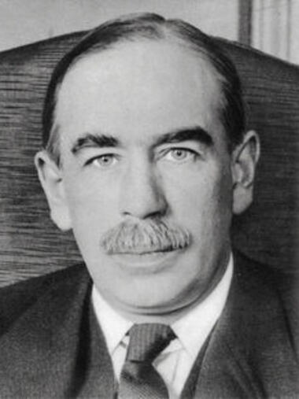
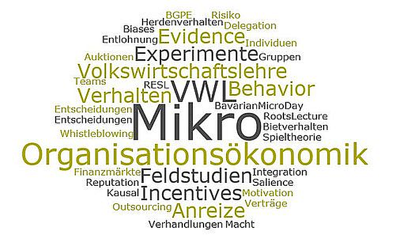
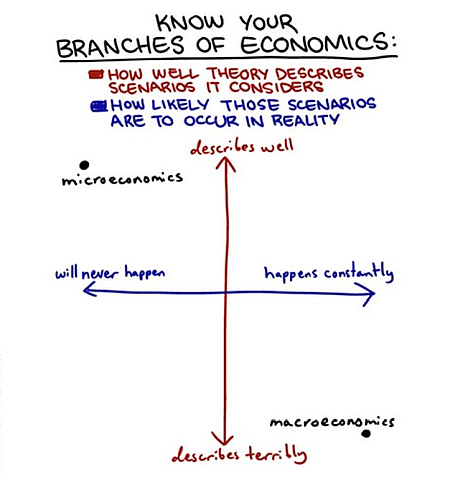
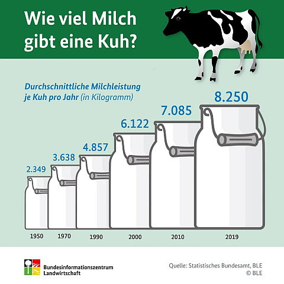
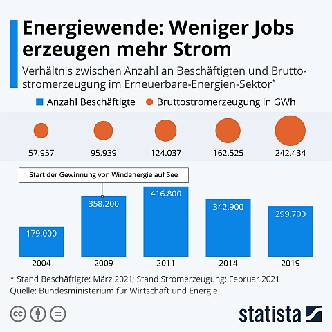
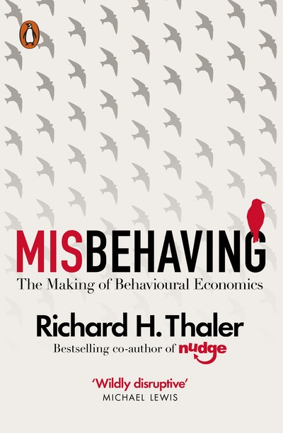

class: title-slide

```{r xaringan-themer, include=FALSE}
library(xaringanthemer)
style_xaringan(text_color = "#232461",inverse_text_color = "#FFFFFF",inverse_background_color = "#232461", title_slide_background_color = "#232461",header_background_color = "#232461",header_color = "#FFFFFF",header_h1_font_size = "32px",
  header_h2_font_size = "26px",link_color="#d84116",
  header_h3_font_size = "20px",text_slide_number_color = "#232461",text_slide_number_font_size = "0.5em")
```

```{r xaringanExtra, echo=FALSE}
xaringanExtra::use_progress_bar(color = "#d84116", location = "bottom")
xaringanExtra::use_xaringan_extra(c("tile_view","scribble","panelset","tachyons"))
xaringanExtra::style_panelset_tabs(font_family = "inherit")
#xaringanExtra::use_search(show_icon = TRUE)
#weitere: "share_again","animate_css", "webcam","freezeframe","clipboard","fit_screen","extra-styles" 
xaringanExtra::use_editable(expires = 1)
xaringanExtra::use_freezeframe(trigger = "hover")
```

```{r setup, include=FALSE}
options(htmltools.dir.version = FALSE)
library(tidyverse)
library(latex2exp)
library(fontawesome)
```


# Volkswirtschaftslehre

## CORE - The Economy

### Unit 3: Rational Choice Modell
 

<br>
<br>
<br>
<br>
<br>
<br>
<br>
### Sommersemester 2025 
<br>
### Prof. Dr. Jörg Schoder
.mycontacts[
`r fa('github')` @ISBA-University
`r fa('linkedin')` @jfschoder
]

---
layout: true

<div class="my-footer"></div>       

<div style="position: absolute;left:400px;bottom:10px;color:ISBAblue;font-size:9px">`r r2symbols::sym('copyright')``r rmarkdown::metadata$author`</div>


---
name: Motivation
class: left

# John Maynard Keynes und die Früchte des Wachstums

.pull-left[
```{r, echo=FALSE}

```
]

.pull-right[
.center[
"What can we reasonably expect the level of our economic life to be a
hundred years hence? [..]

Three-hour shifts or a fifteen-hour week may put off the
problem for a great while. For three hours a day is quite enough to satisfy the old Adam in most of us! [..]

Thus for the first time since his creation man will be faced with his real, his permanent problem-how to use his freedom from pressing economic cares, how to occupy the leisure, which science and compound interest will have won for him, to live wisely and agreeably and well."
]

.quelle[J.M. Keynes (1930): [Economic Possibilities for our
Grandchildren](http://www.econ.yale.edu/smith/econ116a/keynes1.pdf)]
]

???

Many have given voice to a shorter working week. Keynes predicted in 1930 that were productivity to keep rising in the way that it was in his era, and in fact has, then by 2030 there would be higher incomes and a 15 hour working week leaving plenty of time for meaningful leisure.


---
name: Gliederung
class: inverse, left, middle

# Was lernen wir?

## Inhaltliche Leitfragen

In Einheit 1 und 2 wurde die Bedeutung des technologischen Fortschritts für die langfristige Entwicklung des Wohlstands deutlich.

.blockquote[
1. Wie kann der Produktivitätsgewinn infolge technologischer Fortschritte genutzt werden bzw. wie wurde er historisch genutzt? 
2. Warum ist die Prognose von J.M. Keynes nicht eingetreten?  
]

## Ökonomische Methoden und Konzepte 

.blockquote[
1. Technologie und Marginale Rate der Transformation
2. Präferenzen und Marginale Rate der Substitution
3. Optimale Entscheidung unter Nebenbedingungen
]


---
name: MikroMakro
clasS: left

# Mikro- vs. Makroökonomik

.panelset[
.panel[.panel-name[Mikro]
```{r, echo=FALSE,fig.align='center',out.width = "60%"}

```
.quellePanURL[Bildquelle: 
[Universität Regensburg](https://www.uni-regensburg.de/wirtschaftswissenschaften/vwl-roider/home/index.html).]
]
.panel[.panel-name[Makro]
```{r, echo=FALSE,fig.align='center',out.width = "60%"}
knitr::include_graphics("../images/unit03/makro_wordcloud.png")
```
.quellePanURL[Bildquelle: shutterstock.]
]
.panel[.panel-name[Perspektiven]
<table>
<thead>
  <tr>
    <th></th>
    <th class="align-right">Mikro</th>
    <th class="align-right">Makro</th>
  </tr>
</thead>
<tbody>
  <tr>
    <td>Ausgangspunkt:</td>
    <td>einzelnes Subjekt/Haushalt </td>
    <td>zweifacher Aggregationsprozess (Vereinfachung vs. Infoverlust)</td>
  </tr>
  <tr>
    <td rowspan="2">Hauptinteressen:</td>
    <td> Allokation und Distribution</td>
    <td>Bestimmungsgründe und Entwicklung Globalgrößen</td>
  </tr>
  <tr>
    <td>Erklärung individueller Entscheidungen</td>
    <td></td>
  </tr>
  <tr>
    <td rowspan="5">Wichtige Zweige:</td>
    <td>Entscheidungstheorie</td>
    <td>Wachstumstheorie</td>
  </tr>
  <tr>
    <td>Preis-/Werttheorie</td>
    <td>Konjunkturtheorie</td>
  </tr>
  <tr>
    <td>Wettbewerbstheorie</td>
    <td>Beschäftigungstheorie</td>
  </tr>
  <tr>
    <td>Informationsökonomik</td>
    <td>Handelstheorie</td>
  </tr>
  <tr>
    <td>Verhaltensökonomik</td>
    <td>Geldtheorie</td>
  </tr>
  <tr>
    <td></td>
    <td colspan="2" style="text-align:center;">Finanzmarkttheorie</td>
  </tr>
</tbody>
</table>

.panel[.panel-name[Fun]
```{r, echo=FALSE,fig.align='center',out.width = "60%"}

```

.quellePanURL[Bildquelle: [tumblr.com](https://econsociology.tumblr.com/post/105479023240)]
]
]
]


???

  |Mikro | Makro
---|------|---------
Ausgangspunkt: | einzelnes Subjekt/Haushalt | zweifacher Aggregationsprozess (Vereinfachung vs. Infoverlust)
Hauptinteressen:| Allokation und Distribution|Bestimmungsgründe und Entwicklung Globalgrößen
|Erklärung individueller Entscheidungen
Wichtige Zweige| Entscheidungstheorie, Preistheorie/Werttheorie, Wettbewerbstheorie, Verhaltensökonomik, Finanzmarkttheorie | Wachstumstheorie,Konjunkturtheorie, Geldtheorie, Beschäftigungstheorie,Handelstheorie,Finanzmarkttheorie

Auf Folie vermerken:
**Mikro und Makro als sich ergänzende *Methoden* - Wahl der Methode abhängig vom Erkenntnisinteresse**


---
name: Makro
class: inverse, center, middle

# Teil 1: Makroökonomische Perspektive

.blockquote[Kleine Fortschritte, große Effekte: Die 69er-Regel]

.blockquote[Verwendungsmöglichkeiten von Produktivitätsfortschritten]


---
name: WachstumProd
class: left

# Keynes' Idee aus mathematischer Sicht

.blockquote[
"Productivity growth isn’t everything, but in the long run it’s almost
everything."
.tr[
— (Paul Krugman)
]]

--

* Geringe Änderungsraten haben langfristig große Niveau-Effekte:

--

  * Die 69er (bzw. 70er oder 72er Regel):
$$\mbox{Anzahl der Jahre bis zur Verdoppelung}\approx\frac{69}{\mbox{jährliche Wachstumsrate}}$$
  * Zur Erinnerung: $$\ln(2)\approx 0,6931$$ und $$\lim_{p\to 0}\left(1+\frac{p}{100}\right)=\frac{p}{100}$$

---
name: Milch
class: left

# Beispiele für Produktivitätsfortschritte

.panelset[
.panel[.panel-name[Milchproduktion]
```{r, echo=FALSE,fig.align='center',out.width = "60%"}

```
<br>
.quellePan[Quelle: [Bundesinformationszentrum Landwirtschaft](https://www.landwirtschaft.de/landwirtschaft-verstehen/haetten-sies-gewusst/tierhaltung/wie-viel-milch-geben-schafe-und-ziegen).]
]
.panel[.panel-name[Stromproduktion]
```{r, echo=FALSE,fig.align='center',out.width = "60%"}

```
<br>
.quellePan[Quelle: [Statista](https://de.statista.com/infografik/25321/verhaeltnis-von-beschaeftigten-und-bruttostromerzeugung-im-bereich-der-erneuerbaren-energien/?utm_source=Statista+Newsletters&utm_campaign=811bba16b4-All_InfographTicker_daily_DE_AM_KW28_2021_Mi_COPY_&utm_medium=email&utm_term=0_662f7ed75e-811bba16b4-314535141).]
]
]


---
name: Mikro-Makro
class: left

# BIP pro Kopf und Produktivität


* Produktivität, Arbeitsmarkt und Präferenzen entscheiden über die
Entwicklung des BIP pro Kopf


$$\frac{\mbox{BIP}}{\mbox{Bevölkerung}}=         \underbrace{\frac{\mbox{BIP}}{\mbox{Arbeitsstunden}}}_{\mbox{Produktivität}} \cdot \underbrace{\frac{\mbox{Arbeitsstunden}}{\mbox{Bevölkerung}}}_{\mbox{Arbeitsmarkt & Präferenzen}}$$

--

* wobei:

$$\frac{\mbox{Arbeitsstunden}}{\mbox{Bevölkerung}}=
		\underbrace{\frac{\mbox{Arbeitsstunden}}{\mbox{Erwerbstätige}}}_{\mbox{Präferenzen}}\cdot\underbrace{\frac{\mbox{Erwerbstätige}}{\mbox{Bevölkerung}}}_{\mbox{(Erwerbstätigenquote)}}$$


--

* bzw.

$$\frac{\mbox{Erwerbstätige}}{\mbox{Bevölkerung}}=\underbrace{\frac{\mbox{Erwerbstätige}}{\mbox{Erwerbspersonen}}}_{\mbox{(1-Arbeitslosenquote)}}\cdot\underbrace{\frac{\mbox{Erwerbspersonen}}{\mbox{ Bevölkerung}}}_{\mbox{Partizipation}}$$		


---
name: Produktivity
class: left

# Arithmetik des Produktivitätswachstums

* (Arbeits-)Produktivität:

$$\begin{equation*}
			y_t\equiv\frac{Y_t}{L_t},
		\end{equation*}$$
		
$$\mbox{mit}~ Y_t: ~\mbox{BIP},~L_t:~\mbox{geleistete Arbeitsstunden}.$$

* Für das Produktivitätswachstum gilt:

$$\begin{eqnarray*}
\frac{y_{t}}{y_{t-1}}=\frac{\frac{Y_t}{Y_{t-1}}}{\frac{L_t}{L_{t-1}}}=\frac{(1+g_{y,t})y_{t-1}}{y_{t-1}}&=&\frac{\frac{(1+g_{Y,t})Y_{t-1}}{Y_{t-1}}}{\frac{(1+g_{L,t})L_{t-1}}{L_{t-1}}}\\
			(1+g_{y,t})&=&\frac{(1+g_{Y,t})}{(1+g_{L,t})}\\
			\iff \ln(1+g_{y,t})&=&\ln(1+g_{Y,t})-\ln(1+g_{L,t})
		\end{eqnarray*}$$
* $$\mbox{Für kleine Wachstumsraten}~ g~\mbox{gilt wegen}~ \lim_{x\to 0}\left(1+g\right)=g~\mbox{näherungsweise}:$$

	$$g_{y,t}\approx g_{Y,t}-g_{L,t}$$

???
* Reminder: Wachstumsrate: Absolute Veränderung bezogen auf das Ausgangsniveau

$$\frac{y_{t}-y_{t-1}}{y_{t-1}}=\frac{y_t}{y_{t-1}}-\frac{y_{t-1}}{y_{t-1}}=\frac{y_t}{y_{t-1}}-1=g_{y,t}$$

* Wachstumsfaktor: Neues Niveau durch altes Niveau

$$\frac{y_t}{y_{t-1}}=g_{y,t}+1$$

---
name: Empirie1
clasS: left

# Arbeit vs. Einkommen: Langfristige Entwicklungsrends


.panelset[
.panel[.panel-name[Längsschnitt]
```{r, echo=FALSE,out.width = "100%"}
knitr::include_url("https://ourworldindata.org/grapher/annual-hours-of-work-and-income-18702016",height = "480px")
```
]
.panel[.panel-name[Querschnitt]
```{r, echo=FALSE,out.width = "100%"}
knitr::include_url("https://ourworldindata.org/grapher/annual-hours-of-free-time-per-worker-and-income",height = "480px")
```
]
]

???

* Tatsächlich wurden die Produktivitätsfortschritte für beides genutzt: Mehr Produktion/Einkommen und mehr Freizeit.

* [OECD-Daten](https://stats.oecd.org/Index.aspx?DataSetCode=ANHRS)

    * Deutschland (2019: 1386 Stunden) vs. Griechenland (2019: 1949 Stunden)
    * Schweiz (2019: 1557 Stunden), Norwegen (2019: 1384 Stunden), 
    * geringste Arbeitsstunden (2019): Dänemark (1380)
    * höchste Arbeitsstanden (2019): Mexiko (2137), in Europa: Griechenland!

* Aber nach Keynes hätten die Arbeitsstunden deutlicher sinken müssen

* Bevor wir nach Erklärungen dafür suchen, wollen wir noch einen etwas detaillierten Blick auf die Möglichkeiten zur Verwendung des Produktivitätswachstums werfen
		
---
name: verwendungProd
class: left

# Wie kann das Produktivitätswachstum genutzt werden?

* Aufschlüsselung der Produktivität

$$y=\frac{Y}{L}=\frac{Y}{L\cdot \frac{1}{N}\cdot N} = \frac{Y}{\frac{L}{E}\cdot \frac{E}{N}\cdot N},$$
$$\mbox{mit}~ Y: ~\mbox{BIP},~L:~\mbox{geleistete Arbeitsstunden},~N:~\mbox{Bevölkerungszahl}~\mbox{und}\\~E:~\mbox{Zahl der Erwerbstätigen}.$$

--

* Für die Wachstumsrate der Produktivität $g_y$ gilt somit näherungsweise:

$$g_y\approx g_Y-g_L-g_E-g_N$$

--

* Mithin kann das Produktivitätswachstum bei konstanter Bevölkerung $(g_N=0)$ genutzt werden für:

--
    * Steigerung des (absoluten) BIP
--
    * Reduktion der Arbeitsstunden (pro Erwerbstätigen)
--
    * Reduktion der Erwerbstätigenquote

--

* Demografischer Wandel?


???


$$\frac{Y}{L}=\frac{Y}{L\cdot \frac{1}{N}\cdot N}=\frac{Y}{\frac{L}{E}\cdot\frac{E}{N}\cdot N}$$


$$g_y\approx g_Y-g_{\mbox{Stunden pro Erw.}}-g_{\mbox{Erwerbstätigenquote}}-g_{\mbox{Bevölkerung}}$$


---
name: Mikro
class: inverse, center, middle


# Teil 2: Mikroökonomische Perspektive

## Warum lag Keynes daneben?

.blockquote[Einführung in die Theorie der Rationalen Wahl (Rational Choice)]


???
Use a model of individual choice to explain the differences in work hours across countries and over time

Zur Beantwortung steigen wir in die mikroökonomische Analyse ein. Wir betrachten ein einfaches Modell, das vielfältige Anwendungsmöglichkeiten (aber auch Grenzen) hat. Beides wollen wir im Rahmen der Vorlesung herausarbeiten


---
name: Methodologie
class: left

# Wissenschaftstheoretischer Hintergrund

.panelset[
.panel[.panel-name[Methodologischer Individualismus]
.pull-left[
```{r, echo=FALSE,out.width = "100%"}
knitr::include_url("../images/unit03/skydiving_(pixabay)_tiny.png",height = "295px")
```
]
.pull-right[
.blockquote[
Das wissenschaftstheoretische Konzept des methodologischen Individualismus führt soziale Phänomene (Prozesse, Institutionen etc.) auf das Verhalten der beteiligten Individuen (als kleinste Einheiten bzw. Grundbestandteile der sozialen Welt) zurück. Kurz: Das Ganze wird als Summe der Einzelteile gesehen und erklärt.
]
]
]
.panel[.panel-name[Homo Oeconomicus]
.pull-left[
```{r, echo=FALSE,out.width = "100%"}
knitr::include_url("../images/unit03/robot_(pixabay)_small.png",height = "405px")
```
]
.pull-right[
* Neoklassik als Ökonomisches Standardparadigma
* Zentrale Annahme: der (zumindest in wirtschaftlichen Fragen) **uneingeschränkt rationale** *homo oeconomicus*
* Diese **Annahme erlaubt** es, Handlungsentscheidungen mit (vereinfachenden) **mathematischen Modellen** abzubilden.
]
]
.panel[.panel-name[Caveat]
* Obs! Der *homo oeconomicus* ist weder positiv (als Menschenbild) noch normativ (als Ideal) zu interpretieren. 
* Ziel: Erklärung gesellschaftlicher Makrophänomene in anonymen Gesellschaften (nicht einzelnes individuelles Verhalten). 
*	Mithin: *methodologische Funktion* (Analysekonstrukt).

.blockquote[Niemand im Vollbesitz seiner geistigen Kräfte möchte seine Tochter mit einem
					'homo oeconomicus' verheiratet sehen, mit jemandem, der sämtliche Kosten
					nachrechnet und stets nach dem Gegenwert fragt, der nie von verrückter Großzügigkeit
					oder nicht berechnender Liebe heimgesucht ist, der nie aus einem
					Gefühl innerer Identität handelt und der in der Tat keine innere Identität besitzt,
					auch wenn er gelegentlich von sorgfältig kalkulierten Erwägungen über Wohlwollen
					und Missgunst bewegt ist.
					.tr[
— (Boulding 1973, S. 12, zitiert nach Bofinger 2010, S. 80)
]
]
]
]

???

* [Stanford Encyclopedia of Philosophy](https://plato.stanford.edu/entries/methodological-individualism/)
* Panel 1: Methodologischer Individualismus
    * Beispiel Unternehmung: Es gibt keine Ziele oder Strategien des Unternehmens sondern nur individuelle Ziele und Strategien der Menschen im Unternehmen.
    * Obs! Methodologischer Kollektivismus: Das Ganze ist mehr als die Summe der Einzelteile (Holismus).
    * Erklärung individueller Handlungen in der Wirtschaftstheorie und **Annahme "rationalen Verhaltens"** der Wirtschaftssubjekte	
    * methodologischer vs. normativer Individualismus

* Panel 2: Standard-Paradigma
    * Der *homo oeconomicus* ist (zumindest in wirtschaftlichen Fragen) uneingeschränkt rational und wird durch folgende Eigenschaften definiert:
    * ausschließlich *eigeninteressiert*: kein Neid, keine Schadenfreude, sondern *gegenseitig desinteressierte Vernünftigkeit* (Kirchgässner 1991, S. 47), Quelle: Franz (2004)
  $\Rightarrow$ Handlungsmotive: Nutzenmaximierung (Haushalte) bzw. Gewinnmaximierung (Unternehmen) 
  	* hat sämtliche entscheidungsrelevanten Informationen (Alternativen und Konsequenzen) $\Rightarrow$ vollkommene Markttransparenz
  	* kann die Informationen auch im Zusammenhang mit sehr komplexen Entscheidungsprozessen verarbeiten und somit bei verschiedenen Handlungsalternativen immer eine konsistente Rangfolge in Bezug auf den Nutzen ermitteln, Quelle Bofinger (2010, S. 80)

* Panel 3:
    * Ziel: Erklärung gesellschaftlicher Makrophänomene in anonymen Gesellschaften (nicht einzelnes individuelles Verhalten), Franz, 2004


---
name: RCT-Modell 
class: left

# Einfaches Entscheidungsmodell der Mikroökonomik

```{tikz,echo=FALSE}
\usetikzlibrary{angles,quotes,babel,calc,matrix,patterns,math,fit,arrows,arrows.meta,shapes.arrows,shapes,shapes.geometric,positioning,intersections,chains,trees,mindmap,shadows,shadows.blur,shadings,backgrounds,colorbrewer,decorations.markings,decorations.pathreplacing,decorations.text}
\tikzset{font=\normalsize\bfseries,
		node distance=4em and 1em,
		node/.style = {align=center, inner sep=4pt, text centered,
			font=\normalsize\bfseries},
		kasten/.style = {node,
			top color=white,
			bottom color=blue!25,
			rectangle,rounded corners,
			minimum height=3em,
			minimum width=9em,
			draw=blue!75,
			very thick,
			align=center,
			text centered,
			drop shadow,
			%			text depth = 2pt,
			%	text width=5em
		},
		plainode/.style = {node,fill=none},% arbre rouge noir, noeud rouge
		line/.style={draw=blue!50, line width=.2em},
		double/.style={draw=blue!50, stealth-stealth, very thick}
	}	
	\begin{tikzpicture}
		\node [kasten] (opt) {Optimum unter\\Nebenbedingung(en)};
		\node [kasten,above left = of opt] (ziel) {Ziel};
		\node [kasten, above right = of opt] (const) {Nebenbedingung(en)};
		%arrows
		\path[line,bend left=30] (ziel.east) edge[draw=blue!50,-stealth] ($(opt.north)+(-.05,0)$);
		\path[line,bend right=30] (const.west) edge[draw=blue!50,-stealth] ($(opt.north)+(.05,0)$);
\end{tikzpicture}
```

.quelle[Eigene Darstellung.]
--

* Anwendungen im Bereich der Haushaltstheorie:

--

  * Entscheidung zwischen Freizeit und Arbeit (Einkommenserzielung)

--

  * Entscheidung zwischen Konsumbündeln

--

  * Intertemporale Konsumentscheidung (Konsum vs. Sparen)

--

* Anwendung in der Produktionstheorie: Entscheidung über das optimale Faktoreinsatzverhältnis (Kapital vs. Arbeit)


???
* Beispiel in Unit 3: Students choose how many hours to study, which affects their grade (GPA). 
* We assume a positive relationship between GPA and the number of hours studied (evidence that this is true, ceteris paribus). 

* Foliensatz wechseln!!!

* Gary Becker: Familie, Gesellschaft, Politik
  * Diskriminierung
	* Kriminalität
	* Suchtverhalten
	* Politik
	* Humankapital (Ausbildungsentscheidung)
	* Heimarbeit
	* Partnerwahl und Familie
	* Organhandel


---
name: OpportunityCost
class: left

# Feasible Set und Opportunitätskosten

```{r, echo=FALSE,out.width = "100%"}
knitr::include_graphics(xfun::from_root("images","unit03","COREde_fig3-9i.png"))
```


???

* Gruppendiskussion: Warum haben die Opportunitätskosten von Alexei keinen linearen Verlauf?

* Konsumentscheidung zwischen zwei Bündeln: Opportunitätskosten entsprechen dem Preisverhältnis (Preisverhältnis = MRT). Die Budgetgerade ist somit die lineare Transformationskurve (in welchem Verhältnis können die beiden Güter getauscht werden?)

* Bei Alexei entsprechen die Opportunitätskosten der Freizeit dem Punkteverlust im Test

* Weil das Grenzprodukt des Lernens abnehmend ist, verläuft der Punkteverlust nicht linear. Entsprechend hat er eine nach außen gewölbte (konkave) Transformationskurve


---
name: OptimalDec
class: left

# Präferenzen und Optimale Entscheidung

.panelset[
.panel[.panel-name[abnehmendes Grenzprodukt]
```{r, echo=FALSE,out.width = "100%"}
knitr::include_graphics(xfun::from_root("images","unit03","COREde_fig3-10a-g.png"))
```
]
.panel[.panel-name[konstantes Grenzprodukt]
```{r, echo=FALSE,out.width = "100%"}
knitr::include_graphics(xfun::from_root("images","unit03","COREde_fig3-15d.png"))
```
]
]

???

* MRT im Fall von Alexei: Opportunitätskosten der Freizeit: Lohn

* abnehmendes Grenzprodukt der Arbeit vs. konstanter Lohnsatz (hier letzteres)


---
name: EE-SE
class: left

# Einkommens-Effekt für unterschiedliche Präferenzen

.panelset[
.panel[.panel-name[EE>0]
```{r, echo=FALSE,out.width = "100%"}
knitr::include_graphics(xfun::from_root("images","unit03","COREde_fig3-17.png"))
```
]
.panel[.panel-name[EE=0]
```{r, echo=FALSE,out.width = "100%"}
knitr::include_graphics(xfun::from_root("images","unit03","COREde_fig3-18.png"))
```
]
.panel[.panel-name[EE<0]
* Bei sog. *normalen* Gütern, gehen wir davon aus, dass der Einkommeneffekt nicht negativ sein kann.

* Führt eine Einkommenserhöhung ceteris paribus zu einer Reduzierung der Nachfrage (d.h. ist der Einkommenseffekt negativ), handelt es sich um ein sog. *inferiores* Gut (vgl. das Feldexperiment in China im Kursnotizbuch).

]
]


???

* Freizeit-Nachfrage = 24-Arbeitszeit
* We assume that for most goods the **income effect** will be either positive or zero, but **not negative**: if your income increased, you would not choose to have less of something that you valued.


---
class: left

# Einkommens- vs. Substitutionseffekt & Keynes' Prognose 


```{r, echo=FALSE,out.width = "100%"}
knitr::include_graphics(xfun::from_root("images","unit03","COREde_fig3-19b-f.png"))
```

???

* Wechsel Foliensatz!!!


---
name: RepAgents
class: left

# Repräsentative Agenten-Modelle


```{r, echo=FALSE,out.width = "100%"}
knitr::include_graphics(xfun::from_root("images","unit03","COREde_fig3-20e.png"))
```

???

* Anwendung auf die Interpretation historischer Daten
* Repräsentative Agenten-Modelle unterstellen, dass alle identische Präferenzen haben - unterschiedliche Entscheidungen können also nur durch unterschiedliche ökonomische Situationen der Agenten resultieren.
* Moderne Modelle arbeiten mit Heterogenen Agenten

* Across Countries [Fremstad et al (Folie 38)](https://docs.google.com/presentation/d/1SR_IwBFoC734Le6Cqg6FFjk0ep318Rzx/edit#slide=id.p38): 
  * We can also plot consumption, free time, and budget constraints across countries. 
  * Indifference curves are unobservable, but if our model is correct they may look like this.
  * Preferences appear to differ across countries.
  * for example, South Koreans may value leisure less than Americans (because their MRS is lower).


---
name:
class: left

# Warum lag Keynes daneben? (Leijonhufvud, 2008)

## Antworten im Modell der Rationalen Wahl(entscheidung)

* Unterschätzt: Substitutionseffekt gestiegener Arbeitslöhne

--
* Überschätzt: Bedeutungsgewinn inferiorer Güter

   * Zwar wurden mehr und mehr Konsumgüter zu inferioren Gütern, jedoch blieben

   * Gesundheit (und Wohnen) normale Güter

--
* Außerdem: Konsum ist nicht das einzige Motiv für Arbeit und Einkommenserzielung

    * Alternativer Zweck von Arbeit und Einkommen: Prestige (Peer Groups)

    * Arbeit als Selbtzweck? Arbeit vs. **Muse** vs. Freizeit (Trade-off?)


???

* Unterschätzt/Überschätzt/Motive: Alles andere ist nicht konstant (c.p.), hier: die Präferenzen haben sich verändert
* Viele Konsumgüter wurden inferior: Anteil des Ausgaben für Nahrung, Kleidung am Einkommen sind kontinuierlich gesunken
* Gesundheit als normales Gut: Anteil der Gesundheitsausgaben am Einkommen in den Industrieländern stieg kontinuierlich
  * Mithin müsste man eigentlich im Gesundheitssektor arbeiten
  * Aber wie werden die Einkommen im Gesundheitssektor verteilt? Ärzte und Pharma haben die beste Lobby
* Muse: Tätigkeit ist Selbstzweck

* David Graeber: [Bullshit-Jobs](https://www.moment.at/sites/default/files/styles/portrait/public/2020-09/20200903-david-graeber.jpg?itok=5_cpGOzG)

  * Graeber: Arbeit als politisches Instrument, das aus dem Puritanismus hervorgegangen ist: die Menschen sind im Hamsterrad und begehren nicht auf
  * Bedeutung der Ungleichheit und der Bodenpolitik

* Lesetipp: [Wieviel ist genug](https://www.kunstmann.de/buch/robert_skidelsky_-wie_viel_ist_genug-9783888978227/t-2/)


---
name: ZwFazit
class: left

# Zwischenfazit

1. Grundlegendes Entscheidungsmodell der Mikroökonomik: Optimierung unter Nebenbedingungen

   * **Beste** Wahl bei gegebenen **Präferenzen** 
   * unter Berücksichtigung der (Nebenbedingung der) **verfügbaren Alternativen** (feasible frontier)
   * Im Optimum gilt: **MRS=MRT**

--
2. Anwendung des Modells auf die Frage der Arbeitsangebotsentscheidung. Gesamteffekt als Summe von...

   * Einkommens- und
   * Subsitutionseffekt

--

3. Modellkritik?


---
name: Modellkritik
class: inverse,center,middle

# Modellkritik


.blockquote[Kritik der Annahmen]

.blockquote[Kritik der Aussagen/Vorhersagen]

.blockquote[Verhaltensökonomische Befunde]


---
name: PauseSimpsons
class: inverse, center

background-size: 75%
background-image: url(https://media1.giphy.com/media/3o6UBiAQ9Ws8UWdmqA/giphy.gif?cid=ecf05e47ro6hu5pfdss2uwd9nop2vjqk8pybb8v4ydqywav7&rid=giphy.gif&ct=g)


---
name: Annahmen
class: left

# Zentrale Annahmen der Rational Choice Theorie

## Baustein 1: Feasible Set und Opportunitätskosten

.blockquote[
* relative Preise vs. 
* Marginale Rate der Transformation
* Arbeitsstunden beliebig variierbar?
]

--

## Baustein 2: Präferenzen

.blockquote[
* Konsistente (vollständige sowie transitive) und stabile Präferenzen 
* Kulturelle Einflüsse?
]

--

## Optimum

.blockquote[
* MRT=MRS? Entscheiden wir so?
]

???

* MRT und Messproblematik
* Framing als bedeutender SIF mit großer Relevanz für Marketing-Fragen

* MRT=MRS: Entscheiden wir wirklich so?
  * M. Friedman: Trial&Error führt im Zeitverlauf zur Selektion rationaler Entscheidungen
  * Aber: Verhaltensökonomische Befunde

* Kultur - Weber: Kapitalismus und protestantische Ethik  


---
name: Prefs
class: left

# Vollständige, transitive und stabile Präferenzen?

.panelset[
.panel[.panel-name[Vollständigkeit]
```{r, echo=FALSE,out.width = "90%",fig.align='center'}
knitr::include_url('../images/unit03/beverages_(pixabay).png',height = '460px')
```

<br>

.quellePan[Bildquelle: [pixabay.com](pixabay.com)]
]
.panel[.panel-name[Transitivität]
.pull-left[
```{r, echo=FALSE,out.width = "85%",fig.align='center'}
knitr::include_url('../images/unit03/shades_of_grey.png',height = '418px')
```
]
.pull-right[
Heinz ist großer Fußballfan. Beim Bier nach dem Training erzählt er seinen Teamkollegen, dass...:
* ...er den SC Freiburg lieber mag als den Karlsruher SC (KSC)
* ...er den KSC lieber mag als den VFB Stuttgart
* ...er den VFB genauso gut findet wie den BVB (Dortmund)
* ...und er den BVB besser findet als den SC Freiburg
]
.panel[.panel-name[Stabilität]
* Extrembeispiel Suchtverhalten
* Wahlmöglichkeiten:
  * x: eine Zigarette pro Tag rauchen
  * y: vollständige Abstinenz (Ausgangssituation)
  * z: schweres Rauchen (eine Packung pro Tag?)
* Präferenzen in der Ausgangssituation: $x\succ y\succ z$
Nach dem Beginn des Rauchens verändert sich die Präferenzrelation zu $z\succ x\succ y$
	.center[
		$\Rightarrow$ Intransitiv, wenn stabile Präferenzen unterstellt werden: $x\succ z\succ x$
	]
* Möglichkeit sich ändernder Präferenzen wichtig zur Analyse von Suchtverhalten
]
]
]


???

* **Stabilität:**
    * Hintergrund: Wir wollen ökonomische Entscheidungen auf das Wirken ökonomischer Anreize zurückführen bzw. mit diesen Anreizen erklären und nicht einfach damit, dass sich möglicherweise die Präferenzen geändert haben.
		* Aber es gibt viele Studien, die zeigen, dass Präferenzen sich im Verlauf eines Lebens verändern (bspw. Musikgeschmack)
    * Ein Extrembeispiel ist Suchtverhalten, wobei sich die Frage stellt, ob ein Modells der rationalen Wahlhandlung hier zur Analyse geeignet ist. Ökonomen machen dies jedenfalls, und ganz abwegig ist es nicht, denn Entscheidungen zu einer Entziehungskur werden vermutlich durchaus rational getroffen (ich weiß ich sollte damit aufhören)
      
* **Vollständigkeit**
	* Bei den meisten Gütern kennen wir nicht alle Eigenschaften, bspw. Joghurtsorten im Supermark oder Speisekarte im Thai-Restaurant.
	* bzw. wissen wir nicht, wie die Eigenschaften eines Gutes zu unseren Bedürfnissen passt (schmeckt das Joghurt bzw. das Thai-Gericht bzw. haben wir möglicherweise Allergien auf Inhaltsstoffe?)
	* Besonders schwierig ist die Bildung von Präferenzen bei Gütern, mit denen wir wenig Erfahrung haben (bspw. seltene Käufe, wie eine Immobilie oder die Wahl des Ehepartners bzw. Entscheidungen im Zusammenhang mit dem Klimawandel)
	* Und klar, häufig treffen Menschen Entscheidungen, ohne sich über ihre Präferenzen im Klaren zu sein (intuitive und affektive Wahlhandlungen).
	* Aufgrund unserer beschränkten Hirnkapazität ist es unmöglich, alle Alternativen miteinander zu vergleichen
	* wenn wir also Vollständigkeit annehmen unterstellen wir implizit, dass keine Transaktionskosten (wie die gerade genannten Informationskosten) anfallen.
	* **Jetzt wissen wir, warum der Homo Oeconomicus keine beschränkte Kapazität** -- es geht um die Modellierung rationaler Präferenzrelationen, die wiederum die Voraussetzung dafür sind, dass wir das Modell der rationalen Entscheidung überhaupt realisieren können.
	
* **Transitivität**
	 * just perceptible differences (Beispiel: "Shades of Grey")
	  * Tatsächlich gibt es noch eine Vielzahl interessanterer Beispiele, die wir uns noch bei der Modellkritik am Ende von Unit 3 anschauen möchten -- bspw. wie wir Verletzungen der Transitivität von Präferenzrelationen nutzen können, um die Verkaufszahlen zu steigern...

  * Heinz inkonsistent
    * Seine Präferenzrelation ist BVB $\succ$ KSC $\succ$ VFB $\sim$ BVB $\succ$ SC
    * Daraus würde folgen: SC $\succ$ KSC $\land$ BVB $\succ$ SC $\implies$ BVB$\succ$ KSC
    * Aber dies widerspricht: KSC $\succ$ VFB $\sim$ BVB

---
name: Condorcet und Agenda-Setting
class: left

# Exkurs: Condorcet-Paradox und Agenda-Setting

.panelset[
.panel[.panel-name[Beispiel]
Drei Haushaltsmitglieder stimmen über das nächste Urlaubsziel ab:

* Mutter: Meer $\succ$ Stadt $\succ$ Berge
* Vater: Berge $\succ$ Meer $\succ$ Stadt
* Tochter: Stadt $\succ$ Berge $\succ$  Meer

Obs! Jedes Haushaltsmitglied hat transitive (und vollständige) Präferenzen
]
.panel[.panel-name[Brexit]
```{r, echo=FALSE,out.width = "100%",fig.align='center'}
knitr::include_url("https://www.economist.com/britain/2019/03/28/theresa-may-has-united-britain-everyone-hates-her-brexit-deal",height="500px")
```
]
.panel[.panel-name[Condorcet-Paradox]
.pull-left[
.blockquote[
Condorcet-Paradoxon
Bei einer kollektiven Entscheidung über mindestens drei Alternativen kann
eine schrittweise (Mehrheits-)Abstimmung über je zwei Alternativen trotz
individuell transitiver Präferenzen zu eine nicht transitive kollektive
Präferenzordnung resultieren.
]
]
.pull-right[
```{r, echo=FALSE,message=FALSE,fig.align='center'}
option<-c('Hart','Soft','Verbleib')
A<-c(3,2,1)
B<-c(1,3,2)
C<-c(2,1,3)

my_tib<-tibble(option,A,B,C)
        
#Überführen in long-Format
plot_tib <- my_tib %>% 
              gather(group, value, -c(option)) %>%
              mutate(value=as.factor(value))
#Plotten

p<-ggplot(plot_tib,aes(x=option,y=value,color=group))
p<-p + geom_point(size=3)
p<-p + geom_line(aes(group =  group),linetype='dashed')
p<-p + labs(x='', y='',color = "Gruppe")
p<-p + scale_color_brewer(palette='Set1')
#Theme mit allg. Layout-Festlegungen 
p <- p + theme_light()
p <- p + theme(legend.position='bottom',
               axis.text.x=element_text(size=12,face='bold'),
               legend.title=element_text(size=14,face='bold'),
               legend.text=element_text(size=14))
p
```
]
.quellePan[Eigene Darstellung.]
]
]

???

* Beispiel Urlaub
  * Selbst wenn die Präferenzen auf individueller Ebene rational sind, können wir bei kollektiven Entscheidungen irrationale (zirkuläre) Präferenzrelationen vorfinden.

* Brexit [Quelle:](https://www.econlib.org/condorcets-brexit/)

  * No group reaches 50% of the electorate, but they can be close, and one group can be very small. The chart depicts these alternatives with ordinal utility indices on the vertical axis (a higher number representing a more preferred option):
  * Präferenzen der Gruppe
    * A: $$H\succ S\succ V$$
    * B: $$S\succ V\succ H$$
    * C: $$V\succ H\succ S$$

* Arrow Unmöglichkeitstheorem


---
name: TrialError
class: left

# Evolutionäre Überlegenheit rationaler Präferenzen

.blockquote["Consider the problem of predicting the shots made by an expert billiard player. It seems not at all unreasonable that excellent predictions would be yielded by the hypothesis that the billiard player made his shots as if he knew the complicated mathematical formulas that would give the optimum directions of travel, could estimate accurately by eye the angles, etc., describing the location of the balls, could make lightning calculations from the formulas, and could then make the balls travel in the direction indicated by the formulas. Our confidence in this hypothesis is not based on the belief that billiard players, even expert ones, can or do go through the process described. It derives rather from the belief that, unless in some way or other they were capable of reaching essentially the same result, they would not in fact be expert billiard players." 
.tr[
— (Milton Friedman, Essays in Positive Economics, 1953).
]
]


???

* Rechtfertigung der Annahme durch Friedman

---
name: Predictions
class: left

# Kritik der Vorhersagen

<br>

.pull-left[
.blockquote["To put this point less paradoxically, the relevant question to ask
			about the "assumptions" of a theory is not whether they are
			descriptively "realistic," for they never are, but whether they are
			sufficiently good approximations for the purpose in hand. And this
			question can be answered only by seeing whether the theory works,
			which means whether it yields sufficiently accurate predictions."
					.tr[
— (Milton Friedman, 1966).
]
]
]
--
.pull-right[
<br>
* Erklärung der historischen Entwicklung der Arbeitszeit?

* Erklärung der Arbeitszeit im internationalen Vergleich?

* Konzeptioneller Wert des Modells: Substitutions- vs. Einkommenseffekt! 
]

???

Konzeptioneller Wert des Modells: Substitutions- vs. Einkommenseffekt! 
* Beispiel Sparen und Zins! (ggf. Classroom Experiment)!


---
class: inverse, center, middle

# Exkurs in die Verhaltensökonomik

---
class: left

# Verhaltensökonomik

.panelset[
.panel[.panel-name[SIFs]
* Thaler (2015): "In order to do good economics, you have to keep in mind that people are human".

* Verhaltensökonomik („Behavioral Economics“) dokumentiert beschränkte Rationalität („Misbehaving“) **realer Menschen**

* Thaler (2015): "Behavioral economics is, to a large extent, standard economics that has been modified to incorporate SIFS"

.blockquote[
Supposedly Irrelevant Factors (SIF) sind Faktoren, für die in Studien ein signifikanter Einfluss auf das Entscheidungsverhalten **realer** Menschen nachzuweisen ist, während sie für den (vollständig) *homo oeconomicus* der Standardtheorie als nicht entscheidungsrelevant angenommen werden.
]

* SIFs und Nudging (bspw. Organspende, Altersvorsorge etc.)
]
.panel[.panel-name[Lesetipp]
```{r, echo=FALSE,out.width = "40%",fig.align='center'}

```
.quellePanURL[Bildquelle: [penguin.com](https://www.penguin.com.au/books/misbehaving-9780241951224)]
]
]


???
* Richard Thaler, Nobelpreis 2019

* Decoy Effekt bei Minute 12:16: Economist Abo
* Decoy (dt. Köder)
* Letztlich auch ein Framing Effekt. Der Entscheidungsrahmen/-kontext (Frame) wird so gesetzt, dass
mehrere Alternativen zur Verfügung stehen, wobei eine klar dominierte Alternative dabei ist (der Köder).
* Decoys are „asymmetrically dominated“: they are completely inferior to one option (the target) but only partially inferior to the other (the competitor). For this reason, the decoy effect is sometimes
called the „asymmetric dominance effect."
* Kommt eine dritte Entscheidungsmöglichkeit ins Spiel, die asymmetrisch von den anderen beiden Optionen platziert wird, greifen die Kunden automatisch zu dem Produkt, bei dem Sie den Preis für angemessener halten


---
name: PredictablyIrrational
class: left

# SIFs als Systematische Verzerrungen 

.panelset[
.panel[.panel-name[Predictably Irrational]
.xxxlarge[**Systematische Verzerrungen:**]
<br>
.tiny[vgl. dazu ausführlich Goolsbee/Levitt/Syverson (2016, Kapitel 18).]

1. Selbstüberschätzung
--

2. Mangelnde Selbstkontrolle und hyperbolische Diskontierung
--

3. Anfälligkeit für Framing
--
  * Verlustaversion (bspw. Ausstattungseffekt)
  * Ankereffekte
  * Mentale Buchführung
  
4. Berücksichtigung versunkener Kosten
--

5. Großzügigkeit und Altruismus
--


]
.panel[.panel-name[Video D. Ariely]
<div style="max-width:854px"><div style="position:relative;height:0;padding-bottom:56.25%"><iframe src="https://embed.ted.com/talks/dan_ariely_are_we_in_control_of_our_own_decisions" width="854" height="480" style="position:absolute;left:0;top:0;width:100%;height:100%" frameborder="0" scrolling="no" allowfullscreen></iframe></div></div>
]
]


???

* Systematische Verzerrungen
* Verweis auf Lehrbuchkapitel in 


---
name: Framing
class: left

# Inkonsistente Präferenzen: Die Bedeutung von Framing 

.panelset[
.panel[.panel-name[Beispiel 1]

.pull-left[
```{r, echo=FALSE,out.width = "100%",fig.align='center'}
knitr::include_url('../images/unit03/smartphone_framing_(pixabay).png',height = '450px')
```
<br>
.quellePan[Bildquelle: [pixabay.com](pixabay.com)]
]
.pull-right[

* Wahlmöglichkeiten
  * A: Kauf in Filiale 2 bei Rabatt auf die Kopfhörer
  * B: Kauf in Filiale 2 bei Rabatt auf das Smartphone
  * C: Kauf beider Artikel in Filiale 1
* Entscheidungen unter "Frame 1" und "Frame 2" offenbaren: $A \succ C \land C \succ B$
* Transitivität würde implizieren: $A \succ C \land C \succ B \implies A \succ B$
* Jedoch offenbaren die Entscheidungen unter "Frame 3": $A\sim B$
]
]
.panel[.panel-name[Beispiel 2]
Halbvoll oder Halbleer?
.blockquote[
Eine Gruppe von Probanden erhält jeweils 50€. Sie müssen sich entscheiden, ob Sie die gesamte Summe für ein Glücksspiel verwenden oder die sichere Alternative wählen, bei der Sie 20€ behalten dürfen.

* Formulierung des Entscheidungsproblems (Framing):
  * A: Sie dürfen bei der sicheren Variante 20€ behalten.
  * B: Sie müssen bei der sicheren Variante auf 30€ verzichten.

* Ergebnis:
  * Obwohl die beiden Wahlmöglichkeiten äquivalent sind,
  * wird bei der Formulierung A weniger häufig das Glücksspiel gewählt als bei Formulierung B.
]
]
]


???

* Beispiel 1:
  * Im Original: Jacke und Taschenrechner (Kahnemann/Tversky, 1983)
		  * In Filiale 1 kostet ein Smartphone 125€, Kopfhörer sind für 15€ zu haben.
			 Der Verkäufer weist darauf hin, dass es in Filiale 2 (20 Minuten entfernt!) einen Rabatt von 5€...
			    * ...auf die Kopfhörer ("Frame 1")
				  * ...auf das Smartphone ("Frame 2") gibt.
			* $\Rightarrow$ In Experimenten machen sich unter Frame 1 68\% der Kunden auf Weg zur Filiale 2, unter Frame 2 aber nur 29\%.
			
			* "Frame 3": Weil die Artikel in Filiale 1 nicht auf Lager sind,  werden die Kunden gebeten, die Ware in Filiale 2 abzuholen und erhalten dafür 5€ Rabatt im Sinne einer Aufwandsentschädigung. 
			$\Rightarrow$ In Experimenten sind die Kunden indifferent zwischen einem Rabatt auf das Smartphone oder auf die Kopfhörer.	
	*	Sind die (offenbarten) Präferenzen transitiv? (siehe Folie rechts: nein)
  * Erklärungen?
      * **Mentale Buchführung** und Schnäppchen: Preisreduktion in Prozent (vs. absolute Beträge)?                 $\rightarrow$ "Transaction Utility" (Thaler)
      * Wahrnehmung von "Frame 1" und "Frame 2": Rabatt auf einzelne Produkte
      * Wahrnehmung von "Frame 3" als Rabatt auf das Güterbündel?

  * **Humans are particularly bad at processing information without context**, something we call a „frame“.
  * The frame provides an understandable setting – one that the client recognises and that helps them understand the meaning of your solution. The frame is the context you place your options in.

* Beispiel 2: 
  * Am häufigsten kommen Framing-Effekte in Situationen mit Unsicherheit vor
  * Verweis auf **Endowment Effect und Verlustaversion**


---
name: sunkcost
class: left

# Versunkene Kosten und Mentale Buchführung

.blockquote[
Beispiel (Thaler, 2015)

„Vince paid $1,000 to an indoor tennis club that entitled him to play once
a week for the indoor season. After two months he developed tennis elbow,
which made playing painful.“ 
]

--
Sollte Vince noch weiterspielen?

--
* Für einen "Econ" (Thaler, 2015) sind Kosten, die bereits angefallen (und
damit nicht veränderbar sind) nicht mehr entscheidungsrelevant: Es
sind **versunkene Kosten** (engl. sunk cost).

* "But for Humans, sunk costs linger and become another SIF
[Supposedly Irrelevant Factor]." (Thaler, 2015)

--

Obs! Verhaltensökononomische Erklärung: Mentale Buchführung (engl.
mental accounting)!

???

ToDo:

* Abonnements oder Gebühren für Fitnessstudios und Strategien zur Vermeidung von Kündigungen


---
name: FazAus
class: inverse, center, middle


# Zusammenfassung und Ausblick


---
name: Fazit
class: left

# Zusammenfassung


* **Makroökonomische Perspektive**
   * Produktivitätssteigerungen können unterschiedlich genutzt werden (Trade-offs)
      * Steigerung der Produktionsmenge
      * Verkürzung Arbeitszeit vs. "Befreiung" von Arbeit (für best. Gruppen)
   * Bevölkerungsalterung "absorbiert" (einen Teil d.) Produktivitätsfortschritte 
--

* **Mikroökonomische Perspektive**
   * Rational Choice Modelle können erklären, wie Produktivitätssteigerungen historisch genutzt wurden
   * Kritik an der Rational Choice Theorie
      * Verhaltensökonomik (s.u.)
      * Dennoch: Konzeptioneller Wert (hier: EE vs. SE)
--
* **Verhaltensökonomik**
   * Reale Menschen verhalten sich nicht (immer) wie der 
*homo oeconomicus*
   * Dennoch kann Verhalten vorhergesagt werden
      * menschliches Verhalten ist "**predictably irrational**" (D. Ariely)
      * Hintergrund: **Heuristiken** erleichtern das "Zurechtfinden" in komplexer Welt


???

* Makro: Nutzung Produktivitätsfortschritte und Demografischer Wandel

---
name: Ausblick 
class: left

# Ausblick

In Unit 4 erwartet uns:

  * Modelle individueller Entscheidungen, die zusätzliche wichtige Faktoren berücksichtigen
  
  * Bedeutung sozialer Interaktionen für individuelle Entscheidungen
  
  * Effekte individueller Handlungen auf kollektive/soziale Ergebnisse
  

---
name: EndHanks
class: inverse, center


background-size: 75%
background-image: url(https://media.giphy.com/media/KJ1f5iTl4Oo7u/giphy.gif)


