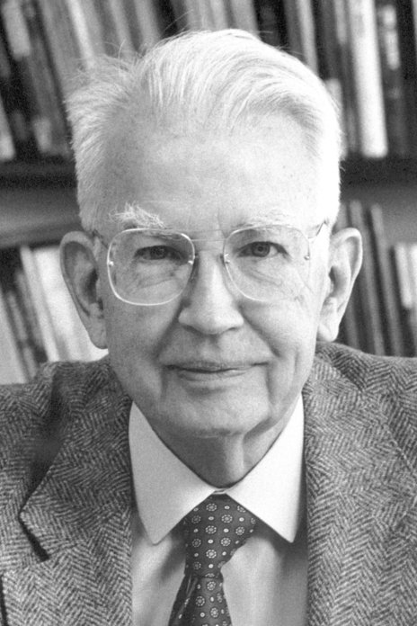
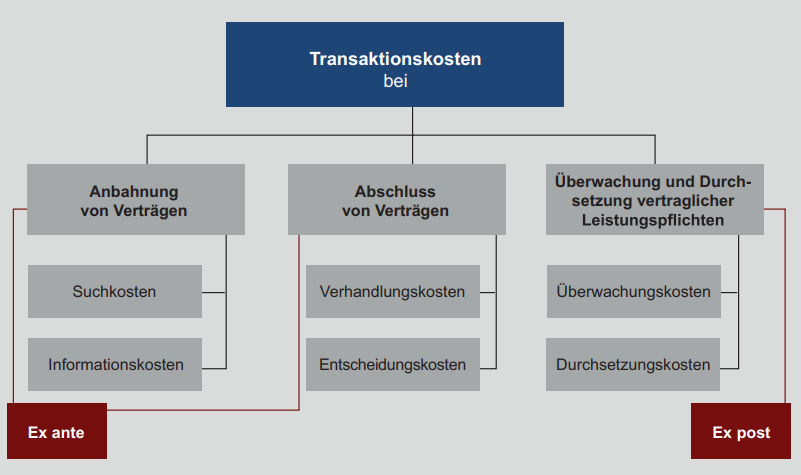
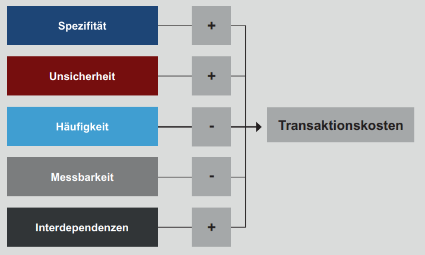
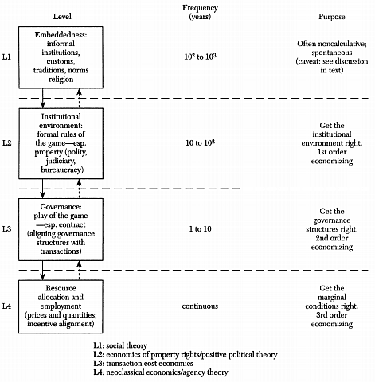

class: title-slide

```{r xaringan-themer, include=FALSE}
library(xaringanthemer)
style_xaringan(text_color = "#232461",inverse_text_color = "#FFFFFF",inverse_background_color = "#232461", title_slide_background_color = "#232461",header_background_color = "#232461",header_color = "#FFFFFF",header_h1_font_size = "32px",
  header_h2_font_size = "26px",link_color="#d84116",
  header_h3_font_size = "20px",text_slide_number_color = "#232461",text_slide_number_font_size = "0.5em")
```

```{r xaringanExtra, echo=FALSE}
xaringanExtra::use_progress_bar(color = "#d84116", location = "bottom")
xaringanExtra::use_xaringan_extra(c("tile_view","scribble","panelset","tachyons"))
xaringanExtra::style_panelset_tabs(font_family = "inherit")
#xaringanExtra::use_search(show_icon = TRUE)
#weitere: "share_again","animate_css", "webcam","freezeframe","clipboard","fit_screen","extra-styles" 
xaringanExtra::use_editable(expires = 1)
xaringanExtra::use_freezeframe(trigger = "hover")
```

```{r setup, include=FALSE}
options(htmltools.dir.version = FALSE)
library(latex2exp)
library(fontawesome)
```

# Volkswirtschaftslehre

## Intake 2022B

### CORE - The Economy: Unit 6  (Asymmetrische Information im Unternehmenskontext)

<br>
<br>
<br>
<br>
<br>
<br>
<br>
### Sommersemester 2023 
<br>
### Prof. Dr. Jörg Schoder
.mycontacts[
`r fa('github')` @ISBA-University
`r fa('linkedin')` @jfschoder
]


---
layout: true

<div class="my-footer"></div>       

<div style="position: absolute;left:400px;bottom:10px;color:ISBAblue;font-size:9px">`r r2symbols::sym('copyright')``r rmarkdown::metadata$author`</div>


---
name: Aktuell
class: left

# Arbitrage und die Bedeutung von Transaktionskosten

```{r, echo=FALSE,fig.align='center',out.width='80%'}
knitr::include_graphics('../images/unit06/Profite_LNG_(BerlinerZeitung).png')
```


---
name: Motivation
class: left

# Herbert Simon: Organisationen und Märkte

.pull-left[
```{r, echo=FALSE,fig.align='center',out.width='100%'}

```
]

.pull-right[

<br>

.center[.small[
"Suppose that [a visitor from Mars] approaches the Earth from space,
equipped with a telescope that reveals social structures. The firms reveal themselves, say, as solid green areas with faint interior contours marking out divisions and departments. Market transactions
show as red lines connecting firms, forming a network in the spaces between
them.

<br>

"Organizations would be the dominant feature of the landscape. A message sent back home, describing the
scene, would speak of "large green areas interconnected by red lines." It would not likely speak of "a network of red lines connecting green spots."
]]
]


.quelle[Herbert Simon (1991): [Organziations and Markets](https://pubs.aeaweb.org/doi/pdf/10.1257/jep.5.2.25)
]

???


---
name: Lernziele
class: inverse, left, middle
# Was lernen wir?

.small[
Arbeitsteilung und Spezialisierung ermöglichen Tauschgewinne und sind damit Grundlage des Wohlstands (Unit 1).    
  * Arbeitsteilung erfordert zwangsläufig Koordination. Eine dezentrale Koordination (die unsichtbare Hand) kann funktionieren, muss es aber nicht (Unit 4, mehr dazu in Unit 8 und 12). 
  * Die Verteilung der Tauschgewinne ist primär eine Frage der Verhandlungsmacht (Unit 5).
]
 
## Inhaltliche Leitfragen

.blockquote[.small[
1. Warum gibt es Unternehmen, wenn Preise eine dezentrale Koordination ermöglichen? 
2. Wo liegen Vor- und Nachteiler einer Koordination über Märkte im Vergleich zu jener in Unternehmen? 
3. Wie werden die Arbeitslöhne in Unternehmen bestimmt? Und wie beeinflussen Lohnverhandlungen die Arbeitslosigkeit?
]
]

## Ökonomische Methoden und Konzepte 

.blockquote[.small[
1. Transaktionskosten und Vertragstheorie
2. Lohnverhandlung und unfreiwillige Arbeitslosigkeit
3. Unvollständige Verträge, Prinzipal-Agenten-Modell
]
]


---
name: NIE-title
class: inverse, center, middle


# Neue Institutionenökonomik

.blockquote[Warum gibt es Unternehmen?]

.blockquote[Welchen Einfluss haben Institutionen auf Transaktionskosten?]


---
name: CoaseFirm
class: left

# Ronald Coase und die "Natur der Unternehmung"

.pull-left[
```{r, echo=FALSE,fig.align='center',out.width='100%'}

```
]

.pull-right[
.center[.small[
"An economist thinks of the economic system as being co-ordinated by the price mechanism and society becomes not an organisation but an organism. The economic &laquo;system works itself&raquo;."

"Within a firm, the description does not fit at all. For instance, in economic theory we find that the allocation of factors of production between different uses is determined by the price mechanism."


"Yet in the real world, we find that there are many areas where this does not apply. If a workman moves from department Y to department X, he does not go because of a change in relative prices, but because he is ordered to do so."

"The main reason why it is profitable to establish a firm would seem to be that there
is a cost of using the price mechanism, the most obvious... [being] that of
discovering what the relevant prices are."

]
]]


.quelle[Ronald H. Coase (1937): [The Nature of the Firm](https://onlinelibrary.wiley.com/doi/full/10.1111/j.1468-0335.1937.tb00002.x)
]

???


* bezugnehmend auf Robinson ("the two questions to be asked of a set of assumptions in economics are : Are they tractable? and : Do they correspond with the real world? Though, as Mrs. Robinson points out, "more often one set will be manageable and the other realistic, [..]" ):
* Coase: "a definition of a firm may be obtained which is 
      * not only realistic in that it corresponds to what is meant by a firm in the real world, 
      * but is tractable by two of the most powerful instruments of economic analysis developed by Marshall, the idea of the margin and that of substitution, together giving the idea of substitution at the margin.

* Handbook of new institutional economics (2008): 
  * "Coase describes his unwillingness to treat the firm as a "black box" that takes prices at one end and produces outputs at the other. 
  * This unwillingness led him famously to ask why firms exist, why are not all transactions done through the market? He famously answered that firms exist to economize on transaction costs. We find firms when it is cheaper to organize activities under a governing hierarchy than to try to conduct them in the market place and pay the costs to search, negotiate, monitor and enforce contracts. Coase’s argument that the level of transaction costs depends upon the institutional setting within which economic actors operate set the stage for the NIE. 


---
name: Tkosten
class: left

# Transaktionskosten

.panelset[
.panel[.panel-name[Entstehung]
```{r, echo=FALSE,fig.align='center',out.width='100%'}

```

.quellePanURL[Quelle: Felden/Hack (2019, S. 111).]
]
.panel[.panel-name[Einflussfaktoren]
```{r, echo=FALSE,fig.align='center'}

```

.quellePanURL[Quelle: Felden/Hack (2019, S. 112).]
]
]


???

* **Urache**: Es kommt zu diesen Transaktionskosten, weil die Akteure von Transaktionen 
    * nur begrenzte Fähigkeiten haben, Informationen aufzunehmen und zu verarbeiten (**begrenzte Rationalität**).
          * Damit können sie zum einen die Aufnahme und Abwicklung der für die Transaktion wichtigen Kontextparameter nicht vorhersagen und zum anderen nicht einschätzen, wie sich der Transaktionspartner während der Transaktion verhalten wird.
          * Somit müssen zum Beispiel Investitionen in die Suche und Auswahl der Partner getätigt werden, die bei vollkommener Markttransparenz so nicht angefallen wären. Auch muss die Transaktion durch Verträge abgesichert werden.
    * Diese Absicherung wäre nicht nötig, würden die Transaktionspartner selbstlos und
unter allen Kontextbedingungen und -entwicklungen immer altruistisch handeln. D.h. eine **zweite Ursache** neben die *begrenzte Rationalität* ist die Möglichkeit, dass sich Geschäftspartner  **opportunistisch** verhalten können (v.a. dann, wenn die Infos asymmetrisch verteilt sind)
  * Ein Holdup ist das opportunistische Ausnutzen von Vertragslücken


* Transaktionskosten fallen somit in den verschiedenen Phasen eines Austauschs von Leistungen zwischen Menschen an
   * vorvertragliche Suchkosten
   * Verhandlungskosten
   * nachvertragliche Kontroll- und Durchsetzungskosten
  
  
* Transaktionen sind also immer so zu organisieren, dass die aus der eigenen begrenzten Rationalität entstehenden Kosten möglichst gering ausfallen und gleichzeitig eine optimale Absicherung vor opportunistischem Verhalten des Vertragspartners aufgebaut wird 


* Jedoch ziehen nicht alle Transaktionen gleich hohe Transaktionskosten nach sich. Daher werden in der Transaktionskostentheorie verschiedene **Transaktionsmerkmale betrachtet, die einen Einfuss auf die Höhe** der Kosten haben
    * **Spezifizität**:  wenn Investitionen nur für die ausgewählte Transaktion einen Wert haben (z.B. Automobilzulieferer). Mit steigenden transaktionsspezifschen Investitionen steigt die Abhängigkeit vom jeweiligen Transaktionspartner (Verhandlungsmacht!).
    * **Häufigkeit**: Lerneffekte mit steigender Häufigkeit senken die T-kosten
    * **Unsicherheit**: bzgl. Zukunft, aber auch bzgl. des Verhaltens der Geschäftspartner
    * **Messbarkeit**: bspw. Arbeitseinsatz kaum messbar (**Shirking**-Problematik)
    * **Interdependenz**: mit anderen Transaktionen


---
name: Governance
class: left

# Transaktionskostenökonomik (O. Williamson)

## Transaktionskosten und Governance-Alternativen

.center[
```{tikz,echo=FALSE}
		\tikzset{
			point/.style={insert path={node[circle, inner sep=1.5pt, fill]{}}}
		}
	{\sffamily\tiny
		\begin{tikzpicture}[scale=.3,thick]
			\usetikzlibrary{calc,intersections}   %allows coordinate calculations.
			
			\draw[-stealth] (0,0) -- (16,0) node[below, text width=1.5cm,text height =6pt, text centered] {k};
			\node[thick,below]  at (8,-.7) {Spezifizität/Unsicherheit}; 
			\draw[-stealth] (0,0) -- (0,12) node[left,text height =6pt,text centered] {};
			\node[thick, above, rotate=90] at (0,5) {Transaktionskosten}; 
		%Kurven
			\draw[name path=markt,line width=1.2pt,color=blue,domain=0:6.5] plot (\x,{(1+(.45*\x)^2)}) node [left,align=center] {Markt\\(Spontane Ordnung)};
			\draw[name path=hybrid,line width=1.2pt,color=blue,domain=0:10.25] plot (\x,{(2.5+(.15*\x)^4.5)}) node [above] {Hybridform};
			\draw[name path=firm,line width=1.2pt,color=blue,domain=0:14] plot (\x,{(4+(.1*\x)^5)}) node [above] {Organisation};
		%Schnittpunkte
			\path[name intersections={of=markt and hybrid, by={M}}]	(M) node[] {};	
			\path let \p1 = (M) in node[below]  at (\x1,0) (kM) {$k_M$};
			\draw[dotted] (M) -- (kM);
 			\path[name intersections={of=hybrid and firm, by={H}}]	(H) node[] {};
 			\path let \p1 = (H) in node[below]  at (\x1,0) (kH) {$k_H$};
 			\draw[dotted] (H) -- (kH);
		\end{tikzpicture}}
```
]
.quelle[Eigene Darstellung.]


???

[TCE](https://www.researchgate.net/profile/Oliver-Williamson/publication/267767542/figure/fig1/AS:392124844527617@1470501256337/The-sciences-of-choice-and-contract_W640.jpg)


---
name: NIE
class: left

# Neue Insitutionenökonomik

```{r, echo=FALSE,fig.align='center',out.width='75%'}

```

.quelle[[Williamson (2000, S. 597)](https://www.researchgate.net/publication/4981429_The_New_Institutional_Economics_Take_Stock_Looking_Ahead)]


???


[NIE](https://www.researchgate.net/profile/Rod-Sheaff/publication/232947946/figure/fig1/AS:670028332556310@1536758611715/Branches-of-the-New-Institutional-Economics_W640.jpg)


Quelle: Handbook of NIE (Menard, 2008)
* Ronald Coase’s query as to why some transactions are done in markets and others in firms seems deceptively simple. 
* An important achievement of NIE in the years since Coase asked that question is to show how complex both question and answer really are.
* Claude Menard’s chapter explores how command, control and cooperation might give firms an advantage over markets and argues that we must understand the internal costs of firms as well as transaction
costs if we want to explain when they have an advantage over markets.
* Menard explores the many different ways of organizing activities that fall between the polar choices of vertically integrating the transaction into a firm or conducting trades on the spot market. 
* NIE differs from traditional economics not just by peering into the black box of the firms; it also opens the black box of markets. 
* Menard points out that to a new institutionalist markets are not costless, identical, or immediate; they are diverse in their costs because they vary in how they are organized, the rules that support them, and how those rules are enforced.


---
name: Firms
class: inverse, center, middle

# Unternehmen

.blockquote[Worin liegen zentrale Unterschiede zwischen Märkten und Organisationen?]

.blockquote[Welche Ziele können Unternehmen verfolgen?]


???

* Zentrale Unterschiede:
  * Koordination
  * Art der Verträge
  
* Ziele
  * Vielfältig (Zebras und Einhörner etc.). Viele laufen am Ende aber auf Gewinnmaximierung hinaus
  * Gewinnmaximierung vs. Kostenminimierung
  * Ziele einer Organisation und methodologischer Individualismus?
  * 


---
name: Firm
class: left

# Organisationen vs. Märkte

* Die Koordination von Tätigkeiten im Rahmen der Arbeitsteilung unterscheidet erfolgt in Unternehmen (als Organisationen) anders als über Märkte

--

* Unternehmen: Ausübung wirschaftlicher Macht
    * Eigentümer/Manager geben ihren Mitarbeitern Anweisungen...
    * ...in der Annahme, dass diesen Folge geleistet wird ("Order als Befehl")

--

* Märkte: Dezentralisierte Macht und Freiwilligkeit
  * Käufe und Verkäufe als Resultat autonomer Entscheidungen von Ver-/Käufern
  * "Order als Anfrage", die abgelehnt werden kann.


???

* Unternehmen: Hierarchie
* Markt: Freiwilligkeit


---
name: contractsRelations
class: left

# Verträge und Beziehungen

* Organisationen und Märkte unterscheiden sich in der Form der Verträge als Basis des Austauschs


--
    * (Arbeits-)Verträge transferieren **zeitlich begrenzt** die Autorität über die Tätigkeiten der Mitarbeiter an die Eigentümer/Manager

--
    * Verträge über Güter, die auf Märkten gehandelt werden, transferieren das **Eigentum** der Güter **dauerhaft** vom Verkäufer zum Käufer.


--

* Organisationen und Märkte unterscheiden sich auch in der Art der Beziehungen (Mitarbeiter erwerben **firmenspezifisches Kapital**)
    * Soziale Beziehungen in Organisationen sind langfristig (**Netzwerk** von Kollegen)
    * Angeeignete **Fähigkeiten** zur Erledigung der Aufgaben 
    * Beendigung der Arbeitsbeziehung bedeutet für beide Seiten einen Wertverlust


???

* Vertrag als rechtliches Dokument oder Einigung über Handlungen, die von den Vertragspartnern zu erbringen sind.


---
name: Struktur
class: left

# Unternehmensstruktur und Entscheidungen


```{r, echo=FALSE,fig.align='center',out.width='100%'}
knitr::include_url('https://www.core-econ.org/the-economy/book/images/web/figure-06-01-b.svg',height='550px')
```


???

* Hierarchie

* Owners decide long-term strategies
  * The owners, through their board of directors, decide the long-term strategies of the firm concerning how, what, and where to produce. 
  * They then direct the manager(s) to implement these decisions.

* Managers assign workers
  * Each manager assigns workers to the tasks required for these decisions to be implemented,
  * and attempts to ensure that the assignments are carried out.


---
name: Struktur
class: left

# Unternehmen: Hierarchie oder spontane Ordnung?

```{r, echo=FALSE,fig.align='center',out.width='100%'}
knitr::include_url('https://www.deutschlandfunknova.de/beitrag/arbeit-wie-viel-hierarchie-wir-brauchen',height='550px')
```


---
name: profitmax
class: left

# Unternehmensziele: [Einhörner oder Zebras?](https://news.gaborsteingart.com/online.php?u=C4SLy2i5744)

.pull-left[

* Wirtschaftliche Ziele
  * Unternehmenswert (Shareholder Value, vgl. [Handelsblatt (2019)](https://www.handelsblatt.com/finanzen/maerkte/boerse-inside/us-topmanager-apple-und-amazon-wollen-sich-vom-shareholder-mantra-verabschieden/24919706.html?ticket=ST-4506118-jYDOUxrXzebMmceLjHPB-ap6))
  * Gewinnmaximierung
  * Umsatzmaximierung (Vertrieb und Provisionsgestaltung)
  * Marktanteilsstreben (Marktmacht)

* Politische Ziele (Macht...)
* Soziale Ziele	(Mitarbeiterwohl...)
* Ökologische Ziele (NGOs...)

* Vereinfachende Annahme: Unternehmen streben nach Gewinnmaximierung.
]

.pull-right[
```{r, echo=FALSE,fig.align='center',out.width='100%'}
knitr::include_graphics('../images/unit06/gewinnmaximierung.png')
```

<br>

.quellePan[Bildquelle: pixabay.com]
]


???

* Gewinne als das was übrig bleibt, wenn alle Stakeholder die vereinbarten Leistungen erhalten haben.
  * Arbeitnehmer und Managament
  * Lieferanten
  * Kreditgeber
  * Staat (Steuern und Abgaben)

* [Abkehr vom Shareholder Value Mantra](https://www.handelsblatt.com/finanzen/maerkte/boerse-inside/us-topmanager-apple-und-amazon-wollen-sich-vom-shareholder-mantra-verabschieden/24919706.html?ticket=ST-4506118-jYDOUxrXzebMmceLjHPB-ap6)

* Zebras vs. Einhörner []()
 * "Corona ist Blitz, Donner und Sturm und in diesem Wirbel werden diejenigen Firmen überleben, die verstehen, dass Innovation nicht mehr schieres, quantitatives Wachstum ist, sondern schwarz und weiß ist, dass gesellschaftlicher und wirtschaftlicher Mehrwert nicht mehr ohne einander zu denken und zu gestalten sind."
 * "Im Gegensatz zu den Einhörner nennen wir diese Art von Unternehmen Zebras. **Zebra-Unternehmen wollen nicht nur Geld verdienen oder nur die Gesellschaft verbessern. Sie wollen beides gleichwertig verbinden.**"'


* Können wir überhaupt von einem Ziel sprech? Hat nicht jeder Akteur eigene Ziele?
  * die er offen kommuniziert
  * oder für sich behält (hidden agenda)
 


---
name: OwnersManagers
class: inverse, center, middle

# Eigentümer und Manager


.blockquote[Welche Probleme entstehen, wenn Eigentum und Kontrolle getrennt werden?]

.blockquote[Welche Mechanismen gibt es, um diese Problematik zu lösen?]


---
name: Owners
class: left

# Trennung von Eigentum und Kontrolle

* Kleinunternehmen
  * Eigentümer sind gleichzeitig auf Geschäftsführer (Manager) 
  * Eigentum und Haftung
  
* Großunternehmen
  * typischerweise viele Eigentümer (Anteilseigner)
      * Individuen und 
      * Institutionelle Investoren (Pensionskassen) 
  * die Mehrheit der Anteilseigner ist nicht in der Unternehmensführung 
    
  * Geschäftsführer entscheiden über die **Verwendung des Eigentums anderer**
     * Produktion (was, wo, wie?)
     * Entlohnung von Angestellten und Managern
     * Ausschüttung von Gewinnen

???

* The firm's profits legally belong to the owners, i.e. the people who own the firm's assets.
* Profit is the residual: whatever remains after revenues (the proceeds from sale of the products) are used to pay employees, managers, suppliers, creditors, and taxes.
* The owners claim it, which is why they are called residual claimants.
* The owners try to maximize the firm's profits. Managers (unless they are also owners) and employees are not
residual claimants.


---
name: Interessenkonflikt
class: left

# Interessenkonflikte

* Die Überschüsse aus der unternehmerischen Tätigkeit stehen den Eigentümern zu


* Trennung von Eigentum und Kontrolle kann zu Interessenkonflikten führen

  * Entscheidungen der Geschäftsführung beeinflussen die Profite
  
  * Profitiert die Geschäftsführung von steigenden Profiten?
  
  * Haftet die Geschäftsführung für sinkende Profite?

--

* Lösungsmöglichkeiten:

  * Überwachung (Monitoring) der Management-Leistung (bspw. in D: Aufsichtsrat)
  
  * Verknüpfung der Manager-Entlohnung mit der Wertentwicklung des Unternehmens (Aktienoptionen)
  
  


???
* Profit is the residual: whatever remains after revenues (the proceeds from sale of the products) are used to pay employees, managers, suppliers, creditors, and taxes.
  
* Walter Eucken: Haftung als Grundprinzip einer funktionierenden marktwirtschaftlichen Ordnung.  


---
name: Pay
class: left

# Kritik an Managerentlohnung

```{r, echo=FALSE,fig.align='center',out.width='100%'}
knitr::include_url('https://www.finance-magazin.de/cfo/gehalt/aktionaere-ruegen-managerverguetung-bei-bayer-118247/',height='550px')
```

???


[Manager-Magazin](https://www.manager-magazin.de/finanzen/artikel/manager-gehaelter-norwegens-staatsfonds-macht-mobil-a-1090312.html)


---
name: limits
class: left

# Grenzen des Monitorings


```{r, echo=FALSE,fig.align='center',out.width='100%'}
knitr::include_url('https://www.core-econ.org/the-economy/book/images/web/figure-06-01-c.svg',height='550px')
```

???


* Flows of information
  * The **green arrows** represent **flows of information**.
  * The **upward green arrows are dashed** lines **because workers often know things** that managers do not, and managers know things that owners do not.
  
* **The dashed upward green arrows represent a problem of asymmetric information**, dazu gleich mehr

* Owners or managers do not always know what their subordinates know or do, not all of their directions or commands are necessarily carried out.
  
* Bedeutung **dezentralen Wissens** wird in Organisationen zunehmend erkannt.
* Unternehmen häufig auch als kleine Profit-Center organisiert


---
name: Arbeitnehmer
class: inverse, center, middle

# Arbeitnehmer


.blockquote[Wann ist es für Arbeitgeber rational, mehr als den Reservationslohn bezahlen?]

.blockquote[Welcher Zusammenhang besteht zwischen Effizienzlöhnen und Arbeitslosigkeit?]


---
name: IncompleteContracts
clas: left

# Unvollständige Verträge

* Entscheidungsträger in Unternehmungen entscheiden gemäß Arbeitsvertrag darüber, wie die Arbeitskraft ihrer Mitarbeiter *eingesetzt* wird

--
* Arbeitsverträge zwischen Unternehmen und Mitarbeitern sind unvollständig
  * Unsicherheit: manche Aufgaben hängen von Entwicklungen ab, die in der Zukunft liegen 
  * Messbarkeit: manche Aspekte einer Tätigkeit lassen sich schwer/nicht messen (bspw. Arbeitseinsatz)

--

.blockquote[
Wenn nicht jeder Aspekt des Austauschs (von Arbeitsleistung gegen Lohn) in einer rechtlich durchsetzbaren Form spezifiziert werden kann, dann handelt es sich um einen **unvollständigen Vertrag.**
]

???

* **Arbeitseinsatz** schwer messbar, daher kann der Lohn kaum daran festgemacht werden

* **Mithin** ist nicht jeder Aspekt des Austauschs (von Arbeitsleistung gegen Lohn) in einer rechtlich durchsetzbaren Form spezifizierbar


---
name: Lohnformen
class: left

# Lohnformen

.center[
```{tikz,echo=FALSE}
\usetikzlibrary{angles,arrows,arrows.meta,babel,backgrounds,bending,calc,chains,colorbrewer,decorations.markings,decorations.pathreplacing,decorations.text,fit,intersections,math,matrix,mindmap,patterns,positioning,quotes,shapes,shapes.arrows,shapes.multipart,shapes.geometric,shadows,shadows.blur,shadings,trees}
	\tikzset{font=\normalsize,
	edge from parent fork down,
	%level distance=12mm,
	level 1/.style={sibling distance=60mm,level distance=15ex,},
%	level 2/.style={sibling distance=50mm,level distance=15ex,},
	level 3/.style={grow=down,xshift=1em,anchor=west,
		edge from parent path={(\tikzparentnode.south) |- (\tikzchildnode.west)}},
	first/.style={level distance=15ex},
	second/.style={level distance=30ex},
	third/.style={level distance=45ex},
	%	every node/.style=
	treenode/.style = {align=center, inner sep=4pt, text centered,
		font=\normalsize\bfseries},
	kasten/.style = {treenode,
		top color=white,
		bottom color=blue!25,
		rectangle,rounded corners,
		minimum width=34mm,
		minimum height=12mm,
		draw=blue!75,
		very thick,
		drop shadow,
		align=center,
		text depth = 2pt
	},
	plainode/.style = {treenode,fill=none},% arbre rouge noir, noeud rouge
	edge from parent/.style={draw=blue!50,thick}
	}
{\sffamily\scriptsize
\begin{tikzpicture}
	\node [kasten] {Lohnformen}
	child[level 1] {node [kasten]{Zeitlohn}
			child[level 3,first] {node [kasten]{Reiner Zeitlohn}} 
			child[level 3,second] {node [kasten,align=left]{Zeitlohn mit\\ Leistungszulage}}
	}	
	child[level 1]  {node [kasten] {Leistungslohn}
		child[level 3,first] {node [kasten]{Akkordlohn}} 
		child[level 3,second] {node [kasten]{Prämienlohn}}	
		child[level 3,third] {node [kasten]{Pensumlohn}}
	};
\end{tikzpicture}
}
```
]

.quelle[Eigene Darstellung.]


???

Quelle: Doris Lindner-Lohmann/Lohmann/Schirmer (2016): Personalmanagement

* Out of all US manufacturing workers:
  * In the late 19th century, the pay of more than 50% was based on their output.
  * In the 21st century, less than 5% were paid piece rates (Helper, Kleiner & Wang, 2010).

* Der **Akkordlohn** als "die" Leistungslohnform **kann immer weniger genutzt werden**,
    * weil die Automatisierung der Arbeitsprozesse den Arbeitnehmern immer weniger Einflussmöglichkeiten lässt. 
    * Zudem können damit **qualitative Leistungsaspekte nicht erfasst** werden. Aus diesem Grund wird der Prämienlohn immer bedeutsamer
    
    
* **Akkordlohn** gibt Mitarbeitern Leistungsanreiz (bspw. Spargelernte)
  * dort sogar Teamlohn! (sozialer Druck, anders als im Lehrbuch, wo gesagt wird, dass bei Teamarbeit ein Akkordlohn nicht möglich ist)


* **Prämienlohn**: Der Prämienlohn setzt sich aus einem Grundlohn (anforderungsbezogener Zeitlohn)
und einer Prämie (leistungsbezogen) zusammen. Im Gegensatz zu der subjektiven Leistungszulage basiert die Prämie hier auf einer objektiven Bemessungsgrundlage. 
* **Pensumlohn**: Der Pensumlohn unterscheidet sich dadurch, dass er sich auf künftig erwartete Leistungen und nicht auf in der Vergangenheit erbrachte Leistungen bezieht


* Beim **Zeitlohn mit Leistungszulage** wird versucht einen zusätzlichen Leistungsanreiz
zu schaffen.
  * Dabei stellt diese Lohnform aber nach wie vor **keinen echten Leistungslohn** dar, da die Zulage **nicht auf einer objektiven Bemessungsgrundlage** basiert. 
  *  Vielmehr wird sie auf Grundlage einer subjektiven Vorgesetztenbeurteilung gewährt. Zusätzliche Anforderungen an die Vorgesetzten


---
name: Einsatz
class: left

# Arbeitseinsatz und Employment Rent


.panelset[
.panel[.panel-name[Arbeitseinsatz]
* Wenn der Arbeitseinsatz kaum direkt messbar ist, warum arbeiten Arbeitnehmer teilweise mit sehr hohem Engagement?
  * Freude/Interesse
  * Arbeitsethik, Pflichtgefühl (Kollegen, Arbeitgeber etc.)
  * Dankbarkeit für Arbeitsbedingungen (Reziprozität)
  * Belohnungen für messbare Ergebnisse
  * Beförderung
  * Angst vor Entlassung
* Mitarbeiter fürchten Entlassungen dann, wenn sie eine Anstellungs-Rente erhalten.
  * Anstellungs-Rente (Employment Rent) als Differenz des aktuellen Gehalts und der besten Außenoption
  * Anstellungs-Rente als Kosten des Arbeitsplatzverlustes
       * Einkommensverlust während der Suche nach neuer Beschäftigung
       * Kosten im Zusammenhang mit dem Jobwechsel (Umzug...)
       * Verlust weiterer Leistungen (bspw. in den USA: Krankenversicherung)
       * Soziale Kosten (Stigma)
]
.panel[.panel-name[Anstellungs-Rente]

```{r, echo=FALSE,fig.align='center',out.width='100%'}
knitr::include_url('https://www.core-econ.org/the-economy/book/images/web/figure-06-02-g.svg',height='480px')
```
]
.panel[.panel-name[Anreizeffekte]
```{r, echo=FALSE,fig.align='center',out.width='100%'}
knitr::include_url('https://www.core-econ.org/the-economy/book/images/web/figure-06-03.svg',height='480px')
```
]
]


???

* Faktoren der Arbeitsmotivation 
  * intrinsische Motivation
    * Freude, Interesse
    * Pflichtgefühl (ggb. Kollegen, Arbeitgeber)
  * extrinsische Motivation (Anstellungsrente)

* To calculate employment rent (the net cost of job loss), sum all the benefits and costs of the job and subtract the value of the next best option (other employment or unemployment benefits), i.e. the
reservation wage.

* Benefits of working:
  * Wage income, that can be partially offset by unemployment benefit or lower-paying self-employment or work on the family farm.
  * Firm-specific assets: workplace friends, the proximity of the workplace to your present home, etc.
  * Fringe benefits (medical insurance, etc.)
  * The social status of being employed.
  
* Costs of working:
  * The disutility of work;
  * The cost of traveling to work.

* Beispiel

  * Maria currently earns **12 Euro** an hour for a 35-hour working week.
  * Her utility is increased by the goods and services she can buy with her wage, but reduced by the disutility of work, which positively depends on her effort.
  * If she **works 1/2 of her working time**, the **cost is 2 Euro** per hour.
  * Net utility per hour = Hourly wage - Disutility of effort per hour = 12-2 = 10 Euro
  * While Maria remains unemployed, she receive a (unemployment) benefit equivalent to being paid $6 an hour (reservation wage).
  * Employment rent per hour = Net utility of work-Reservation wage = 10-6 = 4 Euro
  * If she loses her job she expect to remain unemployed for 44 weeks before finding another, the total employment rent equals:
  * Tot employment rent = Expected lost hours of work x Rent per hour = (44x35)x4 = 1540x4 = 6160
      


* Empirie
 * Besides the large but hard-to-measure psychological and social cost of job loss, estimating the size of the employment rent is not simple.
 * We cannot compare the economic situation of employed and unemployed, because the latter are different in terms of abilities and skills: even if they were employed, they would on average earn less than people currently employed.
 * **An entire firm closing, or a mass layoff** of workers, provides a **natural experiment** that can help: we **can look at the earnings of workers before and after** they lost their job.
 * Jacobson, Lalonde & Sullivan (1993) studied experienced full-time workers hit by mass layoffs in the US state of Pennsylvania in 1982.
      * In 2014 dollars, those displaced had been earning 50.000 Dollar in 1979.
      * Those who find another job in 3 months earned 15,000 less.
      * 4 years later they were still making 13.300 less than similar workers whose firms did not lay off their workers.
  * Similar studies (e.g. Kletzer, 1998; Couch & Placzek, 2010) suggest that employment rents are large enough for workers to worry about losing them. 
  


---
name: Game
class: left

# Arbeitseinsatz und Entlohnung

* Sollten Arbeitnehmer nur den Reservationslohn bezahlen? 

* Unter Anreizgesichtspunkten nicht: 
  * Arbeitgeber kann Arbeitseinsatz nicht direkt messen
  * Höhere Anstellungsrente  `r fa("circle-right")`  höhere Kosten des Arbeitsplatzverlustes  `r fa("circle-right")`  höherer Anreiz zu hohem Arbeitseinsatz
  * Lohnerhöhung als Anreizinstrument

* Außerdem: Suchkosten etc. um adäquaten Ersatz zu finden. 


???

* Paying the lowest possible wage is almost never the firm's strategy to minimize the cost of acquiring the labor effort it needs.
* If firms paid their employees the lowest wages they would be willing to accept, such a wage would make the worker indifferent between remaining in the job and losing it and the employment rent would be zero.
* Employment rents can benefit owners and managers in two ways:
  * The employee is more likely to stay with the firm: If she were to quit the job, the firm would need to pay to recruit and train someone else;
  * They can threaten to fire the worker: Owners and managers exert power over employees because the
employee has something to lose. The (implicit or explicit) threat will make the worker perform in ways that she would not choose unless this was the case.


---
name: EmpGame
class: left

# Employment Game

Setup 

* Zwei Spieler: Arbeitgeber und Arbeitnehmer (Maria)
* Sequenzielles Spiel:
  * Arbeitgeber bestimmt die Entlohnungshöhe
  * Arbeitnehmer bestimmt (daraufhin) den Arbeitseinsatz
* Auszahlungen:
  * Arbeitgeber: Gewinn = Arbeitsergebnis - Entlohnung
  * Arbeitnehmer: Anstellungsrente


???

* Nash-Gleichgewicht:
  * Maria wählt den Arbeitseinsatz als "Beste Antwort" auf ihre Bezahlung
  * Arbeitgeber wählt die Entlohnung so, dass der Gewinn **für gegebenen Arbeitseinsatz** Marias  maximal ist

* Diminishing marginal returns
  At higher levels of wages, however, increases in wages have a smaller effect on effort.


---
name: EmpGame
class: left

# Arbeitnehmer: Beste Antwort

```{r, echo=FALSE,fig.align='center',out.width='100%'}
knitr::include_url('https://www.core-econ.org/the-economy/book/images/web/figure-06-04-g.svg',height='500px')
```

Steigung der Besten-Antwort-Kurve entspricht der MRT


???

* Beste Antwort: optimaler Arbeitseinsatz bei gegebenem Lohnsatz
* Stellt für das Unternehmen den Raum der möglichen Kombinationen von Lohn und Arbeitseinsatz 
* Die Steigung der Beste-Antwort-Kurve entspricht der MRT
* Diminishing marginal returns
  At higher levels of wages, however, increases in wages have a smaller effect on effort.

* We have drawn the best response function in Figure 6.4 under the assumption that unemployment is expected to last 44 weeks.
    * If the expected duration were to change, the best response function would change too. 
    * If economic conditions worsened, increasing unemployment duration, Maria’s employment rent would be higher. 
    * So for any wage, her best response would be to exert a higher level of effort.

---
name: Employer
class: left

# Arbeitgeber Beste Antwort

.panelset[
.panel[.panel-name[Isokostenlinie]
```{r, echo=FALSE,fig.align='center',out.width='100%'}
knitr::include_url('https://www.core-econ.org/the-economy/book/images/web/figure-06-05-e.svg',height='480px')
```
]
.panel[.panel-name[Beste Antwort]
```{r, echo=FALSE,fig.align='center',out.width='100%'}
knitr::include_url('https://www.core-econ.org/the-economy/book/images/web/figure-06-06-f.svg',height='480px')
```
]
.panel[.panel-name[Effizienzlohn]
.blockquote[
Löhne oberhalb des Reservationslohns geben Anreize zu einem höheren Arbeitseinsatz, weil der drohende Verlust der Anstellungsrente (Employment Rent) dazu führt, dass es unattraktiver wird, sich "zu drücken" (**shirking**).
]
]
]

???

* Arbeitgeber will die Kosten eines gegebenen Arbeitseinsatzes minimieren
* Steigung der Isokostenkurve entspricht der MRS (Wieviel Mehr Lohn ist der AG bereit zu bezahlen für eine Einheit mehr Arbeitseinsatz?)

* **ISOKOSTEN**

  * An isocost line for effort:
    If w = 10 and e = 0.45, e/w = 0.045. At every point on this line the ratio of effort to wages is the same. The cost of a unit of effort is w/e = 22.22.
  * The line slopes upward because a higher effort level must be accompanied by a higher wage for the e/w ratio to remain unchanged. The slope is equal to e/w = 0.045, the number of units of effort per dollar.
  * Other isocost lines: 
  On an isocost line, the slope is e/w, but the cost of effort is w/e. The steeper line has a lower cost of effort, and the flatter line has a higher cost of effort.
  Some lines are better for the employer than others
  * A steeper line means lower cost of effort and hence higher profits for the employer. On the steepest isocost line he gets 0.7 units of effort for a wage of 10 (at B) so the cost of effort is 10/0.7 = 14.29 per unit. On the middle line he only gets 0.45 units of effort at this wage, so the cost of effort is 22.22, and profits are lower.
  * The slope is the MRS: 
    The employer is indifferent between points on an isocost line. Like other indifference curves, the slope of the effort isocost line is the marginal rate of substitution: the rate at which the employer is willing to increase wages to get higher effort.


* Beste Antwort Arbeitgeber
  * Minimizing the cost of effort: To maximize profits, the owner wants to obtain effort at the lowest cost. He will seek to get onto the steepest isocost line possible. But because he cannot dictate the level of effort, he has to pick some point on the worker’s best response curve
  * C? Sicher nicht. 
  * Point A is the best the employer can do:
  The best he can do is the isocost line that is just touching (tangent to) the worker’s best response curve.
  * MRS = MRT: 
  At this point, the marginal rate of substitution (the slope of the isocost line for effort) is equal to the marginal rate of transformation of higher wages into greater effort (the slope of the best response function).
  * Points on steeper isocosts, such as Point B, would have lower costs for the employer but are **infeasible.** You get what you pay for
  * Minimum feasible costs
  Therefore $12 is the hourly wage that the employer should set to minimize costs and maximize profits.


---
name: AL
class: left

# Effizienzlöhne implizieren Unfreiwillige Arbeitslosigkeit


```{r, echo=FALSE,fig.align='center',out.width='100%'}
knitr::include_url('https://www.core-econ.org/the-economy/book/images/web/figure-06-07-d.svg',height='420px')
```

.blockquote[
Wer zu den gegebenen Arbeitsbedingungen und Löhnen, zu denen andere Arbeitnehmer beschäftigt sind, keine Arbeit findet, gilt als **unfreiwillig arbeitslos**. 
]


???


* In Deutschland: Tariflöhne. Häufig verhandelt nicht der Einzelne, sondern eine Gewerkschaft, die ein Kollektiv vertritt. In Uni 9 wird gezeigt, dass "zu hohe Löhne" zu Arbeitslosigkeit führen

* Arbeitslosigkeit wiederum wirkt auf sinkende Reservationslöhne hin


* The best response function (and hence the efficiency wage) will shift in reaction to changes in:
    * the utility of the things that the wage can buy;
    * the disutility of effort;
    * the reservation wage;
    * the probability of getting fired at each effort level.


* Im Gleichgewicht müssen sowohl die 
    * Anstellungsrente als auch 
    * die unfreiwillige Arbeitlosigkeit hoch genug sein, um Arbeitnehmern Anreize zu bieten.

* **Somit implizieren Effizienzlöhne unfreiwillige Arbeitslosigkeit!** Im Gleichgewicht müssen sowohl die 
    * Anstellungsrente als auch 
    * die unfreiwillige Arbeitlosigkeit hoch genug sein, um Arbeitnehmern Anreize zu bieten.

* Alternative Lohnfindungsmodelle:
  * Cooperative = a firm that is mostly or entirely owned by its workers, who hire and fire the managers. 
  * Because profits are paid out to workers, there is less need for supervision and monitoring.


---
name: PAmodels
class: inverse, center, middle

# Prinzipal-Agenten-Modelle

.blockquote[Wann entstehen Agency-Probleme?]

---
name: incompCont
class:

# Unvollständige Verträge und Prinzipal-Agenten-Modelle

* **Allgemein** entsteht das Problem unvollständiger Verträge, wenn...
  * ...Informationen nicht überprüfbar sind (Gerichtsfestigkeit)
  * ...die Vertragsbeziehung für einen längeren Zeitraum besteht (Unbekannte Zukunft)
  * ...Messprobleme bestehen (u.a. Dienstleistungen)
  * ...keine Gerichtsbarkeit existiert (bspw. internationale Transaktionen)
  * ...eine Präferenz für das Weglassen von Informationen besteht

* Prinzipal-Agenten-Modelle erfassen Interaktionen mit Interessenkonflikten bei unvollständigen Verträgen (**Hidden-Action-Probleme**)
  * Handlungen der Agenten betreffen die Interessen des Prinzipals...
  * ...sind für diesen aber nicht beobachtbar (asymmetrische Information) oder verifizierbar 


???

* Unvollständige Verträge nicht nur bei Anstellungsverhältnissen

* In the employment game, **if the employer and the employee could have written** a 
**complete contract**, the situation would have been different:
  * The employer could have offered the employee an enforceable contract specifying the wage and the level of the employee's effort;
  * If these terms were acceptable, the employee would have agreed and worked as required.
  * To maximize profit, the employer would have chosen a contract that was just acceptable: the employee would not have earned any rents.
  
* Präferenz für Weglassen: z.B. kann der Arbeitgeber auf Vereinbarung zur Überwachung verzichten, um den Arbeitnehmer nicht zu verärgern und zu demotivieren (mangelndes Vertrauen)

---
name: PA
class: left

# Prinzipale und Agenten

```{r, echo=FALSE,fig.align='center',out.width='65%'}
knitr::include_graphics('../images/unit06/Prinzipal-Agent_(Felden_Hack_S113).png')
```

Auswahl weiterer Beispiele (neben Arbeitgeber/-nehmer, Eigentümer/Manager)

Prinzipal     | Agent         | Hidden Action
------------- | ------------- | --------------
Anleger       | Banker        | Investitionsauswahl 
Vermieter     | Mieter        | Guter Umgang mit der Mietsache
Versicherer   | Versicherter  | Vorsichtiges Verhalten
Eltern        | Lehrer        | Qualität der Lehre
...             | ...         | ...


???
Prinzipal     | Agent        | Hidden Action
------------- | ------------- | --------------
Arbeitgeber   | Arbeitnehmer  | Arbeitseinsatz und -qualität
Banker        | Kreditnehmer  | Kreditwürdigkeit, Vorsichtsprinzip
Anleger       | Banker        | Investitionsauswahl 
Eigentümer    | Manager       | Maximierung Shareholder-Value
Vermieter     | Mieter        | Guter Umgang mit der Mietsache
Versicherer   | Versicherter  | Vorsichtiges Verhalten
Eltern        | Lehrer        | Qualität der Lehre
...             | ...         | ...


---
name: FazitAusblick
class: inverse, center, middle

# Fazit und Ausblick


---
name: Fazit
class: left

# Fazit

1. Unternehmen: Eigentümer und Management haben Macht über Arbeitnehmer
  * Verträge sind meist unvollständig (Arbeitseinsatz nicht spezifiziert)
  * Angestelltenrenten als Anreize für  Arbeitnehmer (extrinsische Motivation)
  * Zwischen Prinzipal und Agenten bestehen Hidden-Action-Probleme
  
2. Employment Game
  * Isokostenkurve
  * Beste Antworten
  * Optimum für den gewinnmaximierenden Unternehmer: MRS=MRT
  * Unfreiwillige Arbeitslosigkeit als Eigenschaft des Gleichgewichts


---
name: Ausblick
class: left

# Ausblick

* Modelle der Interaktion von Unternehmen und Kunden

* Verteilung der Tauschgewinne zwischen Unternehmenseignern und Kunden

* Auswirkungen von Steuern und Wettbewerb auf Preise und Absatzmengen
