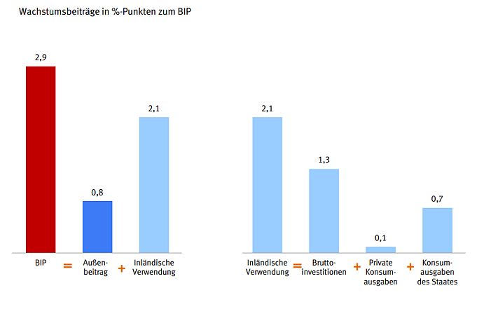

class: title-slide

```{r xaringan-themer, include=FALSE}
library(xaringanthemer)
style_xaringan(text_color = "#232461",inverse_text_color = "#FFFFFF",inverse_background_color = "#232461", title_slide_background_color = "#232461",header_background_color = "#232461",header_color = "#FFFFFF",header_h1_font_size = "32px",
  header_h2_font_size = "26px",link_color="#d84116",
  header_h3_font_size = "20px",text_slide_number_color = "#232461",text_slide_number_font_size = "0.5em")
```

```{r xaringanExtra, echo=FALSE}
xaringanExtra::use_progress_bar(color = "#d84116", location = "bottom")
xaringanExtra::use_xaringan_extra(c("tile_view","scribble","panelset","tachyons"))
xaringanExtra::style_panelset_tabs(font_family = "inherit")
#xaringanExtra::use_search(show_icon = TRUE)
#weitere: "share_again","animate_css", "webcam","freezeframe","clipboard","fit_screen","extra-styles" 
xaringanExtra::use_editable(expires = 1)
xaringanExtra::use_freezeframe(trigger = "hover")
```

```{r setup, include=FALSE}
options(htmltools.dir.version = FALSE)
library(latex2exp)
library(fontawesome)
```


# Volkswirtschaftslehre

## Intake 2022B

### CORE - The Economy: Unit 13 (Schwankungen der wirtschaftlichen Aktivität und des Preisniveaus)


<br>
<br>
<br>
<br>
<br>
<br>
<br>
### Sommersemester 2023 
<br>
### Prof. Dr. Jörg Schoder
.mycontacts[
`r fa('github')` @ISBA-University
`r fa('linkedin')` @jfschoder
]


---
layout: true

<div class="my-footer"></div>       

<div style="position: absolute;left:400px;bottom:10px;color:ISBAblue;font-size:9px">`r r2symbols::sym('copyright')``r rmarkdown::metadata$author`</div>


---
name: Kuznets
class: left

# Motivation: Kuznets-Kurve(n)


.panelset[
.panel[.panel-name[Umwelt]
```{tikz ,echo=FALSE, message=FALSE}
{\sffamily
  \begin{tikzpicture}[scale=.5,xscale=1.5,thick]
			\usetikzlibrary{calc}   %allows coordinate calculations.
			
			\draw[-stealth] (0,0) -- (10,0);
			\node[thick,below]  at (5,0) {BIP pro Kopf}; 
			\draw[-stealth] (0,0) -- (0,10);
			\node[thick, above, rotate=90] at (0,5) {Umweltverschmutzung}; 
		
			\draw[blue,domain=0:9,smooth] plot (\x,{(-.3*((\x-4.5)^2)+8)}) node[below right] {};
			\draw[blue,dotted] (4.5,0)--(4.5,8);
  
    	\draw (2,6.125) node[pin={[pin distance=1.7em]91:Industrialisierung}] {};
			\draw (7,6.125) node[pin={[pin distance=1.7em]89:Tertiärisierung}] {};
		\end{tikzpicture}
}
```
]
.panel[.panel-name["Original"]
```{tikz ,echo=FALSE, message=FALSE}
{\sffamily
  \begin{tikzpicture}[scale=.5,xscale=1.5,thick]
			\usetikzlibrary{calc}   %allows coordinate calculations.
			
			\draw[-stealth] (0,0) -- (10,0);
			\node[thick,below]  at (5,0) {BIP pro Kopf}; 
			\draw[-stealth] (0,0) -- (0,10);
			\node[thick, above, rotate=90] at (0,5) {Ungleichheit}; 
		
			\draw[blue,domain=0:9,smooth] plot (\x,{(-.3*((\x-4.5)^2)+8)}) node[below right] {};
			\draw[blue,dotted] (4.5,0)--(4.5,8);
		\end{tikzpicture}
}
```
]
]

???

* Anknüpfend an die Diskussion zur Umweltproblematik gibt vielleicht die Umwelt-Kuznets-Kurve Hoffnung.
  * Industrialisierung führt zu hoher Umweltbelastung
  * Anschließende Tertiärisierung mit "grünem Wachstum"
  * Angesprochen damit auch das Thema: Strukturwandel

* Ursprüngliche Kuznets-Kurve bezieht sich auf die Einkommensverteilung.
* Erklärung von Kuznets basiert auf einer Ökonomie, die sich von landwirtschaftlicher Prägung hin zur Industriegesellschaft entwickelt.
  * Zu Beginn sind alle Arbeiter in der Landwirtschaft beschäftigt und haben ungefähr gleiche Einkommen. 
  * Vergleichsweise hohe Produktivität im Industriesektor führt zu ungleicher Einkommensverteilung. 
  * Im Laufe der Industrialisierung verringern sich die Gewinnmöglichkeiten in der Industrie (Konkurrenz erodiert Innovationsrenten)...
  * ...während die Qualifizierung der Arbeiter es ihnen ermöglichen, hohe Stundenlöhne zu verhandeln 
  * eine Marktdynamik wirkt somit der ursprünglich wachsenden Ungleichheit entgegen.
  * Die Ungleichheit lässt auch Sozialprogramme wahrscheinlich werden, mit welchen der Wohlstand gleichmäßig verteilt werden soll. Dadurch sinkt die Ungleichheit wieder. 
  * Über die Zeit gesehen umgekehrt-U-förmiger Verlauf der Ungleichheit

* Bis in die 1970er Jahre war die Kuznets-Kurve ein relativ unumstrittener Zusammenhang. In den 1980er und 1990er Jahren stieg die Ungleichheit in den OECD-Staaten jedoch wieder an.
* Zahlreiche wissenschaftliche Arbeiten widerlegen den von Kuznets aufgestellten Zusammenhang seitdem


---
name: Lernziele
class: inverse, left, middle
# Was lernen wir?

.small[In Einheit 1 und 2 haben wir uns mit der langfristigen Entwicklung des Wohlstands befasst. Das BIP misst dabei die Produktion (Gütermarkt), welche historisch gerade in dezentralen Wirtschaftssystemen durchaus deutlichen Schwankungen unterliegt. Aber nicht nur die produzierten Gütermengen schwanken, sondern auch die Preise für diese Güter. Über den Wirtschaftskreislauf sind auch andere makroökonomische Aggregate von den Schwankungen am Gütermarkt betroffen.]

## Inhaltliche Leitfragen

.blockquote[.small[
1. Welche Aggregate betrachtet die Makroökonomik neben dem Gütermarkt?
2. Wie lassen sich Schwankungen des Preisniveaus am Gütermarkt (Inflation) messen?
3. Wie reagieren Haushalte und Unternehmen auf Schwankungen bzw. welche selbstverstärkenden Effekt gibt es?
4. Wie wirken sich die Schwankungen auf die Lebensqualität aus? 
]
]

## Ökonomische Methoden und Konzepte 

.blockquote[.small[
1. Wirtschaftskreislauf, Makroökonomische Aggregate und VGR
2. Inflationsmessung
3. Konjunkturzyklus und die Rolle von Konsum und Investitionen
4. Phillipskurve
]
]

???


In Einheit 1 und 2 wurde die Bedeutung des technologischen Fortschritts für die langfristige Entwicklung des Wohlstands deutlich. In Einheit 4 und Einheit 5 haben wir uns mit individuellen Entscheidungen und sozialen Dilemmata befasst. Die individuellen Entscheidungen (z.B. "wieviel spare ich"?) sind dabei auch abhängig von makroökonomischen Entwicklungen (Einkommen, Arbeitslosigkeit, Preise), die zum Teil deutlich vom langfristigen Trend abweichen können. Diese Schwankungen bezeichnen wir als Konjunkturzyklus.


---
name: Teil1
class: inverse, center, middle

# Teil 1

## Die vier Märkte der Makroökonomik


---
name: MakroAggs
class: left

# Wirtschaftskreislauf und makroökonomische Aggregate

.panelset[
.panel[.panel-name[Wirtschaftskreislauf]
```{r, echo=FALSE,fig.align='center'}
knitr::include_graphics('../images/unit13/Wirtschaftskreislauf_500.png')
```
]
.panel[.panel-name[Märkte der Makroökonomik]
```{tikz,echo=FALSE,fig.align='center'}
 \usetikzlibrary{shapes}
\begin{tikzpicture}[scale=1.7]
   \draw[blue!50,rounded corners=10,thick,shift={(0.15,-0.15)}, fill=blue!50]
           (0,2.75) rectangle (3.25,4.25) node[black,pos=.5] {\huge \textbf{\textsf{Gütermarkt}}};
   \draw[blue!50,rounded corners=10,thick,shift={(-0.15,-0.15)},fill=blue!50]
           (3.75,2.75) rectangle (7,4.25) node[black,pos=.5] {\huge \textbf{\textsf{Arbeitsmarkt}}};
           
     \draw[blue!50,rounded corners=10,thick,fill=blue!30]
           (7,2.5) rectangle (0,0) node[black,pos=.5,shift={(0,-1.5)}] {\huge \textbf{\textsf{Finanzmärkte}}};
     \draw[blue!50,rounded corners=10,thick,shift={(0.15,-0.15)},fill=blue!50]
           (0,1) rectangle (3.25,2.5) node[black,pos=.5] {\huge \textbf{\textsf{Geldmarkt}}};
     \draw[blue!50,rounded corners=10,thick,shift={(-0.15,-0.15)},fill=blue!50]
           (3.75,1) rectangle (7,2.5) node [black,rectangle split,rectangle split parts=2,pos=.5]{
             {\huge\textbf{\textsf{(Finanz-)}}}
             \nodepart{second}
             {\huge\textbf{\textsf{Kapitalmarkt}}}
        };
\end{tikzpicture}
```
]
]

.quelle[Eigene Darstellung.]


???
  
  * Die zentralen Themen der Makroökonomik können mit Hilfe der vier zentralen Märkte der Makro strukturiert werden.
* Dies sind:
  * Der Arbeitsmarkt (Reallohn und Arbeitslosigkeit)
* Haushalte bieten Arbeit an,
* Unternehmen fragen Arbeit nach

* Der Gütermarkt (Gütermenge (BIP), Güterpreise und Inflation)
* Unternehmen bieten Güter (Verbrauchs- und Investitions-) an,
* Haushalte fragen Konsumgüter nach
*  Finanzmärkte als "Markt für Ansprüche an Reale Vermögensgüter" 
* leisten eine Transformation von Einkommen in Real-Kapital
* Geldmarkt: Makroökonomischer (Transaktionsmittel) vs. institutioneller Geldmarkt (kurzfristige Liquidität)
* Kapitalmarkt: langfristige Liquidität (Zins)
* Devisenmarkt (offene Volkswirtschaft)


---
name: Geld
class: left

# Ausblick: Geld und Währung (5. Semester)


.panelset[
.panel[.panel-name[Etymologie]
```{r, echo=FALSE,fig.align='center',out.width='100%'}
knitr::include_url('../images/unit13/Vieh.png',height='480px')
```
.quellePanURL[Bildquelle: [Pixabay.com](pixabay.com)]
]
.panel[.panel-name[Definition]
.blockquote[
In der Volkswirtschaftslehre wird der Geldbegriff heute überwiegend über die Geldfunktionen bestimmt. Motto: Geld ist, was (mindestens eine) Geldfunktion erfüllt.
]

* Geldfunktionen:

    * allgemein akzeptiertes (universelles!) Tausch- und

    * Zahlungsmittel

    * Wertaufbewahrungsmittel (Vermögensobjekt, Aktivum)

    * Recheneinheit
    
* Unterschiedliche Geldmengendefinitionen 
    * Geldmengenbegriffe (M1, M2, M3)
    * Abgrenzung nach Liquidität

]
.panel[.panel-name[Verwechslungsgefahr]

* **Einkommen** entsteht im Wege der Produktion **realer Güter**, 
    * deren Wert den Produktionsfaktoren als Entlohnung zukommt 
    * auch Naturalleistungen sind demnach Einkommen, aber nicht Geld.

* Kapital
    * Produktionsfaktor (Sach-/Realkapital) 
    * erwirtschaftet eine reale Rendite in Form von Produktivitätsgewinnen

* Finanzkapital 
    * verbrieft Rechte an realen Vermögensgegenständen (Sach-/Realkapital)
    * dient der Finanzierung von Realkapital
    * erhält eine Faktorentlohnung in Form des Zinses (nominale Rendite)
    
* Geld ist wie Einkommen eine Stromgröße, Kapital/Finanzkapital ist eine Bestandsgröße

]
]

???

* Obwohl Geld zu den zentralen Forschungsgegenständen der Wirtschaftswissenschaften gehört, ist der Geldbegriff im Fach keineswegs unumstritten.

* Obs! Definitionen sind nicht richtig oder falsch, sondern zweckmäßig (oder nicht).
* In der Volkswirtschaftslehre wird der Geldbegriff heute überwiegend über die Geldfunktionen bestimmt. Motto: Geld ist, was (mindestens eine) Geldfunktion erfüllt.

    * Es ist ein **universelles** Tauschmittel, da man es gegenüber anderen Händlern zum Tausch gegen Waren verwenden kann. Dies ist am wichtigsten! Geld funktioniert nur, wenn wir uns einig sind, dass es einen Wert hat! Vertrauen!
		* Es ist Zahlungsmittel, da man mit ihm  **Rechnungen begleichen**, also **Schuldverhältnisse auflösen**, kann (**settlement**).
		* Es ist Wertaufbewahrungsmittel, weil man es vorrätig halten kann, um seine **Zahlungsfähigkeit zu erhalten**.
		* ist die allgemeine Recheneinheit, da man alle Güter und Dienstleistungen in Geldeinheiten bewertet und ihre Preise so miteinander vergleichen kann.

* **Funktionen beeinflussen sich gegenseitig**: am bedeutsamsten ist vielleicht der Zusammenhang zwischen der Wertaufbewahrungsfunktion und der Tauschmittel-/Zahlungsmittelfunktion. Einschätzung der **künftigen Kaufkraft des Geldes** entscheidend für dessen Akzeptanz als Zahlungsmittel.


---
name: FinMarkets
class: left

# Finanzsystem, Finanzmärkte und Zinsen


.panelset[
.panel[.panel-name[Finanzsystem]
```{r, echo=FALSE,fig.align='center',out.width='100%'}
knitr::include_graphics('../images/unit13/FinMarkets.png')
```
.quellePan[Eigene Darstellung.]
]
.panel[.panel-name[Finanzmärkte]
```{r, echo=FALSE,fig.align='center',out.width='100%'}
knitr::include_graphics('../images/unit13/FinMarkets2.png')
```
.quellePan[Eigene Darstellung.]
]
.panel[.panel-name[Zinsen]
```{r, echo=FALSE,fig.align='center',out.width='100%'}

```
.quellePan[Quelle: [Bundeszentrale für Politische Bildung (2015)](https://www.bpb.de/system/files/dokument_pdf/4938_zb_dtindaten_gesamt.pdf)]
]
]


---
name: Teil 2
class: inverse, center, middle

# Teil 2

## Gütermarkt: Preise, Wachstum und Konjunktur

.blockquote[Preisniveau und Inflation]

.blockquote[Wachstum vs. Konjunktur]


---
name: BIPaktuell
class: left

# Bruttoinlandsprodukt 2021

```{r, echo=FALSE,fig.align='center',out.width='100%'}
knitr::include_url('../images/unit13/BIP_2022.PNG',height='550px')
```
.quelle[Quelle: [Destatis (2023)](https://www.destatis.de/DE/Themen/Wirtschaft/Volkswirtschaftliche-Gesamtrechnungen-Inlandsprodukt/Publikationen/Downloads-Inlandsprodukt/zusammenhaenge-pdf-0310100.pdf).]


---
name: VGR-Monitor
class: left

# Destatis VGR-Monitor

```{r, echo=FALSE,fig.align='center'}
knitr::include_url('https://service.destatis.de/DE/vgr-monitor-deutschland/investitionen.html',height='550px')
```


---
name: Inflation
class: left

# Inflation und Geldwert


.blockquote[
Inflation

Eine über einen längeren Zeitraum anhaltende Zunahme des Preisniveaus bzw. sinkende Kaufkraft. 
]

* Preisniveau
      * Preis als objektiver Tauschwert eines Gutes in Marktwirtschaften.
      * Preisniveau als durschnittlicher Preis aller (produzierten) Güter.

* Inflation vs. Disinflation vs. [Deflation vs. Stagflation](#Deflation)


.blockquote[
Die **Kaufkraft**...

...gibt an, welche Gütermenge mit einer gegebenen Geldsumme erworben
werden kann (**Geldwert**).
]

* Obs! **Den** Geldwert gibt es nicht (`r fa("circle-right")` [individueller Verwendungszweck](#PersInf)).


???

* Disinflation: Abnehmende/rückläufige Inflationsraten. 
* Deflation: Gegenteil von Inflation, also fallende Preise (negative Inflationsraten)


---
name: Deflation
class: left


# Stagflation vs. Deflation


.panelset[
.panel[.panel-name[Stagflation]
```{r, echo=FALSE,fig.align='center',out.width='100%'}
knitr::include_url('https://www.boersen-zeitung.de/img/pdf/91d/91da2e80-1483-11ec-9992-c879d4511d99/ff85530beff72d2f81ad487c4657a0a1/wusinflationarbeitslosenquotems2sp.webp',height='480px')
```
.quellePanURL[Quelle: [Börsen-Zeitung (14.09.2021).](https://www.boersen-zeitung.de/konjunktur-politik/debatte-ueber-drohende-stagflation-91da2e80-1483-11ec-9992-c879d4511d99).]
]
.panel[.panel-name[Deflation]
```{r, echo=FALSE,fig.align='center',out.width='100%'}
knitr::include_url('../images/unit13/comic_deflation_(Bauman_S55).png',height='480px')
```

.quellePanURL[Quelle: [Bauman (2011, S. 48)](https://www.amazon.de/dp/0809033615/ref=cm_sw_em_r_mt_dp_5WNEX8X23YD4AVNFM9Y9).]
]
]


???

* Inflation im Boom vs. Stagflation


---
name: InfMess
class: left

# Preisniveau und Preisentwicklung

.panelset[
.panel[.panel-name[Inflationsmessung]
* Inflation als Anstieg  des Preisniveaus: **Veränderungsrate**

* Preis*niveau* als Durchschnitt aller Güterpreise (Waren und Dienstleistungen): **Indexwert**

* Aggregierte Betrachtung: [BIP-Deflator bzw. Preisindex des BIP](https://www.destatis.de/DE/Themen/Wirtschaft/Volkswirtschaftliche-Gesamtrechnungen-Inlandsprodukt/Publikationen/Downloads-Inlandsprodukt/inlandsprodukt-lange-reihen-pdf-2180150.pdf?__blob=publicationFile)
(Konsum- und Investitionsgüter/Vorprodukte)
   

* [Disaggregierte Betrachtung](https://www.dashboard-deutschland.de/indicator/data_preisentwicklung?mtm_campaign=dd-social-sharing)

    * Produktion: Erzeugerpreise
    
    * Außenhandel: Importpreise
    
    * Großhandel: Großhandelspreise (Einkaufspreise)
    
    * Konsum: Verbraucherpreise (VPI/HVPI)

]
.panel[.panel-name[BIP-Deflator]
.blockquote[
Der BIP-Deflator ist der implizite Preisindex des BIP und misst die Änderung des aggregierten Preisniveaus unter Berücksichtigung aller Güter
]
* Berechnung des BIP-Deflators (vgl. [reales BIP](#Real-nominal)):

$$P_t=\frac{\mbox{nominales BIP in Periode t}}{\mbox{reales BIP in Periode t}}=\frac{Y_t}{Y_t^r}$$
* Inflationsrate $\pi_t$ gemessen am BIP-Deflator:
	
	$$\pi_t=\frac{P_t-P_{t-1}}{P_{t-1}}=\frac{P_t}{P_{t-1}}-1$$
* Obs! Preise der im Inland hergestellten Güter
]
.panel[.panel-name[VPI]
```{r, echo=FALSE,fig.align='center',out.width='100%'}
knitr::include_url('https://service.destatis.de/Voronoi/PreisKaleidoskop.svg',height='480px')
```
]

.panel[.panel-name[Vergleich]
```{r, echo=FALSE,fig.align='center',out.width='100%'}
knitr::include_url('https://www.wirtschaftsdienst.eu/files/journal-issues/wirtschaftsdienst/10.1007/s10273-020-2778-0/ZG-Weichen-abb-1.png',height='480px')
```

.quellePanURL[Quelle: [Weichenrieder/Gürer (2020)](https://www.wirtschaftsdienst.eu/inhalt/jahr/2020/heft/11/beitrag/inflation-inflationsmessung-und-zentralbankpolitik.html).]
]
]


???
* Deflator (Verwendungsseite, Seite 122): 112,06 (2021; 2015=100)
* VPI (Dashboard): 111,1 (Dez 2021; 2015=100)

* [Quelle: [Statistisches Bundesamt](https://www.destatis.de/DE/Themen/Wirtschaft/Preise/_inhalt.html).]
    
    
* [Methodik](https://www.destatis.de/DE/Methoden/Qualitaet/Qualitaetsberichte/Preise/verbraucherpreis.pdf?__blob=publicationFile)

* [Güterkategorien im Detail](https://www.destatis.de/DE/Themen/Wirtschaft/Preise/Verbraucherpreisindex/Methoden/Downloads/waegungsschema-2015.pdf?__blob=publicationFile)


* BIP-Deflator vs. VPI
  * [BIP-Deflator](https://www.destatis.de/DE/Themen/Wirtschaft/Volkswirtschaftliche-Gesamtrechnungen-Inlandsprodukt/Publikationen/Downloads-Inlandsprodukt/inlandsprodukt-vorlaeufig-pdf-2180140.pdf?__blob=publicationFile) - Preise der im Inland **produzierten** Güter
      * 
  * [VPI Dashboard](https://www.dashboard-deutschland.de/indicator/data_preisentwicklung?mtm_campaign=dd-social-sharing) - Preise der im Inlande **konsumierten** Güter
  
* Berechnung des BIP-Deflators: Division des zu einer Messzahl umgerechneten Ergebnis in jeweiligen Preisen (nominales BIP) dividiert durch die entsprechende preisbereinigte Größe (reales BIP).
			* BIP-Deflator: nominales BIP-Wachstum abzüglich reales BIP-Wachstum (Näherungsformel!).
			* BIP-Kettenindex: (= 100 im Jahr 2010)
			      Vorjahreswert $\cdot$ (1 + reales BIP-Wachstum).
			* BIP-Deflator: (= 100 im Jahr 2010) 
	  		    Vorjahreswert $\cdot$ (1 + Inflationsrate (BIP-Deflator)).


---
name: Preise
class: left

# Historischer und internationaler Vergleich

.panelset[
.panel[.panel-name[Deutschland]
```{r, echo=FALSE,fig.align='center',out.width='100%'}
knitr::include_graphics('../images/unit13/verbraucherpreise_(BpB_S209)_small.png')
```
.quellePan[Quelle: [Bundeszentrale für Politische Bildung (2015)](https://www.bpb.de/system/files/dokument_pdf/4938_zb_dtindaten_gesamt.pdf)]
]
.panel[.panel-name[International]
<iframe src="https://ourworldindata.org/grapher/inflation-levels-and-volatility-in-high--and-low-income-economies-1960-2017" loading="lazy" style="width: 100%; height: 480px; border: 0px none;"></iframe>
]
]


???

* D: Hyperinflation 20er Jahre, Deflation 30er Jahre
* International: Konvergenz der Inflationsraten auf niedrigem Niveau (Great Moderation)


---
name: PersInfl
class: left

# Persönliche Inflationsrate

```{r, echo=FALSE,fig.align='center',out.width='100%'}
knitr::include_url('https://service.destatis.de/inflationsrechner/',height='550px')
```


???

* Durchschnittlicher Warenkorb vs. individuelle Gewichtung


---
name: Prod
class: left


# Produktivität und Inflation

.panelset[
.panel[.panel-name[Benzin]
```{r, echo=FALSE,fig.align='center',out.width='90%'}
knitr::include_graphics('https://www.iwkoeln.de/fileadmin/user_upload/Presse/IW-Nachrichten/Inflation_1.png')
```
]
.panel[.panel-name[Strom]
```{r, echo=FALSE,fig.align='center',out.width='90%'}
knitr::include_graphics('https://www.iwkoeln.de/fileadmin/user_upload/Presse/IW-Nachrichten/Inflation_2.png')
```
]
]

.quelle[Quelle: [IW Köln](https://www.iwkoeln.de/presse/iw-nachrichten/michael-huether-christoph-schroeder-fuenf-minuten-arbeit-fuer-einen-liter-benzin.html).]


---
name: UrsachenInflation
class: left

# Ursachen und Erklärungen für Inflation

.panelset[
.panel[.panel-name[Übersicht]
```{r, echo=FALSE,fig.align='center',out.width='100%'}

```

.quellePanURL[Eigene Darstellung.]
]
.panel[.panel-name[Quantitätstheorie]
```{r, echo=FALSE,fig.align='center',out.width='100%'}

```

.quellePan[Quelle: [Bauman (2011, S. 48)](https://www.amazon.de/dp/0809033615/ref=cm_sw_em_r_mt_dp_5WNEX8X23YD4AVNFM9Y9).]
]
]


---
name: WachstumKonj
class: inverse,center,middle

# Teil 3

## Konjunktur und Wachstum

.blockquote[Wachstum vs. Konjunktur]

.blockquote[Erklärungen wirtschaftlicher Schwankungen]


---
name: Wachstum
class: left

# Langfristige Wirtschaftsentwicklung in D


.panelset[
.panel[.panel-name[BIP pro Kopf]
```{r, echo=FALSE,fig.align='center'}

```
]
.panel[.panel-name[Wachstumsraten]
```{r, echo=FALSE,fig.align='center'}

```
]
]
.quelle[Quelle: [Bundeszentrale für Politische Bildung (2015)](https://www.bpb.de/system/files/dokument_pdf/4938_zb_dtindaten_gesamt.pdf)]


???
* Langfristige Betrachtung des realen BIP
* Anstieg des Index von 3,6 (1850) auf 2643,9 (2012), das entspricht einer jährlichen Wachstumsrate von
durchschnittlich 4,18 Prozent.

* Aber die Grafik zeigt schon, dass wir im Zeitverlauf deutliche Schwankungen hatten, nicht 
nur in den Kriegszeiten

* Schauen wir uns die Schwankungen seit den 1970er Jahren genauer an


---
name: Log-scale
class: left

# Wachstumsprozesse und Logarihmische Skalen


<iframe src="https://ourworldindata.org/grapher/uk-real-gdp-per-capita-in-2011-us-dollars" loading="lazy" style="width: 100%; height: 550px; border: 0px none;"></iframe>


---
name: Wachstumsraten
class: left

# Wachstumsraten seit 1970

```{r, echo=FALSE,fig.align='center'}
knitr::include_graphics('../images/unit13/Wachstumsraten_(destatis_2023_S10).png')
```


.quelle[[Statistisches Bundesamt (2022, S. 10)](https://www.destatis.de/DE/Themen/Wirtschaft/Volkswirtschaftliche-Gesamtrechnungen-Inlandsprodukt/Publikationen/Downloads-Inlandsprodukt/zusammenhaenge-pdf-0310100.pdf?__blob=publicationFile)]


???


* Wir sehen auf Seite 10: 7 Jahre mit negativen Wachstumsraten seit 1970 

* Lange Frist [BpB (2015)](http://www.deutschland-in-daten.de/wp-content/gallery/Abbildungen/13-abb-2.png)

* Seit dem 2. Weltkrieg: Negative Wachstumsraten in **acht
Kalenderjahren** (**1967**, 1975, 1982, 1993, 2002, 2003, 2009, 2020)!

* Zunächst wollen wir ein paar Begriffe klären und wir beginnen mit der Unterscheidung
von Konjunktur und Wachstum


---
name: Abgrenzung-Wachstum-Konjunktur
class: left

# Theorie: Wachstum vs. Konjunktur

.panelset[
.panel[.panel-name[Wachstum]
```{tikz ,echo=FALSE, message=FALSE}
{\sffamily
	\begin{tikzpicture}[scale=.65]
	\draw[-stealth,very thick] (0,0) -- (0,5.6) node [left] {$Y$};  
	\draw[-stealth,very thick] (0,0) -- (5.1,0)  node [below] {$X$};
	\draw[color=black,very thick] (0,4.1) ..controls (2,3.7) and (3.3,2) .. (3.4,0);
	\draw [-stealth,very thick] (2.6,2.8) -- (3,3.1);
	\draw[color=black,very thick] (0,5.1) ..controls (2,4.9) and (4.3,2.5) .. (4.4,0);
	\node [left] at (0,4.1) {$F$};
	\draw [fill] (0,4.1) circle [radius=.1];
	\node [above left] at (3.4,0) {$G$};
	\draw [fill] (3.4,0) circle [radius=.1];
	\end{tikzpicture}	
}
```
.quellePanURL[Eigene Darstellung.]
]
.panel[.panel-name[PPF]
* Transformationskurve (PPF - Production Possibilities Frontier)  
  * Welche Güter können mit der aktuellen Technologie hergestellt werden
  * Knappheit der Ressourcen und Trade-off (bspw. Autos vs. Beatmungsgeräte)
  * Produktivitätswachstum als Verschiebung der Transformationskurve

* Einflussfaktoren:
  * Natürliche Ressourcen: Boden/Land, Rohstoffe (Aber: Curse of
    natural resources, J. Sachs)
  * Institutionen: Rechtsordnung und -durchsetzung, Kultur
  * Technologie und Technologischer Fortschritt
  * Physisches Kapital (K): Maschinen, Infrastruktur,. . .
  * Arbeitskraft (L): Physische Tätigkeiten, Arbeitszeit
  * Humankapital: Wissen, Bildung
  * Sozialkapital: Vertrauen
]
.panel[.panel-name[Konjunktur]
```{tikz ,echo=FALSE, message=FALSE}
{\sffamily
  	\begin{tikzpicture}[scale=.65]
		\draw[-stealth,very thick] (0,0) -- (0,5.6) node [left] {$Y$};  
		\draw[-stealth,very thick] (0,0) -- (5.1,0)  node [below] {$X$};
		\draw[color=black,very thick] (0,4.1) ..controls (2,3.7) and (3.3,2) .. (3.4,0);
		\draw [fill] (0,4.1) circle [radius=.1];
		\draw [fill] (3.4,0) circle [radius=.1];
		\node [left] at (2.08,2.95) {$N$};
		\draw [fill] (2.08,3) circle [radius=.1];
		\node [left] at (2.8,3.5) {$\mbox{Ü}$};
		\draw [fill] (2.8,3.5) circle [radius=.1];
		\node [left] at (1,2) {$R$};
		\draw [fill] (1,2) circle [radius=.1];
		\draw [-stealth] (1.3,2.3) -- (1.75,2.7);
		\end{tikzpicture}
}
```
.quellePanURL[Eigene Darstellung.]
]
.panel[.panel-name[Outputlücke]
```{r, echo=FALSE,fig.align='center'}
knitr::include_graphics('../images/unit13/Outputgap_(SVR_2017_S131)_small.png')
```

.quellePanURL[Quelle: [Sachverständigenrat (2017, S. 131)](https://www.sachverstaendigenrat-wirtschaft.de/fileadmin/dateiablage/gutachten/jg201718/jg2017_06_de_konjunktur.pdf)]]
]
]


???
* **Produktionspotenzial**
  * entspricht der gesamtwirtschaftlichen Produktion, wenn alle Produktionsfaktoren   
  (a) maximal ausgelastet sind, ohne Inflationsdruck zu erzeugen.
  (b) normal (96,75 Prozent) beschäftigt (ausgelastet) sind (Definition des
  Sachverständigenrates).
  * Problem: lässt sich schwer messen! Langfristiger BIP-Trend als eine (!) Möglichkeit zur Schätzung des PPs.

* **Produktionslücke**
  * Die Abweichung des tatsächlich realisierten Bruttoinlandsprodukts vom (geschätzten!) Produktionspotenzial wird als Produktionslücke (auch Outputlücke, Output Gap) bezeichnet

  * Produktionslücke als Abweichung vom langfristigen BIP-Trend als eine (!)
Möglichkeit zur Schätzung der Produktionslücke.

Schätzungen anhand von Zeitreihenanalysen, bei denen aus der beobachtbaren
Veränderung der Produktion konjunkturelle Effekte herausgefiltert
werden, um so einen Wachstumstrend zu erhalten. Dieser wird als Veränderung
des Produktionspotenzials interpretiert.


---
name: Definition
class: left

# Konjunkturbegriff und -phasen

.panelset[.panel[.panel-name[Definition]
.blockquote[
Als Konjunktur werden *Schwankungen* der wichtigen makroökonomischer Aggregate
(Produktion, Beschäftigung und Preise,...) in *marktwirtschaftlich*
organisierten Volkswirtschaften bezeichnet, wobei die Schwankungen eine *gewisse Regelmäßigkeiten* aufweisen.
]
]
.panel[.panel-name[Phasen]
```{r, echo=FALSE,fig.align='center'}
knitr::include_graphics('../images/unit13/Konjunkturzyklus_(Perret_Welfens_2016_S335).png')
```

<br> 

.quellePan[Quelle: Perret/Welfens (2016, S. 335)]
]
]


???

* Etymologie des Konjunkturbegriffs:
  * "conjunctio rerum omnium- eine das Dasein geheimnis- und unheilvoll verknüpfende Schicksalskette"(3. Jh. V. Ch.)
  * später: "Konjunktur als Synonym für eine "gute Geschäftslage"

* "Konjunktur" ist im allgemeinen Sprachgebrauch eine Bezeichnung
für die gesamtwirtschaftliche Lage.
* In der **Fachsprache** sind mit "Konjunktur" die zyklischen
Schwankungen um den langfristigen Trend der wirtschaftlichen
Entwicklung gemeint.
* Typischerweise sind kurzfristige Schwankungen mit Zyklus von 4
bis 6 Jahren.
* Wir werden gleich sehen, dass sich Zyklen mit unterschiedlichen
Dauern überlagern

* Zyklen von einem Hoch zum nächsten Hoch

* **Rezessionen** (teil der Abschwungphase) meist als Perioden definiert,
in denen die preis-, saison- und kalenderbereinigten
Vierteljahreswerte des Bruttoinlandsprodukts (BIP) **mindestens zwei
Vierteljahre in Folge rückläufig** sind (technische Rezession).

* Rezession relativ klar definiert, auch wenn sich die Definitionen im Detail unterscheiden
  * Null oder negatives Wachstum über einen Zeitraum von mehreren Monaten (in D: sechs)

* Unklarer ist, was unter einer Depression zu verstehen ist
  * ein gemeinsamer Nenner ist, dasss es bei der Depression  um einen längeren Zeitraum
  wirtschaftlicher Schwäche geht und viele Menschen in Not bringt
  
* [Robert Hall (2011)](https://web.stanford.edu/~rehall/Long%20Slump.pdf) führte noch einen weiteren Begriff ein: Slump
  * A slump **begins with a contraction**, usually fairly **brief, at least in comparison to the extended period of slow growth that follows** the contraction. 
  * Relative to the vocabulary of peaks and troughs, a slump lasts from the time when employment falls below its normal level during the contraction to the time when employment regains its normal level during an expansion.


---
name: Zyklen
class: left

# Konjunktur und Konjunkturzyklen


.panelset[.panel[.panel-name[Statistik]
```{r, echo=FALSE,fig.align='center',out.width='67%'}
knitr::include_graphics('../images/unit13/Zyklen.png')
```


.quellePanURL[Quelle: [Savoiu/Manea (2014)](https://www.revistadestatistica.ro/wp-content/uploads/2014/05/RRS01_2014_A1.pdf).]

]
.panel[.panel-name[Kondratieff]
```{r, echo=FALSE,fig.align='center',out.width='80%'}
knitr::include_graphics('https://www.researchgate.net/profile/Gerhard-Posch/publication/318360851/figure/fig2/AS:515180092026881@1499839913439/Kondratieff-Zyklen-Technische-Innovationen_W640.jpg')
```

<br>

.quellePanURL[Quelle: [Posch/Bruckner (2017)](https://www.researchgate.net/publication/318360851_Schweisstechnik_im_Zeichen_von_Internet_of_Things_und_Industrie_40)]
]
]


???

* Juglar-Zyklus (sieben bis elf Jahre); 
  * 1860 von C. Juglar festgestellt; 
  * dieses ist der Konjunkturzyklus i.e.S;
* Kitchin-Zyklus (drei bis vier Jahre)
  * auch als Mitchell-Zyklus bezeichnet; 
  * 1923 von J. Kitchin in den USA und Großbritannien festgestellt; **Existenz umstritten**;
* Kondratieffzyklus (50 bis 60 Jahre); 
  * 1926 von N.D. Kondratieff festgestellt. 
  * Interpretation als Basisinnovationen


---
name: KonsumInvest
class: inverse, center, middle

## Erklärungen wirtschaftlicher Schwankungen

.blockquote[Konsum im Konjunkturzyklus]

.blockquote[Investitionen im Konjunkturzyklus]


---
name: Konjunkturtheorien
class: left

# Konjunkturtheorien


.panelset[
.panel[.panel-name[Kreislaufbetrachtung]
```{r, echo=FALSE,fig.align='center',out.width='100%'}

```
.quellePanURL[Quelle: [Baldwin (2020)](https://voxeu.org/article/how-should-we-think-about-containing-covid-19-economic-crisis).]
]
.panel[.panel-name[Theorien]
* **Angebotstheoretische Erklärungen**

  * am Beispiel der Real-Business-Cycles-Theorie (modifiziertes Solow-Modell)
      * technisches Wissen wächst mit schwankenden (durchschnittlich positiven) Raten
      * wechselseitige Beeinflussung der Produktionsfaktoren
  * Konjunktur als amplifizierte **Produktivitätsschocks** (Arnold 2016, S.
140f).


* **Nachfragetheoretische Erklärungen**

  * Langfristig: Produktion durch die Angebotsseite (Wachstum der Produktionsfaktoren und technischen Fortschritt) bestimmt.
  * Kurzfristig: Produktion entscheidend durch die gesamtwirtschaftliche Nachfrage beeinflusst!
  * vgl. Unit 14 (Keynesianisches Kreuz)


* **Politökonomische Erklärungen**

* u.a.m.
]
]


???

Shock = an unexpected event (such as extreme weather) which causes GDP to fluctuate.

There are two broad types of shocks:
Good or bad fortune strikes the household
Good or bad fortune strikes the entire economy


---
name: Wachstumsbeitrag
class:

# Wachstumsbeiträge der Nachfragekomponenten


.panelset[
.panel[.panel-name[2020]
```{r, echo=FALSE,fig.align='center'}
knitr::include_graphics('../images/unit13/Wachstumsbeitraege_Nachfragekomponenten_(destatis_2021_S12).png')
```
]
.panel[.panel-name[2021]
```{r, echo=FALSE,fig.align='center'}

```
]
.panel[.panel-name[2022]
```{r, echo=FALSE,fig.align='center'}
knitr::include_graphics('../images/unit13/Wachstumsbeitraege_Nachfragekomponenten_(destatis_2023_S12)_small.png')
```
]
]

.quelle[[Statistisches Bundesamt (2021/2022/2023, S. 12)](https://www.destatis.de/DE/Themen/Wirtschaft/Volkswirtschaftliche-Gesamtrechnungen-Inlandsprodukt/Publikationen/Downloads-Inlandsprodukt/zusammenhaenge-pdf-0310100.pdf?__blob=publicationFile)]


???

* Auf Seite 12 sehen wir die Beiträge der BIP-Nachfragekomponenten zu den
Wachstumsraten 2020
  * Sowohl Konsum rückläufig (-1%)
  * als auch Investition (-6,9%)

* Anders als in *The Economy* betont, konnten wir also im Corona-Jahr 2020 beobachten, dass die Investitionen einen geringeren negativen Effekt auf das Wirtschaftswachstum hatten als der Konsum 

* wie sieht das in "normalen Jahren" aus und was können wir daraus lernen?


---
name: Lifecycle
class: left

# Konsumverhalten und Lebenszyklushypothese

.panelset[
.panel[.panel-name[RCT-Modell]
```{r, echo=FALSE,fig.align='center',out.width='100%'}
knitr::include_url('https://www.core-econ.org/the-economy/book/images/web/figure-10-04-a.svg',height='480px')
```
]
.panel[.panel-name[Lebenszyklusprofil]
```{r, echo=FALSE,fig.align='center',out.width='100%'}
knitr::include_url('https://www.core-econ.org/the-economy/book/images/web/figure-13-10-c.svg',height='480px')
```
]
.panel[.panel-name[Schock]
```{r, echo=FALSE,fig.align='center',out.width='100%'}
knitr::include_url('https://www.core-econ.org/the-economy/book/images/web/figure-13-12-f.svg',height='480px')
```
]
]


???

* **Intertemporales Optimum** - Zeichnung ergänzen! 
  * Geringeres Einkommen in Periode 1 und hohes in Periode 2
(sodass auf der Budgetgerade links oben) - rationaler Akteur würde Kredit aufnehmen
  * Hohes Einkommen in Periode 1 und niedriges in Periode 2 (rechts unten auf der BG) - rationaler Akteur würde in Periode 1 sparen

* Entsprechend ergibt sich das **Profil**

* **Schock**

  * Beispiel: Arbeitslosigkeit und Corona
    * S. 5, S. 8: [Deutschland](https://statistik.arbeitsagentur.de/Statistikdaten/Detail/202104/arbeitsmarktberichte/am-kompakt-corona/am-kompakt-corona-d-0-202104-pdf.pdf?__blob=publicationFile&v=1)
    * S.3. [USA](https://fas.org/sgp/crs/misc/R46554.pdf)
  

* Households make lifetime consumption plans based on expectations about the future, and react to shocks:
* Readjust long-run consumption (red line) if shocks are permanent
* Do not change long-run consumption if shocks are temporary

* Consumption smoothing is a **basic source of stabilisation** in an economy.


---
name: ConSmooth
class: left

# Möglichkeiten zur Konsumglättung


* Vorsorge (Self-Insurance)


--
    * Sparen
    * Kreditaufnahme

--
* Versicherung (Co-Insurance)

--
    * Grundproblem: Asymmetrische Information

--
        * vorvertraglich: Adverse Selektion
            * Market(s) for Lemons (G. Akerlof)
            * Lösungsstrategie: Signalling, Screening
        * nachvertraglich: Moralisches Risiko
            * Verhaltensänderungen nach Abschluss einer Versicherung gefährden die Versicherungsidee
            * Lösungsstrategie:  Monitoring, Screening
            
--
    * Private Versicherungen (freiwilliges Risiko-Pooling)
    * Sozialversicherungen (Zwangs-Pooling)


???

* Zwangspooling als Pareto-Verbesserung

* Co-insurance is less effective if the bad shock hits everyone at the same time.

* But when these shocks hit, co-insurance is even more necessary.

* In **farming economies** of the past that were based in volatile climates, people practised **co-insurance based on trust, reciprocity, and altruism**.

* [Hall (2010)](https://conference.nber.org/confer/2010/MEf10/Hall.pdf): 

  * Stripped to its basics, the story of the paper is that
     * in the years leading up to the slump, households borrowed much more than usual and used the proceeds to buy more houses and cars than usual. 
     * They used the credit market to speed up purchases - they bought first and planned to save later. 
     * In an economy without a floor on it real interest rate, households not subject to borrowing constraints would have taken over purchasing unusual volumes once the constrained households reached their saving phase. 
     * But the interest rate could not fall far enough to induce that response. Instead, output fell and unemployment rose.
  
  * Of course, this story leaves out a lot. 
      * In particular, the crisis of September 2008 is portrayed as only a response to the more fundamental forces of overextended households and not a separate causal factor. 
      * In fact, the increase in financial frictions from the crisis surely made its own contribution.


---
name: Hindernisse
class: left

# Konsumglättung in der Praxis?

.panelset[
.panel[.panel-name[Kreditbeschränkungen]
```{r, echo=FALSE,fig.align='center',out.width='100%'}
knitr::include_url('https://www.core-econ.org/the-economy/book/images/web/figure-13-11-c.svg',height='480px')
```
]
.panel[.panel-name[Disziplin]
```{r, echo=FALSE,fig.align='center',out.width='100%'}
knitr::include_url('https://www.core-econ.org/the-economy/book/images/web/figure-13-13-c.svg',height='480px')
```
]
]


???

* Weitere Einschränkungen der Konsumglättung durch fehlende Disziplin
  * Weakness of will - inability to commit to beneficial future plans.
  * A household is able to smooth consumption but doesn’t, and may regret it later.

* Limitations to consumption smoothing mean it cannot always stabilise the economy; it may amplify the initial shock.
  * credit constraints
  * weakness of will, 
  * limited co-insurance

* This helps us understand the business cycle and how to manage it. 

* Credit constraints – limits on amount borrowed/ability to borrow.
The households unable to adjust to a temporary income shock have lower welfare.


---
name: EUDebtCrisis
class: left

# Konsumglättung in der EU-Schuldenkrise

```{r, echo=FALSE,fig.align='center',out.width='100%'}
knitr::include_url('../images/unit13/Konsumglaettung_Schuldenkrise_(VoxEU).png',height='550px')
```

.quelle[Quelle: [VoxEU.org](https://voxeu.org/article/consumption-and-credit-constraints-during-financial-crises)]


---
name: Invest
class: left

# Investitionen und selbstverstärkende Effekte

.panelset[
.panel[.panel-name[Abwärtsspirale]
```{r, echo=FALSE,out.width='100%'}
knitr::include_url('https://www.core-econ.org/the-economy/book/images/web/figure-13-15.svg', height='480px')
```
]
.panel[.panel-name[Aufwärtsspirale]
```{r, echo=FALSE,out.width='100%'}
knitr::include_url('https://www.core-econ.org/the-economy/book/images/web/figure-13-16.svg', height='480px')
```
]
]


???

* Rolle der Erwartungen

* Bruttoinvestitionen in der VGR = Bruttoanlageinvestitionen + Vorratsinvestitionen (Lager) + Nettozugang Wertsachen (u.a. Edelmetalle)

* Bruttoanlageinvestitionen = Erweiterungsinvestitionen + Ersatzinvestitionen
* Vorratsinvestitionen: Bestände an 
  * nicht dauerhaften Produktionsmitteln wie Roh-, Hilfs- und Betriebsstoffe
  * unfertige Erzeugnisse
  * fertige Erzeugnisse oder Handelswaren.
  


---
name: InvestmentGame
class: left

# Investitionen als Koordinationsspiel


```{r, echo=FALSE,out.width='100%'}
knitr::include_url('https://www.core-econ.org/the-economy/book/images/web/figure-13-17.svg', height='550px')
``` 


???

* Actors: the two firms

* Actions: Invest, or Do not invest

* Information: they decide simultaneously

* Payoff: profits from investment 

* Investment is the best response to other firms’ investment (coordination game).


---
name: Indikatoren
class: left

# Konjunkturindikatoren und -prognosen


.panelset[
.panel[.panel-name[Indikatoren]
* [ifo Geschäftsklima](http://www.cesifo-group.de/de/ifoHome/facts/Survey-Results/Business-Climate.html)
  * Geschäftslage 
  * Geschäftserwartungen

* [ZEW-Konjunkturerwartungen](http://www.zew.de/de/publikationen/zew-gutachten-und-forschungsberichte/forschungsberichte/konjunktur/zew-finanzmarktreport/)

* [Earlybird-Indikator](https://www.commerzbank.de/media/de/research/economic_research/aktuell_1/early_bird.pdf) (Commerzbank, Wirtschaftswoche)

* [FAZ-Konjunkturindikator](http://www.faz.net/-gqe-rfsb)

* [GfK-Konsumklimaindex](http://www.gfk.com/de/insights/press-release/konsumklima-nimmt-wieder-fahrt-auf/)

* [Einkaufsmanager-Index (EMI)](http://www.bme.de/services/einkaufsmanager-index/)

* [Google R-Word](https://trends.google.com/trends/explore?date=all&geo=DE&q=rezession)

* ...
]
.panel[.panel-name[Vorlaufeigenschaften]
```{r, echo=FALSE,fig.align='center'}
knitr::include_graphics('../images/unit13/Konjunkturindikatoren_(Breitung&Jag_2002).png')
```

<br>

.quellePan[Quelle: [Breitung/Jagodzinski (2002, S. 11)](https://www.researchgate.net/publication/254458181_Prognoseeigenschaften_alternativer_Indikatoren_fur_die_Konjunkturentwicklung_in_Deutschland).]
]
]


---
name: animalspirits
class: left

# Investitionen und Erwartungen: Die Rolle der Psychologie

```{r ShillerVOX, echo=FALSE,fig.align='center',out.width='100%'}
knitr::include_graphics('../images/unit13/Shiller_voxEU.png')
```

.quelle[[Podcast mit Robert Shiller](https://voxeu.org/vox-talks/animal-spirits)]


---
name: narrativeEcon
class: left

# Exkurs: Narrative Economics

.center[
<iframe width="800" height="550" src="https://www.youtube.com/embed/SCNzE3FbVEY" title="YouTube video player" frameborder="0" allow="accelerometer; autoplay; clipboard-write; encrypted-media; gyroscope; picture-in-picture" allowfullscreen></iframe>
]

???

* Menschen sind narrative Wesen - Geschichten-Erzählen gehört schon seit den Höhlenmenschen
zu unserer Kultur
* Welche Geschichte erzählen wir? bzw. die Medien? die Sozialen Medien?
* Fakten im Post-faktischen (Trump) Zeitalter? und Überforderung der Menschen?
* Narrative und Erwartungen


---
name: Beschäftigung
class: inverse, center, middle

# Teil 4

## Konjunktur, Beschäftigung und Inflation

.blockquote[Beschäftigung und Arbeitsmarkt]

.blockquote[Okun's Gesetz]

.blockquote[Phillipskurve]


---
name: Arbeitsmarkt
class: left

# Arbeitsmarkt (ILO vs. SGB)


.panelset[
.panel[.panel-name[ILO (Unit 9)]
```{r, echo=FALSE,fig.align='center',out.width='100%'}
knitr::include_url('https://www.core-econ.org/the-economy/book/images/web/figure-09-02.svg',height='480px')
```
]
.panel[.panel-name[D (2019)]
```{r, echo=FALSE,fig.align='center',out.width='100%'}

```
.quellePan[Quelle: Destatis (2019).]
]
.panel[.panel-name[Historisch]
```{r, echo=FALSE,fig.align='center',out.width='100%'}

```
.quellePan[Quelle: [Bundeszentrale für Politische Bildung (2015)](https://www.bpb.de/system/files/dokument_pdf/4938_zb_dtindaten_gesamt.pdf)]
]
.panel[.panel-name[Aktuell]
```{r, echo=FALSE,fig.align='center',out.width='100%'}
knitr::include_url('../images/unit13/Eckwerte_Arbeitsmarkt_(Destatis_2022).png',height='475px')
```
.quellePanURL[Quelle: [Destatis (2023)](https://www.destatis.de/DE/Themen/Arbeit/Arbeitsmarkt/Erwerbstaetigkeit/Tabellen/eckwerttabelle.html).]
]
]


???

* ILO-Definitionen
    * Erwerbsfähige Personen (alle zwischen 15 und 74) - Population of working age
        * 2018 ungefähr drei Viertel der Gesamtbevölkerung beziehungsweise 62 Millionen Frauen und Männer im erwerbsfähigen Alter.
    *  Erwerbspersonen - Labor Force
    *  Nicht-Erwerbspersonen - Out of Labor force (inactive)
        * 2018 knapp 30 Prozent der Personen im dem Erwerbsfähigen Alter (zum Beispiel viele Schüler, Studenten (ab Klasse 10), Hausfrauen und Rentner (nicht nur Frührentner, da bis 74 erwerbsfähig)). 
        * davon ein Teil sog. stille Reserve
              * Nichterwerbspersonen, die gerne arbeiten würden, dem Arbeitsmarkt aber nicht kurzfristig zur Verfügung stehen.
              * Gründe:
                      * persönliche und familiäre Verpflichtungen (zum Beispiel Kinderbetreuung und Pflege),
                      * Fortbildung oder 
                      * Krankheit sowie
                      * Personen, die aufgrund fehlender Erfolgsaussichten nicht aktiv eine Beschäftigung suchen
* unemployed
    * (a) persons who during the reference week **worked for at least one hour for pay** or profit or family gain.
    * (b) persons who were **not at work during** the reference week **but had a job or business** from which they were **temporarily absent**.
* underemployed
    * (1) not employed according to the definition of employment above;
    
    * oder stille Reserve
          * (2) (verfügbar aber nicht suchend?) currently available for work, i.e. were available for paid employment or self-employment before the end of the two weeks following the reference week;
          * (3) (suchend, aber nicht verfügbar) actively seeking work, i.e. had taken specific steps in the four week period ending with the reference week to seek paid employment or self-employment or who found a job to start later, i.e. within a period of at most three months from the end of the reference week.
    
* Unterbeschäftigung
      * liegt vor, wenn Erwerbstätige den Wunsch nach zusätzlichen Arbeitsstunden haben und dafür auch kurzfristig verfügbar sind.
      * verbreitete Motivation: durch Mehrarbeit ein höheres Einkommen erzielen. 
      * betrifft mehrheitlich Teilzeitbeschäftigte, 
      * aber auch viele Vollzeitbeschäftigte (überwiegend Männer) würden gerne länger arbeiten. 
      * Unterbeschäftigte Erwerbstätige machen zahlenmäßig fast die Hälfte des verfügbaren Potenzials am Arbeitsmarkt aus.

* Verfügbares (ungenutztes) Potenzial, insgesamt etwa 5 Mio Menschen
    * stille Reserve (1 Mio)
    * Erwerbslose (1,6 Mio)
    * Unterbeschäftigte (2,4 Mio bzw. ~50%)


* ALQ vs. ELQ (ILO-Def)
* ALQ erhält in der Öffentlichkeit mehr Aufmerksamkeit, für Ökonomen ist die ELQ aussagekräftiger, weil sie eine ökonomische Perspektive einnimmt (s.u.). 

* In beiden Statistiken gelten jene Personen als arbeitslos oder erwerbslos, die ohne Arbeit sind, dem Arbeitsmarkt zur Verfügung stehen und Arbeit suchen. 

* Dass trotzdem die Arbeitslosigkeit der SGB-Arbeitsmarktstatistik höher ausfällt als die Erwerbslosigkeit des ILO-Erwerbsstatuskonzepts folgt daraus, dass die Begriffsmerkmale unterschiedlich definiert und mit verschiedenen Methoden erhoben werden.

* In folgenden Punkten gibt es Unterschiede:
      * Unterschiedliche Erhebungsmethoden
      * Altersabgrenzung
      * Aktive Arbeitsuche
      * Verfügbarkeit
      * Das Ein-Stunden-Kriterium
      * Teilnahme an einer Maßnahme der aktiven Arbeitsmarktpolitik
      
* Zusammenfassend ergeben sich folgende grundlegende Unterschiede:
 
    * Die ILO-Erwerbsstatistik hat eine eher **ökonomische Sichtweise**. 
        * Sie unterscheidet trennscharf zwischen Erwerbstätigen und Erwerbslosen und bildet umfassend die Personen ab, die aktiv Arbeit suchen und dem Arbeitsmarkt zur Verfügung stehen.
        * Sie nimmt dabei auch die Suche nach geringfügigen Arbeitsplätzen mit in den Blick und erfasst auch die Personen, die sich nicht arbeitslos melden.
    
        * Die ILO-Erwerbsstatistik ist für internationale Vergleiche unentbehrlich, weil die Daten nach einem international einheitlichen Konzept erhoben werden.

    * Die SGB-Arbeitsmarktstatistik nimmt stärker eine sozialpolitische Perspektive ein. Anders als in der ILO-Erwerbsstatistik werden auch die Personen als arbeitslos erfasst, die eine nur geringfügige Beschäftigung ausüben. Zudem sind in der SGB-Arbeitsmarktstatistik auch Personen enthalten, die Arbeit wollen, aber zuletzt keine konkreten Suchschritte unternommen haben. 

 
vgl. [Arbeitsagentur](https://statistik.arbeitsagentur.de/DE/Navigation/Grundlagen/Definitionen/Arbeitslosigkeit-Unterbeschaeftigung/Arbeitslosigkeit-Erwerbslosigkeit-Nav.html)


---
name: Okun
class: left

# Konjunktur und Beschäftigung

.panelset[
.panel[.panel-name[Entwicklung]
```{r, echo=FALSE,fig.align='center',out.width='100%'}
knitr::include_url('https://www.core-econ.org/the-economy/book/images/web/figure-13-03-d.svg',height='480px')
```
]
.panel[.panel-name[Okun's Gesetz]
```{r, echo=FALSE,fig.align='center'}
knitr::include_url('https://www.core-econ.org/the-economy/book/images/web/figure-13-05.svg',height='480px')
```
]
]


???

* Okun’s Law = a strong and stable relationship between unemployment and GDP growth. 
* Changes in the rate of GDP growth are negatively correlated with the unemployment rate.
* Output falls -- Unemployment rises -- Well-being falls

* Regressionsmodell
  * Ermöglicht Prognosen: Wie stark wirkt sich rückläufiges Wachstum im Durchschnitt
  auf die Beschäftigung aus?
  * Finanzkrise 2009:
    * Deutschland: unterdurchschnittlicher Rückgang der Beschäftigung. Warum?
    Kurzarbeitergeld + Konjunkturprogramm (u.a. Abwrackprämie - Finanzierung?)
    * Spanien: deutlich heftiger als im Durchschnitt der Landesgeschichte. Warum?
    Überschuldete Haushalte (Immobilienkrise), Zukunftsangst größer (Erwartungen)  
* Aber dazu später mehr
* Jetzt erstmal noch einige Grundbegriffe, damit wir eine gemeinsame Sprache finden,
um die Phänomene zu beschreiben und die Probleme zu analysieren


---
name: Phillipskurve
class: left

# Phillips-Kurve (A.W. Phillips, 1958)

.panelset[
.panel[.panel-name[Original]
```{r, echo=FALSE,fig.align='center',out.width='100%'}
knitr::include_url('../images/unit13/phillips_mod_(Issing_S229).png',height='480px')
```
.quellePanURL[Quelle: Issing (2011, S. 227).]
]
.panel[.panel-name[Modell]
```{r, echo=FALSE,fig.align='center',out.width='100%'}
knitr::include_url('https://www.core-econ.org/the-economy/book/images/web/figure-15-04-a.svg',height='480px')
```
.quellePanURL[[CORE - The Economy (Unit 15)](https://www.core-econ.org/the-economy/book/text/15.html#153-inflation-the-business-cycle-and-the-phillips-curve).]
]
.panel[.panel-name[Modifikation]
```{r, echo=FALSE,fig.align='center',out.width='100%'}
knitr::include_url('../images/unit13/phillips_mod_(Issing_S229).png',height='480px')
```
.quellePanURL[Quelle: Issing (2011, S. 229).]
]
.panel[.panel-name[Instabilität]
<iframe src="https://ourworldindata.org/grapher/phillips-curves-in-the-us" loading="lazy" style="width: 100%; height: 480px; border: 0px none;"></iframe>
]
.panel[.panel-name[Zusammenfassung]
```{r, echo=FALSE,fig.align='center',out.width='100%'}
knitr::include_url('https://www.core-econ.org/the-economy/book/images/web/figure-15-box-a.svg',height='480px')
```
.quellePanURL[[CORE - The Economy (Unit 15)](https://www.core-econ.org/the-economy/book/text/15.html#153-inflation-the-business-cycle-and-the-phillips-curve).]
]

]
]


???


* Original: Empirisches Paper von Arthur William Phillips (1958)

* Modell: Verhandlungsmacht und Lohnerhöhungen
    * **Bargaining Gap**
    * In Figure 15.4a, it is only at point (A), where the real wage on the wage-setting curve coincides with the real wage on the price-setting curve, that the labour market is at a **Nash equilibrium**.
         * As we saw in Unit 9, at this point both workers and firms are doing the best that they can, given the actions of the other. 
         * At A, the **claims** of owners for profits and of workers for wages **add up exactly to the size of the pie** (the sum of the double-headed arrows showing the profits per worker and real wages is equal to output per worker, which is shown by the red dashed line). 
  
    * This means that the 
           * HR department will have no reason to raise wages, 
          * and with no increase in costs, the marketing department will keep prices unchanged.
  
    * The real wage will remain constant and no one will be disappointed.


* Modifikation (Samuelson/Solow, Jahr?)
    * Modell der Zuschlagskalkulation
    * Löhne als Kostenfaktor
    * Produktivität und Lohnerhöhungsspielraum (ToDo - Tabelle ergänzen)


---
class: inverse, center, middle


# Fazit und Ausblick


---
name: Fazit
class: left

# Zusammenfassung

1. Inflation als anhaltende Zunahme des Preisniveaus 
  * Vor- und Nachteile alternativer Messmethoden
      * BIP-Deflator
      * Disaggregierte Methoden (Verbraucherpreise, Erzeugerpreise, etc.)
  * Aktuelle Entwicklung
  * Erste Erklärungen

2. Wirtschaftswachstum ist ein Prozess, der Schwankungen unterliegt
  * Haushalte wollen Schwankungen ausgleichen, unterliegen aber häufig Kreditbeschränkungen
  * Unternehmen denken bei Investitionen häufig (zu) kurzfristig und können dadurch
   die Schwankungen verstärken.
 
3. Epirische Zusmmenhänge zwischen
    * Wachstum und Beschäftigung
    * Inflation und Arbeitslosigkeit

---
name: Aus
class: left

# Ausblick

```{r, echo=FALSE,fig.align='center',out.width='80%'}
knitr::include_graphics('../images/unit13/Flattening_Recession_Curve_(Baldwin_2020).PNG')
```


???


* weitere wichtige Nachfragekomponenten
 * Staat (unabhängig vom Vertrauen ins Geschäftsklima)
 * Ausland

* Corona-Rezession
* Staatliche Reaktion
  * Fiskalpolitik (Kurzarbeitergeld, Hilfszahlungen, Konsumgutscheine in den USA...)
  * Geldpolitik


---
name: EndHanks
class: center

background-size: 75%
background-image: url(https://media.giphy.com/media/KJ1f5iTl4Oo7u/giphy.gif)
