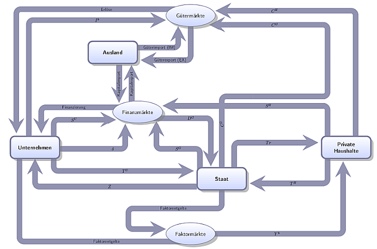

class: title-slide

```{r xaringan-themer, include=FALSE}
library(xaringanthemer)
style_xaringan(text_color = "#232461",inverse_text_color = "#FFFFFF",inverse_background_color = "#232461", title_slide_background_color = "#232461",header_background_color = "#232461",header_color = "#FFFFFF",header_h1_font_size = "32px",
  header_h2_font_size = "26px",link_color="#d84116",
  header_h3_font_size = "20px",text_slide_number_color = "#232461",text_slide_number_font_size = "0.5em")
```

```{r xaringanExtra, echo=FALSE}
xaringanExtra::use_progress_bar(color = "#d84116", location = "bottom")
xaringanExtra::use_xaringan_extra(c("tile_view","scribble","panelset","tachyons"))
xaringanExtra::style_panelset_tabs(font_family = "inherit")
#xaringanExtra::use_search(show_icon = TRUE)
#weitere: "share_again","animate_css", "webcam","freezeframe","clipboard","fit_screen","extra-styles" 
xaringanExtra::use_editable(expires = 1)
xaringanExtra::use_freezeframe(trigger = "hover")
```

```{r setup, include=FALSE}
options(htmltools.dir.version = FALSE)
library(latex2exp)
library(fontawesome)
```


# Volkswirtschaftslehre

## CORE - The Economy

### Unit 14: Kurze Frist - Unterbeschäftigung und Fiskalpolitik

<br>
<br>
<br>
<br>
<br>
<br>
<br>
### Sommersemester 2024 
<br>
### Prof. Dr. Jörg Schoder
.mycontacts[
`r fa('github')` @ISBA-University
`r fa('linkedin')` @jfschoder
]


---
layout: true

<div class="my-footer"></div>       

<div style="position: absolute;left:400px;bottom:10px;color:ISBAblue;font-size:9px">`r r2symbols::sym('copyright')``r rmarkdown::metadata$author`</div>


---
name: Motivation
class: left

# Konjunktur und Politik

.panelset[
.panel[.panel-name[Aktuell]
```{r, echo=FALSE,fig.align='center',out.width='100%'}
knitr::include_url("https://www.sueddeutsche.de/wirtschaft/eu-konjunktur-hilfsprogramme-inflation-1.5655907",height = "470px")
```
]
.panel[.panel-name[StabG (1967)]

## Magisches Viereck...

...definiert im Gesetz zur Förderung der Stabilität und des Wachstums der Wirtschaft ([StabG, §1](https://www.gesetze-im-internet.de/stabg/BJNR005820967.html))

.blockquote[
"Bund und Länder haben bei ihren wirtschafts- und finanzpolitischen Maßnahmen die Erfordernisse des **gesamtwirtschaftlichen Gleichgewichts** zu beachten. Die Maßnahmen sind so zu treffen, daß sie im Rahmen der marktwirtschaftlichen Ordnung **gleichzeitig** zur
* **Stabilität des Preisniveaus**, zu einem
* **hohen Beschäftigungsstand** und 
* **außenwirtschaftlichem Gleichgewicht** bei 
* **stetigem und angemessenem Wirtschaftswachstum**

beitragen."
]
]]


???

* StabG eingeführt vor dem Hintergrund der Keynesianischen Theorie


---
name: GreatModeration
clas: left

# Great Moderation

```{r,echo=FALSE}
knitr::include_url("https://ourworldindata.org/grapher/fluctuations-in-output-and-the-size-of-government-in-the-us?country=~USA",height = "550px")
```


???

* Great Moderation - geringere Volatilität seit Ende WK2 bis 2008
* Rolle des Staates? 
* Korrelation vs. Kausalität

<iframe src="https://ourworldindata.org/grapher/fluctuations-in-output-and-the-size-of-government-in-the-us?country=~USA" loading="lazy" style="width: 100%; height: 550px; border: 0px none;"></iframe>


---
name: Gliederung
class: inverse, left, middle
# Was lernen wir?

.small[In Einheit 13 haben wir gesehen, dass die gesamtwirtschaftliche Aktivität schwankt. Dabei besteht ein Zusammenhang mit der Schwankung der Nachfragekomponenten Konsum und Investitionen, die wiederum auf individuelle Entscheidungen der Haushalte und Unternehmen zurückgehen.]

## Inhaltliche Leitfragen

.blockquote[.small[
1. Führen individuell rationale Entscheidungen bezüglich Konsum und Ersparnisbildung zu gesellschaftlich erwünschten Ergebnissen auf der gesamtwirtschaftlichen Ebene?
2. Welche Möglichkeiten hat die Regierung/Politik, um die Konjunktur zu stabilisieren (Stabilisierungspolitik)? 
3. Warum könnte eine solche Stabilisierungspolitik ineffektiv sein?
]
]

## Ökonomische Methoden und Konzepte 

.blockquote[.small[
1. Modell der gesamtwirtschaftlichen Nachfrage
2. Investitionsnachfrage
3. Ausblick AS-AD-Modell

]
]


---
name: CircFlow
class: left

# Direkte und indirekte Effekte eines Einkommensschocks

.panelset[
.panel[.panel-name[Kreislaufmodell]
```{r, echo=FALSE,fig.align='center'}

```

.quellePanURL[Eigene Darstellung.]
]
.panel[.panel-name[Beispiel Corona]
```{r ,echo=FALSE, message=FALSE,fig.align='center',outwidth='100%'}

```

.quellePanURL[Quelle: [Baldwin (2020).](https://voxeu.org/article/how-should-we-think-about-containing-covid-19-economic-crisis)]
]
]


???

* Die Ausgaben der Haushalte sind die Einnahmen der Unternehmen
* Die Ausgaben der Unternehmen sind die Einkommen der Haushalte


* Wenn Einkommen durch einen Schock zurückgehen, beeinfluss dies das Ausgabeverhalten und damit die Einnahmen anderer Akteure.
* Mithin kommt es zu indirekten Effekten, die den ursprünglichen direkten Effekt (den Schock) verstärken


* Wir wollen im folgenden den sog. **Multiplikator** herleiten und mit seiner Hilfe die Möglichkeiten und Grenzen staatlicher Konjunkturpolitik analysieren
  * Multiplikator gibt den Gesamteffekt (Summe aus direktem und indirektem Effekt einer Einkommensänderung an)
  * wenn es nur einen direkten Effekt gibt, ist der Multiplikator 1: Das BIP ändert sich im Ausmaß des ursprünglichen Schocks
  * Wenn der Multiplikator größer oder kleiner 1 ist, gibt es indirekte Effekte
  
* Wir haben in Unit 13 gesehen, dass der Konsum etwa 70% der gesamtwirtschaftlichen Nachfrage ausmacht. Deshalb beginnen wir unsere Analyse aus Gründen der Einfachheit mit dem Konsum als Teil der gesamtwirtschaftlichen Nachfrage und fügen zu unserem Modell dann später die Investitionen, den Staat und das Ausland hinzu


---
name: kurzfrAT
class: left

# Kurzfristiges Angebot


.panelset[
.panel[.panel-name[PPF]
```{tikz ,echo=FALSE, message=FALSE}
{\sffamily
\begin{tikzpicture}[scale=.65]
		\draw[-stealth,very thick] (0,0) -- (0,5.6) node [left] {$Y$};  
		\draw[-stealth,very thick] (0,0) -- (5.1,0)  node [below] {$X$};
		\draw[color=black,very thick] (0,4.1) ..controls (2,3.7) and (3.3,2) .. (3.4,0);
		\draw [fill] (0,4.1) circle [radius=.1];
		\draw [fill] (3.4,0) circle [radius=.1];
		\node [left] at (2.08,2.95) {$Y^V$};
		\draw [fill] (2.08,3) circle [radius=.1];
		\node [left] at (2.8,3.5) {$\mbox{Ü}$};
		\draw [fill] (2.8,3.5) circle [radius=.1];
		\node [left] at (1,2) {$R$};
		\draw [fill] (1,2) circle [radius=.1];
		\draw [-stealth] (1.3,2.3) -- (1.75,2.7);
\end{tikzpicture}
}
```

.quellePan[Eigene Darstellung.]
]
.panel[.panel-name[Say's Theorem]

.blockquote[Say's Theorem:

Jedes Angebot schafft sich seine Nachfrage.
]
* Hintergund: 
  
  * VGR (geschlossene Volkswirtschaft)
      * Verwendung des Inlandsprodukts: $Y^n=C_H+C_G+I^n$
      * Aufteilung des Volkseinkommens: $Y^n=C_H+C_G+S$
  * Ex-Post-Identität: $I^n=S$
  
* Das Say'sche Theorem unterstellt, dass die Ex-Post-Identität auch Ex-Ante gilt.
  * Implikation: "Die Pläne sind kompatibel" 
  * Lange Frist vs. kurze Frist!
]
.panel[.panel-name[Angebotskurve]
```{tikz ,echo=FALSE, message=FALSE}
\begin{tikzpicture}[scale=0.24,text1/.style={font=\tiny}]
      \usetikzlibrary{calc,intersections,shapes.geometric,shapes,angles,quotes};
      \coordinate (O) at (0,0);
			\coordinate (U) at (5,0);
			\coordinate (C) at (5,5);
			\draw[-stealth, thick] (0,0) -- (20,0) node {};
			\node[text1, below,text centered,align=left] at (10,0) {\textsf{Gesamtwirtschaftliches Angebot bzw. Einkommen (Y)}};
			\draw[-stealth, thick] (0,0) -- (0,15) node {};
			\node[text1, above, rotate=90] at (0,7.5) {\textsf{Gesamtwirtschaftliche Nachfrage (AD)}}; 
			\draw[name path=AT,line width=1pt,color=red,domain=0:10] plot (\x,\x) node {};
      \draw[name path=AT,line width=1pt,color=red,dashed,domain=10:13] plot (\x,\x) node [above right,align=center]{};
  		\pic[draw,red,angle radius=9mm,angle eccentricity=1.4,"$45^{\circ}$"] {angle = U--O--C};
      \draw[name=Kapaz] (10,0) -- (10,14) node[text1,above,text centered] {\textsf{Kapazitätsgrenze ($Y^V$)}};
\end{tikzpicture}
```

<br>
.quellePan[Eigene Darstellung.]
]
.panel[.panel-name[Say's Theorem?]
```{r ,echo=FALSE, message=FALSE,fig.align='center',outwidth='100%'}

```

<br>
.quellePan[Quelle: Blanchard (2017, S. 47).]
]
]

???

* Kapazitätsgrenze: Vollbeschäftigung

* Say'sches Theorem $Y=C+S \iff I=S$: Jedes Angebot schafft sich seine Nachfrage. 

* Comic dreht die Logik um (Say’sches Theorem auf den Kopf gestellt, vgl. Felderer/Homburg (2003,
S.102f))

* "Unternehmen produzieren nur, was sie auch absetzen können"

* Wenn kurzfristig nicht an der Kapazitätsgrenze, kann das Angebot beliebig schnell ausgeweitet werden

* Rolle der Erwartungen: Corona und die Lieferketten bestätigen die kurzfristige Perspektive


---
name: Konsum
class: inverse, center, middle


# Einfaches Gütermarktmodell


???

* Kreislaufmodell hat uns in Erinnerung gerufen:

* Gemäß Kreislaufaxiom muss die Entstehungsseite des Einkommens (ANGEBOT, Y) der Verwendungsseite des Einkommens (gesamtwirtschaftliche Nachfrage, AD) entsprechen

* **Im Diagramm: AD=C+I**

* und wir erinnern uns auch, dass die gesamtwirtschaftliche Nachfrage wie folgt definiert ist:
$$Y=C+I+G+NX$$

* Wir schauen uns zunächst im einfachen Gütermarktmodell nur Konsum und Investitionen an.

* Beginnen wir mit dem Konsum


---
name: aggKonsum
class: left

# Aggregierte Konsumfunktion

.panelset[
.panel[.panel-name[Konsumfunktion]

* Lineares Regressionsmodell

$$C(Y)=c_o+c_1\cdot Y$$


* Gesamtwirtschaftliche Konsumnachfrage als Summe von autonomem Konsum  $(c_0)$ und einkommensabhängigem Konsum  $(c_1)$.

* Interpretation:
  * $c_1$: marginale Konsumneigung 
      * Wenn $c_1$<1, ist die gesamtwirtschaftliche Sparquote $(s=1-c_1)$ positiv (Zusammenhang mit Konsumglättung auf individueller Ebene!)
      * Rolle von Kreditbeschränkungen auf individueller Ebene
  * $c_0$: autonomer Konsum
     * rein statistische Größe
     * Einfluss von Erwartungen über künftige Einkommensentwicklung
]
.panel[.panel-name[Diagramm]
```{tikz ,echo=FALSE, message=FALSE}
\begin{tikzpicture}[scale=0.3]
			\usetikzlibrary{calc,intersections};
			\draw[-stealth, thick] (0,0) -- (20,0) node[below, text width=1cm,text height =6pt, text centered] {\textsf{Einkommen}\\[-.5mm] (Y)};
			\draw[-stealth, thick] (0,0) -- (0,15) node[left,text width=1.4cm,text height =6pt,text centered] {\textsf{Konsum}\\[-.5mm] (C)};			
			\draw[name path=Konsum,line width=1.5pt,color=blue,domain=0:18] plot (\x,{(2+(.6*\x))}) node [above right,align=center] {$C(Y)=c_0+c_1\cdot Y$};
			\draw(0,2) node[left] {$c_0$};
\end{tikzpicture}
```

<br>
.quellePan[Eigene Darstellung.]
]
.panel[.panel-name[Exkurs Vermögensverteilung]

<div id="highcharts-uRwRqhZoT"><script src="https://app.everviz.com/inject/uRwRqhZoT/" defer="defer"></script></div>

.quellePanURL[Quelle: [IW Köln](https://app.everviz.com/inject/uRwRqhZoT/).]
]
]

???


* Marginale Konsumneigung $c_1$ als **Durchschnittswert**. Entsprechend wird die Streuung innerhalb des Hausshaltssektors verdeckt. 

  * Haushalte unterscheiden sich in den Kreditbeschränkungen, mit denen sie konfrontiert sind.
  * Exkurs: Vermögensverteilung: Die meisten Haushalte haben auch in reichen Ländern wie Deutschland nur geringe Vermögen. 
  * Im Schnitt sind 25% der Haushalte kreditbeschränkt, ein Teil auch aufgrund von fehlender Spardisziplin (vgl. Unit 13)
  * **Entscheidend**: für Haushalte die kreditbeschränkt sind, oder solche die vorneweg nicht genügend gespart haben um für Phasen geringer Einkommen vorzusorgen, wird der **Konsum relativ hoch mit dem laufenden Einkommen korrelieren**

* Im Textbook wird eine marginale Konsumquote von $c_1=0.6$ angenommen.
  * Mithin führt ein zusätzlicher Euro Einkommen zu einer Konsumsteigerung um 1 Euro x 0.6 = 60 cent. Analog: Einkommensrückgang um einen Euro, führt zu Konsumreduktion um 60 cent.
  * Haushalte mit geringem Vermögen können ihren Konsum weniger glätten, sodass ein Einkommensverlust hier zu einem stärkeren Konsumrückgang führt. Die marginale Konsumneigung liegt bei diesen Haushalten wohl eher bei 0.8. 
  * Vermögende Haushalte werden Ihren Konsum dagegen wohl kaum anpassen, wenn sie einen Euro mehr Einkommen erhalten, ihre marginale Konsumneigung ist kleiner als 0.6


* Die **Konstante $c_0$** ist im Regressionsmodell immer eine Restgröße
  * bildet statistisch gesehen den Einfluss **aller anderen Faktoren** neben dem Einkommen ab
  * Sollte also **nicht als Existenzminimum** interpretiert werden - Problem: Einkommen von Null, kann kein Existenzminimum sichern. 
  * daher meist als einkommensunabhängier **"autonomer" Konsum** bezeichnet.
  

---
name: Erwartungen
class: left

# Exkurs: Autonomer Konsum und Erwartungen


```{r ,echo=FALSE, message=FALSE,fig.align='center',outwidth='100%'}
knitr::include_url('https://www.core-econ.org/the-economy/book/images/web/figure-14-03.svg',height='550px')
```

.quelle[Quelle: [The Economy](https://www.core-econ.org/the-economy/book/text/14.html#142-the-multiplier-model)]

???
* **Autonomer Konsum** als **einkommensunabhängiger** Teil der Konsumnachfrage
* Statistische Restgröße, die **alle Einflussfaktoren** abbildet, die **neben dem explizit** in der Regressionsgleichung **betrachteten Einkommen** den privaten Konsum beeinflussen
* Ein solcher Einflussfaktor ist das **erwartete zukünftige Einkommen**
* In **Unit 13** haben wir gesehen, dass der **Konsum auch davon abhängt**, ob wir eher **optimistisch oder pessimistisch** in die Zukunft schauen

* Beispiel Finanzkrise 2008:
  * Consumption of **non-durable goods** went down slightly more than disposable income:
      * It fell by 3% during the period.
      * die Haushalte waren also offenbar so besorgt über ihre zukünftige Situation, dass sie selbst bei den Gütern des täglichen Bedarfs (non-durable goods) ihre Ausgaben angepasst haben, also den Konsum nicht perfekt geglättet haben.
  * Aber viel deutlicher waren die Effekte auf die **Ausgaben für langlebige Konsumgüter**. Diese gingen **im ersten Jahr um 10% zurück**
  * Die Sorge zeigt sich im Sentiment-Index, der die u.a. die Angst vor Jobverlusten nach der Lehman-Pleite  (Zusammenbruch Finanzsystem? Pleitewelle?) und die mit den niedrigeren Hauspreisen verbundene höhere Privatverschuldung widerspiegelt
  * Zur Erinnerung (Unit 13): Es ist relativ leicht, die Ausgaben für langlebige Konsumgüter (Möbel, Autos, etc.) zurückzuschrauben In gewisser weise haben diese Ausgaben den Charakter von Investitionen, schwanken also stärker


---
name: EinfacherMulti
class: left

# Einfaches Einkommen-Ausgaben-Modell

.panelset[
.panel[.panel-name[Kurzfristiges Angebot]
```{tikz,echo=FALSE}
	\begin{tikzpicture}[scale=0.2]
	\usetikzlibrary{calc,intersections,shapes.geometric,shapes,angles,quotes}
	\coordinate (O) at (0,0);
	\coordinate (U) at (5,0);
	\coordinate (C) at (5,5);
	\draw[-stealth, thick] (0,0) -- (20,0) node[below] {Y};
	\draw[-stealth, thick] (0,0) -- (0,15) node[left] {AD};
	\draw[name path=AT,line width=1pt,color=red,domain=0:12] plot (\x,\x) node {};
	\draw[name path=ATdash,line width=1pt,color=red,dashed,domain=12:14] plot (\x,\x) node [above right,align=center]{};
	\pic[draw,font=\scriptsize,red,angle radius=9mm,angle eccentricity=1.4,"$45^{\circ}$"] {angle = U--O--C};
\end{tikzpicture}
```
]
.panel[.panel-name[Keynesianisches Kreuz]
```{tikz,echo=FALSE}
	\begin{tikzpicture}[scale=0.3]
	\usetikzlibrary{calc,intersections,shapes.geometric,shapes,angles,quotes}
	\coordinate (O) at (0,0);
	\coordinate (U) at (5,0);
	\coordinate (C) at (5,5);
	\draw[-stealth, thick] (0,0) -- (20,0) node[below] {Y};
	\draw[-stealth, thick] (0,0) -- (0,15) node[left] {AD};

	\draw[name path=AT,line width=1pt,color=red,domain=0:12] plot (\x,\x) node {};
	\draw[name path=ATdash,line width=1pt,color=red,dashed,domain=12:14] plot (\x,\x) node [above right,align=center]{};
	\pic[draw,font=\scriptsize,red,angle radius=9mm,angle eccentricity=1.4,"$45^{\circ}$"] {angle = U--O--C};

	\draw[name path=Konsum,line width=1.5pt,color=blue,domain=0:18] plot (\x,{(3+(.6*\x))}) node [above right,align=center] {$C(Y)=c_0+c_1\cdot Y$};
	\draw(0,3) node[left] {$c_0$};
	\end{tikzpicture}
```
]
.panel[.panel-name[Gleichgewicht]
```{tikz,echo=FALSE}
	\begin{tikzpicture}[scale=0.3]
	\usetikzlibrary{calc,intersections,shapes.geometric,shapes,angles,quotes}
	\coordinate (O) at (0,0);
	\coordinate (U) at (5,0);
	\coordinate (C) at (5,5);
\draw[-stealth, thick] (0,0) -- (20,0) node[below] {Y};
	\draw[-stealth, thick] (0,-4) -- (0,15) node[left] {AD};
	\draw[name path=AT,line width=1.2pt,color=red,domain=0:12] plot (\x,\x) node {};
	\draw[name path=ATdash,line width=1pt,color=red,dashed,domain=12:14] plot (\x,\x) node [above right,align=center]{};
	\pic[draw,font=\scriptsize,red,angle radius=9mm,angle eccentricity=1.4,"$45^{\circ}$"] {angle = U--O--C};
	\draw[name path=Konsum,line width=1.2pt,color=blue,domain=0:18] plot (\x,{(3+(.6*\x))}) node [above right,align=center] {$C(Y)=c_0+c_1\cdot Y$};
	\draw(0,3) node[left] {$c_0$};

	\draw[name path=Spar,line width=1.2pt,color=green,domain=0:18] plot (\x,{(-3+(.4*\x))}) node [above right,align=center] {$S(Y)=-c_0+(1-c_1)\cdot Y$};
	\draw(0,-3) node[left] {$-c_0$};
	\path[name intersections={of=AT and Konsum, by={ggw}}]	(ggw) node[] {};	
	\path let \p1 = (ggw) in node[below]  at (\x1,0) (Y) {$Y^\ast$};
	\draw[dashed] (ggw) -- (Y);	
\end{tikzpicture}
```
]
]

???

* Obs! im gleichgewicht ist $S=0$

* $\frac{1}{1-c_1}$ gibt den Multiplikatoreffekt einer Veränderung des autonomen Konsums an.

* Beispiel: 
    * Autonomer Konsum steigt um 100 (Parallel-Verschiebung $C(Y)$ nach oben)
    * Dann steigt das gleichgewichtige Einkommen bei einer marginalen Konsumneigung um $\frac{1}{1-0,5}=\frac{1}{0,5}=2$ um 200!

* Hier schafft sich das Angebot also seine Nachfrage nicht selbst!! Unterschied
zum Sayschen Theorem: Jedes Einkommensniveau ist mit einem
Gütermarktgleichgewicht vereinbar, welches konkret realisiert wird determiniert
die Situation am Arbeitsmarkt


---
name: Multiplikator
class: left


# Direkte und indirekte Effekte: der Multiplikator


.panelset[
.panel[.panel-name[Multiplikator]
* Die Veränderung der Gesamtproduktion (und damit der Einkommen) kann größer ausfallen, als die ursprüngliche Veränderung der *aggregierten* Nachfrage (bspw. durch eine Zunahme des autonomen Konsums aufgrund positiver Einkommenserwartungen)

* Grund: Der ursprüngliche Effekt stößt im Wirtschaftskreislauf weitere Anpassungen von Einnahmen und Ausgaben an!

* Der **Multiplikator** gibt den Gesamteffekt dieser Veränderungen an. 

]
.panel[.panel-name[Analytisch]

* Im Gleichgewicht muss gelten:

$$Y=AD=C(Y)=c_0+c_1\cdot Y$$

* Gleichgewichtiges Einkommensniveau $Y^\ast$

$$Y^\ast= \frac{1}{1-c_1}\cdot c_0$$
* Der **elementare Ausgabenmultiplikator** $\frac{1}{1-c_1}$ gibt den Multiplikatoreffekt einer Veränderung des autonomen Konsums an.

* Gesamtwirtschaftliche Ersparnis:

$$Y=C+S \iff S=Y-C=Y-(c_0+c_1\cdot Y)$$


$$\implies S=-c_0+(1-c_1)\cdot Y$$
]
]


---
name: GoodsMarket
class: left

# Gütermarktgleichgewicht und Beschäftigung


.panelset[
.panel[.panel-name[Keynesianisches Kreuz]

* Aggregierte Nachfrage mit autonomen Investitionen $I_0$

```{tikz,echo=FALSE}
	\begin{tikzpicture}[scale=0.3]
	\usetikzlibrary{calc,intersections,shapes.geometric,shapes,angles,quotes}
	\coordinate (O) at (0,0);
	\coordinate (U) at (5,0);
	\coordinate (C) at (5,5);
	\draw[-stealth, thick] (0,0) -- (20,0) node[below] {Y};
	\draw[-stealth, thick] (0,0) -- (0,15) node[left] {AD};

	\draw[name path=AT,line width=.8pt,color=red,domain=0:12] plot (\x,\x) node {};
	\draw[name path=ATdash,line width=.8pt,color=red,dashed,domain=12:15] plot (\x,\x) node [above right,align=center]{};
	\pic[draw,font=\tiny,red,angle radius=9mm,angle eccentricity=1.4,"$45^{\circ}$"] {angle = U--O--C};

	\draw[dotted,name path=Konsum,line width=.8pt,color=blue,domain=0:18] plot (\x,{(3+(.6*\x))}) node[right,align=center] {$C(Y)=c_0+c_1\cdot Y$};
	\draw(0,3) node[left] {$c_0$};

  \draw[name path=Invest,line width=.8pt,color=blue,domain=0:18] plot (\x,{(4+(.6*\x))}) node [above right,align=center] {$C(Y)+I_0$};
	\draw(0,4) node[above left] {$c_0+I_0$};

	\path[name intersections={of=AT and Konsum, by={ggw}}]	(ggw) node[] {};	
	\path let \p1 = (ggw) in node[below]  at (\x1,0) (Y) {$Y_1^\ast$};
	\draw[dotted] (ggw) -- (Y);	

  \path[name intersections={of=AT and Invest, by={gneu}}]	(gneu) node[] {};	
	\path let \p1 = (gneu) in node[below]  at (\x1,0) (Y) {$Y_2^\ast$};
	\draw[dashed] (gneu) -- (Y);
  \draw[name=Kapaz,line width=.8pt] (12,0) -- (12,15) node[font=\small,above,text centered] {$Y^V$};
\end{tikzpicture}
```
]
.panel[.panel-name[Interpretation]
* Nur beim Realeinkommen $Y^\ast$ entsprechen sich gesamtwirtschaftliches Angebot und gesamtwirtschaftliche Nachfrage (hier: ohne Staat und ohne Ausland!).

* Damit besteht die Möglichkeit, dass eine Volkswirtschaft dauerhaft nicht an der Kapazitätsgrenze produziert $(Y^\ast\neq Y^V)$:
  * $Y^\ast < Y^V$: Deflatorische Lücke (die vorhandenen Kapazitäten werden nicht auslastet, Beispiel: Große Depression.)
  * $Y^\ast > Y^V$: Inflatorische Lücke (Preisdruck durch *kaufkräftige* Nachfrage oberhalb der	Produktionskapazitäten)
]
]


???
* Mit $I_0$: Autonome Investitionen, die von den Unternehmen geplant wurden
* $(1-c_0)$: elementarer Multiplikator
* Es existiert nur ein Realeinkommen, bei dem der Gütermarkt im Gleichgewicht ist:
$$Y^\ast = \frac{1}{1-b}\cdot(a + I_0)$$
* Unterschied zum Sayschen Theorem: Jedes Einkommensniveau ist mit einem Gütermarktgleichgewicht vereinbar, welches konkret realisiert wird determiniert die Situation am Arbeitsmarkt


---
name: InvestMulti
class: left

# Direkte und indirekte Effekte von (Dis)Investitionen


.panelset[
.panel[.panel-name[Investition]
```{r ,echo=FALSE, message=FALSE,fig.align='center',outwidth='100%'}
knitr::include_url('https://www.core-econ.org/the-economy/book/images/web/figure-14-mcq-02.svg',height = '400px')
```

.small[
**Wirkungskette:** zusätzliche Investitionsausgaben `r fa("circle-right")` Zunahme AD `r fa("circle-right")` Zunahme von Produktion und Einkommen `r fa("circle-right")` weitere Zunahme von Nachfrage und Einkommen `r fa("circle-right")` Neues Gleichgewicht
]

]
.panel[.panel-name[Disinvestition]
```{r ,echo=FALSE, message=FALSE,fig.align='center',outwidth='100%'}
knitr::include_url('https://www.core-econ.org/the-economy/book/images/web/figure-14-05-i.svg',height = '400px')
```

.small[
**Wirkungskette:** Kürzung von Investitionsausgaben `r fa("circle-right")` Rückgang AD `r fa("circle-right")` Rückgang von Produktion und Einkommen `r fa("circle-right")` weitere Rückgänge von Nachfrage und Einkommen `r fa("circle-right")` Neues Gleichgewicht
]

]
]
.quelle[Quelle: [The Economy](https://www.core-econ.org/the-economy/book/text/14.html#142-the-multiplier-model)]


???

* The multiplier represents the relative magnitude of this change.
  * multiplier = 1: the increase in GDP = the initial increase in spending
  * multiplier > (<) 1: the total increase in GDP > (<) the initial increase in spending

* Credit constraints and consumption smoothing is reflected in the slope of the AD curve and the size of the multiplier.


* Consumption decisions can also shift the AD curve.
  e.g. a fall in house prices will be bad news for a household with a mortgage. They may choose to save more (precautionary saving) and hence their autonomous consumption would fall.


---
name: GreatDepression
class: left

# Wirtschaftsgeschichte: Große Depression

```{r ,echo=FALSE, message=FALSE,fig.align='center',outwidth='100%'}
knitr::include_url('https://www.core-econ.org/the-economy/book/images/web/figure-14-06-d.svg',height = '550px')
```

.quelle[Quelle: [The Economy](https://www.core-econ.org/the-economy/book/text/14.html#143-household-target-wealth-collateral-and-consumption-spending)]


???

A: goods market equilibrium (1929)
B : fall in investment = downward shift of AD
C: fall in autonomous consumption = further downward shift of AD
 uncertainty due to stock market crash, pessimism, banking crisis and collapse of credit


---
name: Sparparadox
class: left

# Das Sparparadoxon (Paradox of Thrift)

* *Einzelwirtschaftliche* Versuche zur Erhöhung der (individuellen)
Ersparnis kann...

--

* ...*gesamtwirtschaftlich* aufgrund der Zirkularität zu einer
Abwärtsspirale führen.

--

* Makroökonomische Zusammenhänge können nicht schlicht als
Summe der einzelwirtschaftlichen Überlegungen erschlossen werden

--

* Keynes: **"fallacy of composition"** (bzw. allgemein: Emergenzproblem)

--

* Beispiel: Finanzkrise und Bankbilanzen
    * Wertverluste von Wertpapieren auf der Aktivseite
--
    * Bilanzverkürzung für die einzelne Bank sinnvoll...
--
    * führt aber zu weiteren Kursverlusten in den Bilanzen anderer Banken


???

In a recession, faced with a household budget deficit, a family worried about their falling wealth cuts spending and saves more.

But in the economy as a whole, spending and earning go together.

The paradox of thrift = the aggregate attempt to increase savings leads to a fall in aggregate income.

Fallacy of composition: what is true for one part of the economy (a single household) is not true of the whole economy.


---
name: babysitting
class: left

# Paul Krugman (1998): Baby-Sitting the Economy


```{r ,echo=FALSE, message=FALSE,fig.align='center',outwidth='100%'}
knitr::include_graphics('../images/unit14/Babysitting_(Krugman_1998).png')
```

<br>

Einzelwirtschaftliche vs. gesamtwirtschaftliche Rationalität!

.quelle[Quelle: [Slate.com](https://slate.com/business/1998/08/baby-sitting-the-economy.html)]


---
name: SecInvest
class: inverse, center, middle


# Investitionen


.blockquote[Welchen Einfluss hat das Zinsniveau auf die Investitionsbereitschaft?]

.blockquote[Welche Rolle spielt die Angebotsseite für die Investitionsbereitschaft?]


???
In a capitalist economy, private investment spending is driven by expectations about future post-tax profits. As we saw in Unit 13, spending on investment projects tends to occur in clusters. Two reasons for this observation are:

Firms may adopt a new technology at the same time.
Firms may have similar beliefs about expected future demand


* Im Einkommen-Ausgaben-Modell sind die autonomen Investitionen zinsunabhängig

* Mithin kann der Zins nicht sicherstellen, dass ein Gleichgewicht
zwischen Investitionen und Ersparnis erreicht wird 

* Die zu ihrer Durchführung notwendige Ersparnis verschaffen sich die
Investitionen mittels Multiplikatoreffekten selbst

* Für die Durchführung einer Investition ist die Bürgschaft einer Bank
hinreichend. Die Finanzierungsmittel entstehen dann automatisch mit
der Durchführung der Investition.

* Bei der Diskussion der Kapitalmarktnachfrage wurde die Zinsabhängigkeit von Investitionen bereits angesprochen...

* ...und von einer Übereinstimmung der Kreditnachfrage mit den geplanten Investitionen ausgegangen


---
name: KeynesInvest
class: left

# Investitionskalkül

* Unternehmerische Entscheidung über die Verwendung von Gewinnen hängt ab von:

  * Der Zeitpräferenz (Ungeduld) der Eigentümer: Diskontrate $\rho$
  * Der erzielbaren Rendite auf Kapitalanlagen (r)
  * Der Rentabilität von Investitionen $(\Pi)$
	
1. Für $\rho>r\geq \Pi$: Konsum 
2. Für $r>\rho\geq \Pi$: Sparen/Kredite tilgen 
3. Für $\Pi>\rho\geq r$: Investieren


* Refresher **Kapitalwert** (mit $r$: Kalkulationszins und $R_t$: erwartete (!) Einnahmenüberschüsse):

$$C_0(r)=\sum_{t=0}^{T} R_t\cdot(1+r)^{-t}$$

* Interner Zinsfuß: Zinssatz $r$, für den der Kapitalwert Null ist $(C_0(r)\stackrel{!}{=}0)$.


---
name: InternerZins
class: left

# Investitionen und Opportunitätskosten

```{r,echo=FALSE,fig.align='center',out.width='100%'}
knitr::include_url('https://www.core-econ.org/the-economy/book/images/web/figure-14-09-e.svg',height = '550px')
```


.quelle[Quelle: [The Economy](https://www.core-econ.org/the-economy/book/text/14.html#144-investment-spending)]


???

* Investitionsnachfrage und Gütermarkt

* Improvement in **supply conditions**: The improvement in supply conditions increases the expected rate of profit for each project. (höhere Balken)

Change in interest rate is a **demand-side factor**.


---
name: Investfunktion
class: left

# Aggregierte Investitionsnachfrage

```{r,echo=FALSE,fig.align='center',out.width='100%'}
knitr::include_url('https://www.core-econ.org/the-economy/book/images/web/figure-14-10-c-c.svg',height = '500px')
```

.pull-left[
* Abhängigkeit Gewinnerwartungen
]
.pull-right[
* Zinsabhängigkeit (?)
]

.quelle[Quelle: [The Economy](https://www.core-econ.org/the-economy/book/text/14.html#144-investment-spending)]

???

* In practice, investment is not very sensitive to interest rate. Instead, the shift factors are much more important.


---
name: Neoklassik
class: left

# Exkurs: Neoklassisches Modell der Investitionsnachfrage

* Unternehmenskalkül

$$\max\Gamma=\rho-\kappa=P\cdot Y-\kappa_L-iK$$
* optimaler Kapitaleinsatz (FOC):

$$\frac{\Gamma}{K}=P\cdot\frac{\partial Y}{\partial K}-i\stackrel{!}{=}0$$
* Wertgrenzprodukt des Kapitals $(P\cdot\frac{\partial Y}{\partial K})$ entspricht dem Nominalzins (i)
* Grenzprodukt des Kapitals $(\frac{\partial Y}{\partial K})$ entspricht dem Realzins $(i_r=\frac{i}{P})$


---
name: secStaat
class: inverse, center, middle

# Staatliche Aktivität (Fiskalpolitik)


---
name: AD
class: left

# Aggregierte Nachfrage

* VGR und die Verwendungsseite des BIP

$$AD=C+I=C^{\mbox{Privat}}+C^{\mbox{Staat}}+I$$


## Einfluss des Staates

* Staatsausgaben $C^{\mbox{Staat}}$:
  * erhöhen den gesamtwirtschaftlich den Konsum; Wirkungsgleich mit Erhöhung des autonomen Konsums der Haushalte 
  * Verschiebung der AD-Kurve nach oben

* Steuern und Abgaben $(t)$:
  * Zur Finanzierung der Staatsausgaben kann der Staat Zwangsabgaben (Steuern, Beiträge, Gebühren) erheben oder Schulden machen.
  * Abgabenfinanzierung reduziert die verfügbaren Einkommen (disposable Incomes, $Y^d$) der Haushalte: $Y^d=(1-t)Y$
  * Abgabenfinanzierung reduziert die Profitabilität von Investitionen (Verzinsung nach Steuern)

---
name: MultiStaat
class: left


# Der Staatsausgabenmultiplikator

* Ausgangspunkt VGR und Kreislaufmodell

$$AD=C^P+C^G+I=c_0+c_1\cdot (1−t)\cdot Y + C^G + I(r)$$

* Im Gleichgewicht gilt: $Y=AD$

$$\begin{eqnarray*}
    Y-(c_1\cdot(1-t)\cdot Y&=&c_0+C^G+I(r)\\
    \left(1-c_1\cdot(1-t)\right)\cdot Y&=&c_0+C^G+I(r)\\
    Y^\ast&=&\frac{1}{1-c_1\cdot(1-t)}\cdot \left(c_0+C^G+I(r)\right)\\
\end{eqnarray*}$$


* Höhere Abgabenlast $(t)$ reduziert den Multiplikatoreffekt zusätzlicher Staatsausgaben


---
name: Stabilisierung
class: left

# Stabilisierungspolitik

* Staat kann stabilisierend auf die wirtschaftliche Konjunktur wirken.

  1. **Automatische** Stabilisatoren:
        * Einkommensteuern
        * Arbeitslosenversicherung 
            * hilft Haushalten bei Konsumglättung
            * Pareto-Verbesserung, weil nicht über private Märkte versicherbar
  
  2. **Diskretionäre** Fiskalpolitik    
        * Staatsausgaben, staatliche Investitionen (direkte Wirkung)
        * Abgabenreduktion (indirekte Wirkung)


???

There are also three reasons why the private market fails, and therefore governments provide **unemployment insurance** in the form of unemployment benefits:

* **Correlated risk:** In a recession, job loss will be widespread. This means that there will be a surge in insurance claims across the economy and a private provider may be unable to pay out on the scale required. It also means co-insuranceco-insurance A means of pooling savings across households in order for a household to be able to maintain consumption when it experiences a temporary fall in income or the need for greater expenditure.close among a group of neighbours or family members may be of limited use, as the need for help may arise in many households at the same time.
* **Hidden actions** As we saw in Unit 12, the insurance company cannot observe the reason for the job loss so it would have to insure the employee against a firm cutting back employment due to lack of demand, as well as the worker being fired for inadequate work. This creates a moral hazard because a well-insured person is expected to make less of an effort on the job.
* **Hidden attributes** Suppose you learn that your firm is in difficulty, but the insurance company does not. This is another example of asymmetric information. You will therefore buy insurance when you learn of the likely closure of the firm, and it will be provided at good rates because the insurance company does not know that you are likely to make a claim on them. Workers who know their firm is performing well will not buy insurance. The hidden attributes problem will be true about individuals (hardworking or lazy), as well as firms (successful or failing). The good prospects (those who enjoy working hard, for example) will shun the insurance and the insurer will be left with those likely to face the extra risks of losing their job.

---
name: GovSpend
class: left

# Fiskalpolitik

```{r,echo=FALSE,fig.align='center',out.width='100%'}
knitr::include_url('https://www.core-econ.org/the-economy/book/images/web/figure-14-11-a-c.svg',height = '550px')
```

.quelle[Quelle: [The Economy](https://www.core-econ.org/the-economy/book/text/14.html#146-fiscal-policy-how-governments-can-dampen-and-amplify-fluctuations)]

---
name: Finanzierung
class: left

# Finanzierung von Fiskalpolitik

## Staatsfinanzen im Überblick 

* Staatliches Budget: 

$$B=T-G$$

* Budgetdefizit: Deckungslücke im laufenden Haushalt
    * Defizit: $B<0 \iff G>T$ 
    * Überschuss: $B>0 \iff T>G$

* Staatsverschuldung: Ausstehende verbriefte Verbindlichkeiten (Öffentliche Anleihen)

* Europäische Währungsunion (EWU) - Vertrag von Maastricht (1995):
  * max. (jährliches) Defizit in Höhe von 3% des BIP
  * max. Staatsverschuldung in Höhe von 60% des BIP

* Keynesianische Idee: Antizyklische Fiskalpolitik

???

* Primary budget deficit = $G –T$
  * procyclical
  * the government must borrow to cover the gap between spending and revenue, by issuing bonds

* Government debt = sum of all the bonds sold over time to finance budget deficit – matured bonds (repaid debt).

* Sovereign debt crisis = a situation in which government bonds come to be considered risky (default risk).


---
name: Austerity
class: left

# Hintergrund: Austeritätspolitik

```{r,echo=FALSE,fig.align='center',out.width='100%'}
knitr::include_url('https://www.core-econ.org/the-economy/book/images/web/figure-14-11-b-c.svg',height = '550px')
```

.quelle[Quelle: [The Economy](https://www.core-econ.org/the-economy/book/text/14.html#146-fiscal-policy-how-governments-can-dampen-and-amplify-fluctuations)]


???

* Keynes kritisierte die Versailler Verträge, die Deutschland seiner Ansicht nach nicht erfüllen konnte

* 2010: Griechenland-Krise

---
name: Schuldenquote
class: left

# Internationaler Vergleich


```{r,echo=FALSE}
knitr::include_url("https://ourworldindata.org/grapher/country-level-government-spending-vs-income", height = "550px")
```


???

<iframe src="https://ourworldindata.org/grapher/country-level-government-spending-vs-income" loading="lazy" style="width: 100%; height: 550px; border: 0px none;"></iframe>


---
name: Nachhaltigkeit
class: left

# Fiskalische Nachhaltigkeit

## Explizite vs. implizite Schulden


```{r,echo=FALSE,fig.align='center',out.width='100%'}
knitr::include_graphics('https://i2.wp.com/www.fiwi1.uni-freiburg.de/forschungszentrum-generationenvertraege/wp-content/uploads/sites/2/2020/03/fiskn1.png?ssl=1')
```

.quelle[Quelle: [Forschungszentrum Generationenverträge.](https://www.fiwi1.uni-freiburg.de/forschungszentrum-generationenvertraege/fiskalische-nachhaltigkeit/)]


???

* 2020 offiziell Schuldenquote (Maastricht-Kriterium) 69,7%. Erlaubt: 60%.
* Kritik an Austeritätspolitik berechtigt
* Aber antizyklische Fiskalpolitik hat noch nie geklappt. Schuldenmachen ja, aber Rückzahlung nein.
* Staatspleiten - bspw. Argentinien
* Deutschland als Musterknabe?
* Explizite vs. Implizite Schulden


---
name: Ponzi
class: left

# Von Schulden und Ponzi-Spielen

```{r,echo=FALSE,fig.align='center',out.width='100%'}

```

.quelle[Bildquelle: [Wikimedia.org](https://commons.wikimedia.org/wiki/File:Charles_Ponzi.jpg).]

???

* Schulden tilgen, durch Aufnahme neuer Schulden
* Soll durch Maastricht-Verträge verhindert werden
* Es gibt keinen festen Prozentsatz, 
* A large stock of debt relative to GDP can be a problem because the government has to pay interest on its debt.

* However, there is no point at which the government has to pay off all its stock of debt—it can roll it over instead by issuing new bonds.  

* An ever-increasing debt ratio is unsustainable, but there is no rule that says exactly how much debt is problematic.


---
name: Arbeitsanreize
class: 

# Mikroökonomische Perspektive

## "Nebenwirkungen" der Corona-Politik?

```{r,echo=FALSE,fig.align='center',out.width='100%'}
knitr::include_graphics('../images/unit14/Nebenwirkungen_(Zeit_20210510).png')
```

.quelle[Quelle: [Die Zeit](https://www.zeit.de/wirtschaft/unternehmen/2021-05/usa-corona-hilfspaket-joe-biden-arbeitslosengeld-arbeitgeber-unternehmen).]


---
name: Ausland
class: inverse, center, middle

# Offene Volkswirtschaft


---
name: VGRmitAusland
class: left

# Multiplikator in der offenen Volkswirtschaft

* VGR und die Verwendungsseite des BIP

$$\begin{eqnarray*}AD&=&C+I+NX\\
                    &=&C^P+C^G+I+(Ex-Im)\\
                    &=&c_0+c_1\cdot (1−t)\cdot Y + I(r)+ C^G+ X-m\cdot Y\\
                    \end{eqnarray*}$$

* Annahmen:
  * Exporte ($Ex$) sind exogen (d.h. außerhalb des Modells) bestimmt.
  * Importe hängen vom Volkseinkommen ab.
    * Marginale Importneigung (analog zur marginalen Konsumneigung der Haushalte)
    * $Im=m\cdot Y$

* Multiplikator

$$Y = \frac{1}{1-c_1(1-t)+m}\left(c_0 + I(r) + C^G + X\right)$$
* Höhere marginale Importneigung reduziert den Multiplikatoreffekt (**Leakage**)

---
name: Exporte
class: left

# Vor- und Nachteile des Außenhandels

```{r,echo=FALSE,fig.align='center',out.width='100%'}
knitr::include_url('https://www.core-econ.org/the-economy/book/images/web/figure-14-16.svg',height = '550px')
```


.quelle[Quelle: [The Economy](https://www.core-econ.org/the-economy/book/text/14.html#149-fiscal-policy-and-the-rest-of-the-world)]


???

* Fluctuations in the growth rate of important markets abroad influence the domestic economy via demand for exports.
* Demand for imports dampens domestic fluctuations.
* Foreign trade limits the use of fiscal stimulus if the marginal propensity to import is large.


---
name: FazitAusblick
class: inverse, center, middle

# Zusammenfassung und Ausblick


---
name: Fazit
class: left

# Zusammenfassung

1. Kreislaufmodell: Einnahmen und Ausgaben sind interdependent

2. Komponenten der aggregierten Nachfrage (AD)

$$AD=C^P+C^G+I+NX$$
3. Multipikatoreffekte können Nachfrageschocks verstärken

4. Sparparadoxon

5. Stabilisierungspolitik
  * Automatische Stabilisatoren
  * Diskretionäre Fiskalpolitik

6. Fiskalpolitik und fiskalische Nachhaltigkeit


---
name: Ausblick
class: left

# Ausblick

* Vorlesung "Geld und Währung" (5. Semester)
  * Unit 15: Phillipskurve (Inflation und Beschäftigung) und Geldpolitik 
  * Unit 10: Geld und Finanzsystem


